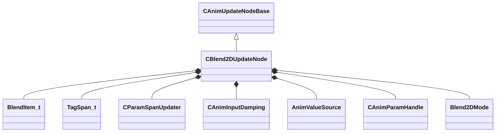

[Schemas](../../schemas.md) / [animgraphlib](../animgraphlib.md) / CBlend2DUpdateNode

# CBlend2DUpdateNode

**Kind:** class · **Size:** 248 bytes (`0xf8`) · **Align:** 8 · **Module:** animgraphlib

**Inherits from:** [CAnimUpdateNodeBase](../animgraphlib/CAnimUpdateNodeBase.md)

**Relationships:**

## Memory layout

18 fields (15 declared here, 3 inherited). Offsets are absolute from the object base.

| Offset | Field | Type | From | Annotations |
|--------|-------|------|------|-------------|
| `0x18` | `m_nodePath` | [CAnimNodePath](../animgraphlib/CAnimNodePath.md) | [CAnimUpdateNodeBase](../animgraphlib/CAnimUpdateNodeBase.md) |  |
| `0x48` | `m_networkMode` | [AnimNodeNetworkMode](../!GlobalTypes/AnimNodeNetworkMode.md) | [CAnimUpdateNodeBase](../animgraphlib/CAnimUpdateNodeBase.md) |  |
| `0x50` | `m_name` | CUtlString | [CAnimUpdateNodeBase](../animgraphlib/CAnimUpdateNodeBase.md) |  |
| `0x60` | `m_items` | CUtlVector< [BlendItem_t](../animgraphlib/BlendItem_t.md) > |  |  |
| `0x78` | `m_tags` | CUtlVector< [TagSpan_t](../animgraphlib/TagSpan_t.md) > |  |  |
| `0x90` | `m_paramSpans` | [CParamSpanUpdater](../animgraphlib/CParamSpanUpdater.md) |  |  |
| `0xa8` | `m_nodeItemIndices` | CUtlVector< int32 > |  |  |
| `0xc0` | `m_damping` | [CAnimInputDamping](../animgraphlib/CAnimInputDamping.md) |  |  |
| `0xd8` | `m_blendSourceX` | [AnimValueSource](../!GlobalTypes/AnimValueSource.md) |  |  |
| `0xdc` | `m_paramX` | [CAnimParamHandle](../animgraphlib/CAnimParamHandle.md) |  |  |
| `0xe0` | `m_blendSourceY` | [AnimValueSource](../!GlobalTypes/AnimValueSource.md) |  |  |
| `0xe4` | `m_paramY` | [CAnimParamHandle](../animgraphlib/CAnimParamHandle.md) |  |  |
| `0xe8` | `m_eBlendMode` | [Blend2DMode](../!GlobalTypes/Blend2DMode.md) |  |  |
| `0xec` | `m_playbackSpeed` | float32 |  |  |
| `0xf0` | `m_bLoop` | bool |  |  |
| `0xf1` | `m_bLockBlendOnReset` | bool |  |  |
| `0xf2` | `m_bLockWhenWaning` | bool |  |  |
| `0xf3` | `m_bAnimEventsAndTagsOnMostWeightedOnly` | bool |  |  |

KV3 class defaults

<pre>{
	&quot;_class&quot;: &quot;CBlend2DUpdateNode&quot;,
	&quot;m_nodePath&quot;:
	{
		&quot;m_path&quot;:
		[
			{
				&quot;m_id&quot;: &lt;HIDDEN FOR DIFF&gt;,
			},
			{
				&quot;m_id&quot;: &lt;HIDDEN FOR DIFF&gt;,
			},
			{
				&quot;m_id&quot;: &lt;HIDDEN FOR DIFF&gt;,
			},
			{
				&quot;m_id&quot;: &lt;HIDDEN FOR DIFF&gt;,
			},
			{
				&quot;m_id&quot;: &lt;HIDDEN FOR DIFF&gt;,
			},
			{
				&quot;m_id&quot;: &lt;HIDDEN FOR DIFF&gt;,
			},
			{
				&quot;m_id&quot;: &lt;HIDDEN FOR DIFF&gt;,
			},
			{
				&quot;m_id&quot;: &lt;HIDDEN FOR DIFF&gt;,
			},
			{
				&quot;m_id&quot;: &lt;HIDDEN FOR DIFF&gt;,
			},
			{
				&quot;m_id&quot;: &lt;HIDDEN FOR DIFF&gt;,
			},
			{
				&quot;m_id&quot;: &lt;HIDDEN FOR DIFF&gt;,
			}
		],
		&quot;m_nCount&quot;: 0
	},
	&quot;m_networkMode&quot;: &quot;ServerAuthoritative&quot;,
	&quot;m_name&quot;: &quot;&quot;,
	&quot;m_items&quot;:
	[
	],
	&quot;m_tags&quot;:
	[
	],
	&quot;m_paramSpans&quot;:
	{
		&quot;m_spans&quot;:
		[
		]
	},
	&quot;m_nodeItemIndices&quot;:
	[
	],
	&quot;m_damping&quot;:
	{
		&quot;_class&quot;: &quot;CAnimInputDamping&quot;,
		&quot;m_speedFunction&quot;: &quot;NoDamping&quot;,
		&quot;m_fSpeedScale&quot;: 1.000000,
		&quot;m_fFallingSpeedScale&quot;: 1.000000
	},
	&quot;m_blendSourceX&quot;: &quot;MoveHeading&quot;,
	&quot;m_paramX&quot;:
	{
		&quot;m_type&quot;: &quot;ANIMPARAM_UNKNOWN&quot;,
		&quot;m_index&quot;: 255
	},
	&quot;m_blendSourceY&quot;: &quot;MoveHeading&quot;,
	&quot;m_paramY&quot;:
	{
		&quot;m_type&quot;: &quot;ANIMPARAM_UNKNOWN&quot;,
		&quot;m_index&quot;: 255
	},
	&quot;m_eBlendMode&quot;: &quot;Blend2DMode_General&quot;,
	&quot;m_playbackSpeed&quot;: 0.000000,
	&quot;m_bLoop&quot;: false,
	&quot;m_bLockBlendOnReset&quot;: false,
	&quot;m_bLockWhenWaning&quot;: false,
	&quot;m_bAnimEventsAndTagsOnMostWeightedOnly&quot;: false
}</pre>

