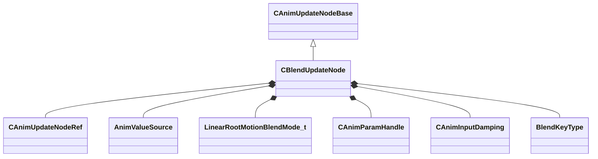

[Schemas](../../schemas.md) / [animgraphlib](../animgraphlib.md) / CBlendUpdateNode

# CBlendUpdateNode

**Kind:** class · **Size:** 224 bytes (`0xe0`) · **Align:** 8 · **Module:** animgraphlib

**Inherits from:** [CAnimUpdateNodeBase](../animgraphlib/CAnimUpdateNodeBase.md)

**Relationships:**

## Memory layout

16 fields (13 declared here, 3 inherited). Offsets are absolute from the object base.

| Offset | Field | Type | From | Annotations |
|--------|-------|------|------|-------------|
| `0x18` | `m_nodePath` | [CAnimNodePath](../animgraphlib/CAnimNodePath.md) | [CAnimUpdateNodeBase](../animgraphlib/CAnimUpdateNodeBase.md) |  |
| `0x48` | `m_networkMode` | [AnimNodeNetworkMode](../!GlobalTypes/AnimNodeNetworkMode.md) | [CAnimUpdateNodeBase](../animgraphlib/CAnimUpdateNodeBase.md) |  |
| `0x50` | `m_name` | CUtlString | [CAnimUpdateNodeBase](../animgraphlib/CAnimUpdateNodeBase.md) |  |
| `0x60` | `m_children` | CUtlVector< [CAnimUpdateNodeRef](../animgraphlib/CAnimUpdateNodeRef.md) > |  |  |
| `0x78` | `m_sortedOrder` | CUtlVector< uint8 > |  |  |
| `0x90` | `m_targetValues` | CUtlVector< float32 > |  |  |
| `0xac` | `m_blendValueSource` | [AnimValueSource](../!GlobalTypes/AnimValueSource.md) |  |  |
| `0xb0` | `m_eLinearRootMotionBlendMode` | [LinearRootMotionBlendMode_t](../!GlobalTypes/LinearRootMotionBlendMode_t.md) |  |  |
| `0xb4` | `m_paramIndex` | [CAnimParamHandle](../animgraphlib/CAnimParamHandle.md) |  |  |
| `0xb8` | `m_damping` | [CAnimInputDamping](../animgraphlib/CAnimInputDamping.md) |  |  |
| `0xd0` | `m_blendKeyType` | [BlendKeyType](../!GlobalTypes/BlendKeyType.md) |  |  |
| `0xd4` | `m_bLockBlendOnReset` | bool |  |  |
| `0xd5` | `m_bSyncCycles` | bool |  |  |
| `0xd6` | `m_bLoop` | bool |  |  |
| `0xd7` | `m_bLockWhenWaning` | bool |  |  |
| `0xd8` | `m_bIsAngle` | bool |  |  |

KV3 class defaults

<pre>{
	&quot;_class&quot;: &quot;CBlendUpdateNode&quot;,
	&quot;m_nodePath&quot;:
	{
		&quot;m_path&quot;:
		[
			{
				&quot;m_id&quot;: &lt;HIDDEN FOR DIFF&gt;,
			},
			{
				&quot;m_id&quot;: &lt;HIDDEN FOR DIFF&gt;,
			},
			{
				&quot;m_id&quot;: &lt;HIDDEN FOR DIFF&gt;,
			},
			{
				&quot;m_id&quot;: &lt;HIDDEN FOR DIFF&gt;,
			},
			{
				&quot;m_id&quot;: &lt;HIDDEN FOR DIFF&gt;,
			},
			{
				&quot;m_id&quot;: &lt;HIDDEN FOR DIFF&gt;,
			},
			{
				&quot;m_id&quot;: &lt;HIDDEN FOR DIFF&gt;,
			},
			{
				&quot;m_id&quot;: &lt;HIDDEN FOR DIFF&gt;,
			},
			{
				&quot;m_id&quot;: &lt;HIDDEN FOR DIFF&gt;,
			},
			{
				&quot;m_id&quot;: &lt;HIDDEN FOR DIFF&gt;,
			},
			{
				&quot;m_id&quot;: &lt;HIDDEN FOR DIFF&gt;,
			}
		],
		&quot;m_nCount&quot;: 0
	},
	&quot;m_networkMode&quot;: &quot;ServerAuthoritative&quot;,
	&quot;m_name&quot;: &quot;&quot;,
	&quot;m_children&quot;:
	[
	],
	&quot;m_sortedOrder&quot;:
	[
	],
	&quot;m_targetValues&quot;:
	[
	],
	&quot;m_blendValueSource&quot;: &quot;MoveHeading&quot;,
	&quot;m_eLinearRootMotionBlendMode&quot;: &quot;LERP&quot;,
	&quot;m_paramIndex&quot;:
	{
		&quot;m_type&quot;: &quot;ANIMPARAM_UNKNOWN&quot;,
		&quot;m_index&quot;: 255
	},
	&quot;m_damping&quot;:
	{
		&quot;_class&quot;: &quot;CAnimInputDamping&quot;,
		&quot;m_speedFunction&quot;: &quot;NoDamping&quot;,
		&quot;m_fSpeedScale&quot;: 1.000000,
		&quot;m_fFallingSpeedScale&quot;: 1.000000
	},
	&quot;m_blendKeyType&quot;: &quot;BlendKey_UserValue&quot;,
	&quot;m_bLockBlendOnReset&quot;: false,
	&quot;m_bSyncCycles&quot;: false,
	&quot;m_bLoop&quot;: false,
	&quot;m_bLockWhenWaning&quot;: false,
	&quot;m_bIsAngle&quot;: false
}</pre>

