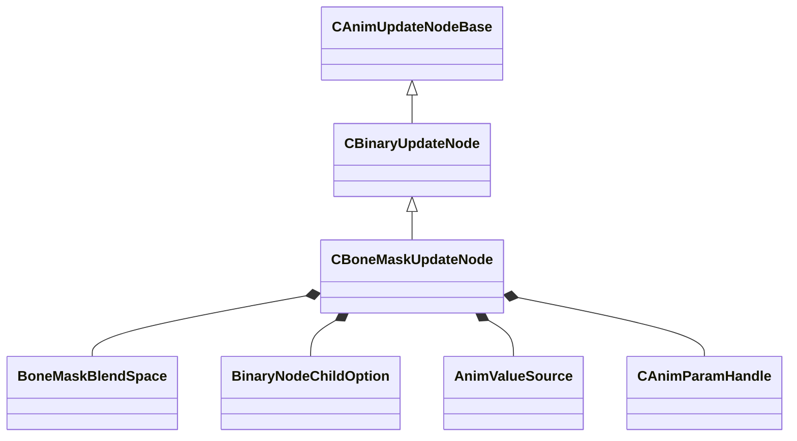

[Schemas](../../schemas.md) / [animgraphlib](../animgraphlib.md) / CBoneMaskUpdateNode

# CBoneMaskUpdateNode

**Kind:** class · **Size:** 176 bytes (`0xb0`) · **Align:** 8 · **Module:** animgraphlib

**Inherits from:** [CBinaryUpdateNode](../animgraphlib/CBinaryUpdateNode.md)

**Relationships:**

## Memory layout

16 fields (7 declared here, 9 inherited). Offsets are absolute from the object base.

| Offset | Field | Type | From | Annotations |
|--------|-------|------|------|-------------|
| `0x18` | `m_nodePath` | [CAnimNodePath](../animgraphlib/CAnimNodePath.md) | [CAnimUpdateNodeBase](../animgraphlib/CAnimUpdateNodeBase.md) |  |
| `0x48` | `m_networkMode` | [AnimNodeNetworkMode](../animgraphlib/AnimNodeNetworkMode.md) | [CAnimUpdateNodeBase](../animgraphlib/CAnimUpdateNodeBase.md) |  |
| `0x50` | `m_name` | CUtlString | [CAnimUpdateNodeBase](../animgraphlib/CAnimUpdateNodeBase.md) |  |
| `0x60` | `m_pChild1` | [CAnimUpdateNodeRef](../animgraphlib/CAnimUpdateNodeRef.md) | [CBinaryUpdateNode](../animgraphlib/CBinaryUpdateNode.md) |  |
| `0x70` | `m_pChild2` | [CAnimUpdateNodeRef](../animgraphlib/CAnimUpdateNodeRef.md) | [CBinaryUpdateNode](../animgraphlib/CBinaryUpdateNode.md) |  |
| `0x80` | `m_timingBehavior` | [BinaryNodeTiming](../animgraphlib/BinaryNodeTiming.md) | [CBinaryUpdateNode](../animgraphlib/CBinaryUpdateNode.md) |  |
| `0x84` | `m_flTimingBlend` | float32 | [CBinaryUpdateNode](../animgraphlib/CBinaryUpdateNode.md) |  |
| `0x88` | `m_bResetChild1` | bool | [CBinaryUpdateNode](../animgraphlib/CBinaryUpdateNode.md) |  |
| `0x89` | `m_bResetChild2` | bool | [CBinaryUpdateNode](../animgraphlib/CBinaryUpdateNode.md) |  |
| `0x94` | `m_nWeightListIndex` | int32 |  |  |
| `0x98` | `m_flRootMotionBlend` | float32 |  |  |
| `0x9c` | `m_blendSpace` | [BoneMaskBlendSpace](../animgraphlib/BoneMaskBlendSpace.md) |  |  |
| `0xa0` | `m_footMotionTiming` | [BinaryNodeChildOption](../animgraphlib/BinaryNodeChildOption.md) |  |  |
| `0xa4` | `m_bUseBlendScale` | bool |  |  |
| `0xa8` | `m_blendValueSource` | [AnimValueSource](../animgraphlib/AnimValueSource.md) |  |  |
| `0xac` | `m_hBlendParameter` | [CAnimParamHandle](../animgraphlib/CAnimParamHandle.md) |  |  |

KV3 class defaults

<pre>{
	&quot;_class&quot;: &quot;CBoneMaskUpdateNode&quot;,
	&quot;m_nodePath&quot;:
	{
		&quot;m_path&quot;:
		[
			{
				&quot;m_id&quot;: &lt;HIDDEN FOR DIFF&gt;,
			},
			{
				&quot;m_id&quot;: &lt;HIDDEN FOR DIFF&gt;,
			},
			{
				&quot;m_id&quot;: &lt;HIDDEN FOR DIFF&gt;,
			},
			{
				&quot;m_id&quot;: &lt;HIDDEN FOR DIFF&gt;,
			},
			{
				&quot;m_id&quot;: &lt;HIDDEN FOR DIFF&gt;,
			},
			{
				&quot;m_id&quot;: &lt;HIDDEN FOR DIFF&gt;,
			},
			{
				&quot;m_id&quot;: &lt;HIDDEN FOR DIFF&gt;,
			},
			{
				&quot;m_id&quot;: &lt;HIDDEN FOR DIFF&gt;,
			},
			{
				&quot;m_id&quot;: &lt;HIDDEN FOR DIFF&gt;,
			},
			{
				&quot;m_id&quot;: &lt;HIDDEN FOR DIFF&gt;,
			},
			{
				&quot;m_id&quot;: &lt;HIDDEN FOR DIFF&gt;,
			}
		],
		&quot;m_nCount&quot;: 0
	},
	&quot;m_networkMode&quot;: &quot;ServerAuthoritative&quot;,
	&quot;m_name&quot;: &quot;&quot;,
	&quot;m_pChild1&quot;:
	{
		&quot;m_nodeIndex&quot;: -1
	},
	&quot;m_pChild2&quot;:
	{
		&quot;m_nodeIndex&quot;: -1
	},
	&quot;m_timingBehavior&quot;: &quot;UseChild1&quot;,
	&quot;m_flTimingBlend&quot;: 0.500000,
	&quot;m_bResetChild1&quot;: true,
	&quot;m_bResetChild2&quot;: true,
	&quot;m_nWeightListIndex&quot;: 0,
	&quot;m_flRootMotionBlend&quot;: 0.000000,
	&quot;m_blendSpace&quot;: &quot;BlendSpace_Parent&quot;,
	&quot;m_footMotionTiming&quot;: &quot;Child1&quot;,
	&quot;m_bUseBlendScale&quot;: false,
	&quot;m_blendValueSource&quot;: &quot;MoveHeading&quot;,
	&quot;m_hBlendParameter&quot;:
	{
		&quot;m_type&quot;: &quot;ANIMPARAM_UNKNOWN&quot;,
		&quot;m_index&quot;: 255
	}
}</pre>

