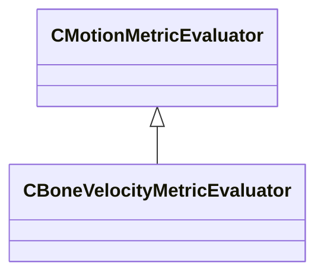

[Schemas](../../schemas.md) / [animgraphlib](../animgraphlib.md) / CBoneVelocityMetricEvaluator

# CBoneVelocityMetricEvaluator

**Kind:** class · **Size:** 88 bytes (`0x58`) · **Align:** 8 · **Module:** animgraphlib

**Inherits from:** [CMotionMetricEvaluator](../animgraphlib/CMotionMetricEvaluator.md)

**Relationships:**

## Memory layout

5 fields (1 declared here, 4 inherited). Offsets are absolute from the object base.

| Offset | Field | Type | From | Annotations |
|--------|-------|------|------|-------------|
| `0x18` | `m_means` | CUtlVector< float32 > | [CMotionMetricEvaluator](../animgraphlib/CMotionMetricEvaluator.md) |  |
| `0x30` | `m_standardDeviations` | CUtlVector< float32 > | [CMotionMetricEvaluator](../animgraphlib/CMotionMetricEvaluator.md) |  |
| `0x48` | `m_flWeight` | float32 | [CMotionMetricEvaluator](../animgraphlib/CMotionMetricEvaluator.md) |  |
| `0x4c` | `m_nDimensionStartIndex` | int32 | [CMotionMetricEvaluator](../animgraphlib/CMotionMetricEvaluator.md) |  |
| `0x50` | `m_nBoneIndex` | int32 |  |  |

KV3 class defaults

<pre>{
	&quot;_class&quot;: &quot;CBoneVelocityMetricEvaluator&quot;,
	&quot;m_means&quot;:
	[
	],
	&quot;m_standardDeviations&quot;:
	[
	],
	&quot;m_flWeight&quot;: 0.000000,
	&quot;m_nDimensionStartIndex&quot;: -1,
	&quot;m_nBoneIndex&quot;: -1
}</pre>

