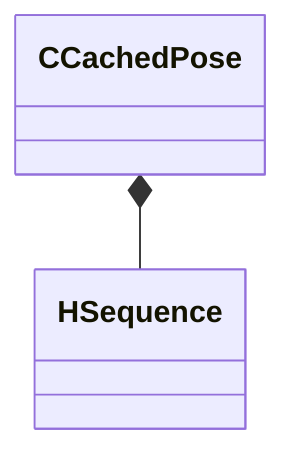

[Schemas](../../schemas.md) / [animgraphlib](../animgraphlib.md) / CCachedPose

# CCachedPose

> Source: **Build 25000182** · 2026-08-28 · `windows-x86_64` · schema `0.10.0`

**Kind:** class · **Size:** 64 bytes (`0x40`) · **Align:** 8 · **Module:** animgraphlib

**Relationships:**

## Memory layout

4 fields (4 declared here, 0 inherited). Offsets are absolute from the object base.

| Offset | Field | Type | From | Annotations |
|--------|-------|------|------|-------------|
| `0x8` | `m_transforms` | CUtlVector< CTransform > |  |  |
| `0x20` | `m_morphWeights` | CUtlVector< float32 > |  |  |
| `0x38` | `m_hSequence` | [HSequence](../animationsystem/HSequence.md) |  |  |
| `0x3c` | `m_flCycle` | float32 |  |  |

KV3 class defaults

<pre>{
	&quot;_class&quot;: &quot;CCachedPose&quot;,
	&quot;m_transforms&quot;:
	[
	],
	&quot;m_morphWeights&quot;:
	[
	],
	&quot;m_hSequence&quot;: -1,
	&quot;m_flCycle&quot;: 0.000000
}</pre>

