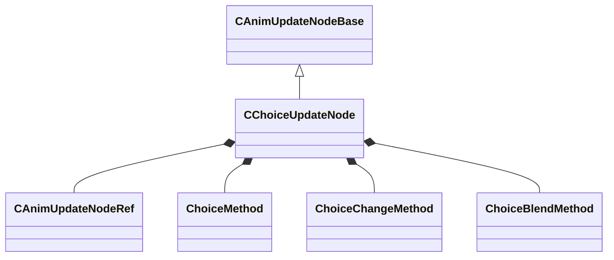

[Schemas](../../schemas.md) / [animgraphlib](../animgraphlib.md) / CChoiceUpdateNode

# CChoiceUpdateNode

**Kind:** class · **Size:** 192 bytes (`0xc0`) · **Align:** 8 · **Module:** animgraphlib

**Inherits from:** [CAnimUpdateNodeBase](../animgraphlib/CAnimUpdateNodeBase.md)

**Relationships:**

## Memory layout

13 fields (10 declared here, 3 inherited). Offsets are absolute from the object base.

| Offset | Field | Type | From | Annotations |
|--------|-------|------|------|-------------|
| `0x18` | `m_nodePath` | [CAnimNodePath](../animgraphlib/CAnimNodePath.md) | [CAnimUpdateNodeBase](../animgraphlib/CAnimUpdateNodeBase.md) |  |
| `0x48` | `m_networkMode` | [AnimNodeNetworkMode](../!GlobalTypes/AnimNodeNetworkMode.md) | [CAnimUpdateNodeBase](../animgraphlib/CAnimUpdateNodeBase.md) |  |
| `0x50` | `m_name` | CUtlString | [CAnimUpdateNodeBase](../animgraphlib/CAnimUpdateNodeBase.md) |  |
| `0x60` | `m_children` | CUtlVector< [CAnimUpdateNodeRef](../animgraphlib/CAnimUpdateNodeRef.md) > |  |  |
| `0x78` | `m_weights` | CUtlVector< float32 > |  |  |
| `0x90` | `m_blendTimes` | CUtlVector< float32 > |  |  |
| `0xa8` | `m_choiceMethod` | [ChoiceMethod](../!GlobalTypes/ChoiceMethod.md) |  |  |
| `0xac` | `m_choiceChangeMethod` | [ChoiceChangeMethod](../!GlobalTypes/ChoiceChangeMethod.md) |  |  |
| `0xb0` | `m_blendMethod` | [ChoiceBlendMethod](../!GlobalTypes/ChoiceBlendMethod.md) |  |  |
| `0xb4` | `m_blendTime` | float32 |  |  |
| `0xb8` | `m_bCrossFade` | bool |  |  |
| `0xb9` | `m_bResetChosen` | bool |  |  |
| `0xba` | `m_bDontResetSameSelection` | bool |  |  |

KV3 class defaults

<pre>{
	&quot;_class&quot;: &quot;CChoiceUpdateNode&quot;,
	&quot;m_nodePath&quot;:
	{
		&quot;m_path&quot;:
		[
			{
				&quot;m_id&quot;: &lt;HIDDEN FOR DIFF&gt;,
			},
			{
				&quot;m_id&quot;: &lt;HIDDEN FOR DIFF&gt;,
			},
			{
				&quot;m_id&quot;: &lt;HIDDEN FOR DIFF&gt;,
			},
			{
				&quot;m_id&quot;: &lt;HIDDEN FOR DIFF&gt;,
			},
			{
				&quot;m_id&quot;: &lt;HIDDEN FOR DIFF&gt;,
			},
			{
				&quot;m_id&quot;: &lt;HIDDEN FOR DIFF&gt;,
			},
			{
				&quot;m_id&quot;: &lt;HIDDEN FOR DIFF&gt;,
			},
			{
				&quot;m_id&quot;: &lt;HIDDEN FOR DIFF&gt;,
			},
			{
				&quot;m_id&quot;: &lt;HIDDEN FOR DIFF&gt;,
			},
			{
				&quot;m_id&quot;: &lt;HIDDEN FOR DIFF&gt;,
			},
			{
				&quot;m_id&quot;: &lt;HIDDEN FOR DIFF&gt;,
			}
		],
		&quot;m_nCount&quot;: 0
	},
	&quot;m_networkMode&quot;: &quot;ServerAuthoritative&quot;,
	&quot;m_name&quot;: &quot;&quot;,
	&quot;m_children&quot;:
	[
	],
	&quot;m_weights&quot;:
	[
	],
	&quot;m_blendTimes&quot;:
	[
	],
	&quot;m_choiceMethod&quot;: &quot;WeightedRandom&quot;,
	&quot;m_choiceChangeMethod&quot;: &quot;OnReset&quot;,
	&quot;m_blendMethod&quot;: &quot;SingleBlendTime&quot;,
	&quot;m_blendTime&quot;: 0.000000,
	&quot;m_bCrossFade&quot;: false,
	&quot;m_bResetChosen&quot;: false,
	&quot;m_bDontResetSameSelection&quot;: false
}</pre>

