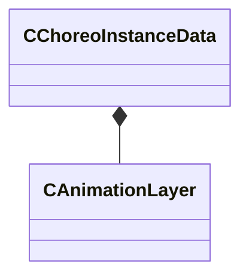

[Schemas](../../schemas.md) / [animgraphlib](../animgraphlib.md) / CChoreoInstanceData

# CChoreoInstanceData

> Source: **Build 25000182** · 2026-08-28 · `windows-x86_64` · schema `0.10.0`

**Kind:** class · **Size:** 920 bytes (`0x398`) · **Align:** 4 · **Module:** animgraphlib

**Relationships:**

## Memory layout

1 field (1 declared here, 0 inherited). Offsets are absolute from the object base.

| Offset | Field | Type | From | Annotations |
|--------|-------|------|------|-------------|
| `0x0` | `m_AnimOverlay` | [CAnimationLayer](../animgraphlib/CAnimationLayer.md)[12] |  |  |

KV3 class defaults

<pre>{
	&quot;m_AnimOverlay&quot;:
	[
		{
			&quot;m_hSequence&quot;: 0,
			&quot;m_flPrevCycle&quot;: 0.000000,
			&quot;m_flCycle&quot;: 0.000000,
			&quot;m_flWeight&quot;: 0.000000,
			&quot;m_nOrder&quot;: 12,
			&quot;m_bLooping&quot;: false,
			&quot;m_nFlags&quot;: 0,
			&quot;m_bSequenceFinished&quot;: false,
			&quot;m_flKillRate&quot;: 100.000000,
			&quot;m_flKillDelay&quot;: 0.000000,
			&quot;m_nPriority&quot;: 0
		},
		{
			&quot;m_hSequence&quot;: 0,
			&quot;m_flPrevCycle&quot;: 0.000000,
			&quot;m_flCycle&quot;: 0.000000,
			&quot;m_flWeight&quot;: 0.000000,
			&quot;m_nOrder&quot;: 12,
			&quot;m_bLooping&quot;: false,
			&quot;m_nFlags&quot;: 0,
			&quot;m_bSequenceFinished&quot;: false,
			&quot;m_flKillRate&quot;: 100.000000,
			&quot;m_flKillDelay&quot;: 0.000000,
			&quot;m_nPriority&quot;: 0
		},
		{
			&quot;m_hSequence&quot;: 0,
			&quot;m_flPrevCycle&quot;: 0.000000,
			&quot;m_flCycle&quot;: 0.000000,
			&quot;m_flWeight&quot;: 0.000000,
			&quot;m_nOrder&quot;: 12,
			&quot;m_bLooping&quot;: false,
			&quot;m_nFlags&quot;: 0,
			&quot;m_bSequenceFinished&quot;: false,
			&quot;m_flKillRate&quot;: 100.000000,
			&quot;m_flKillDelay&quot;: 0.000000,
			&quot;m_nPriority&quot;: 0
		},
		{
			&quot;m_hSequence&quot;: 0,
			&quot;m_flPrevCycle&quot;: 0.000000,
			&quot;m_flCycle&quot;: 0.000000,
			&quot;m_flWeight&quot;: 0.000000,
			&quot;m_nOrder&quot;: 12,
			&quot;m_bLooping&quot;: false,
			&quot;m_nFlags&quot;: 0,
			&quot;m_bSequenceFinished&quot;: false,
			&quot;m_flKillRate&quot;: 100.000000,
			&quot;m_flKillDelay&quot;: 0.000000,
			&quot;m_nPriority&quot;: 0
		},
		{
			&quot;m_hSequence&quot;: 0,
			&quot;m_flPrevCycle&quot;: 0.000000,
			&quot;m_flCycle&quot;: 0.000000,
			&quot;m_flWeight&quot;: 0.000000,
			&quot;m_nOrder&quot;: 12,
			&quot;m_bLooping&quot;: false,
			&quot;m_nFlags&quot;: 0,
			&quot;m_bSequenceFinished&quot;: false,
			&quot;m_flKillRate&quot;: 100.000000,
			&quot;m_flKillDelay&quot;: 0.000000,
			&quot;m_nPriority&quot;: 0
		},
		{
			&quot;m_hSequence&quot;: 0,
			&quot;m_flPrevCycle&quot;: 0.000000,
			&quot;m_flCycle&quot;: 0.000000,
			&quot;m_flWeight&quot;: 0.000000,
			&quot;m_nOrder&quot;: 12,
			&quot;m_bLooping&quot;: false,
			&quot;m_nFlags&quot;: 0,
			&quot;m_bSequenceFinished&quot;: false,
			&quot;m_flKillRate&quot;: 100.000000,
			&quot;m_flKillDelay&quot;: 0.000000,
			&quot;m_nPriority&quot;: 0
		},
		{
			&quot;m_hSequence&quot;: 0,
			&quot;m_flPrevCycle&quot;: 0.000000,
			&quot;m_flCycle&quot;: 0.000000,
			&quot;m_flWeight&quot;: 0.000000,
			&quot;m_nOrder&quot;: 12,
			&quot;m_bLooping&quot;: false,
			&quot;m_nFlags&quot;: 0,
			&quot;m_bSequenceFinished&quot;: false,
			&quot;m_flKillRate&quot;: 100.000000,
			&quot;m_flKillDelay&quot;: 0.000000,
			&quot;m_nPriority&quot;: 0
		},
		{
			&quot;m_hSequence&quot;: 0,
			&quot;m_flPrevCycle&quot;: 0.000000,
			&quot;m_flCycle&quot;: 0.000000,
			&quot;m_flWeight&quot;: 0.000000,
			&quot;m_nOrder&quot;: 12,
			&quot;m_bLooping&quot;: false,
			&quot;m_nFlags&quot;: 0,
			&quot;m_bSequenceFinished&quot;: false,
			&quot;m_flKillRate&quot;: 100.000000,
			&quot;m_flKillDelay&quot;: 0.000000,
			&quot;m_nPriority&quot;: 0
		},
		{
			&quot;m_hSequence&quot;: 0,
			&quot;m_flPrevCycle&quot;: 0.000000,
			&quot;m_flCycle&quot;: 0.000000,
			&quot;m_flWeight&quot;: 0.000000,
			&quot;m_nOrder&quot;: 12,
			&quot;m_bLooping&quot;: false,
			&quot;m_nFlags&quot;: 0,
			&quot;m_bSequenceFinished&quot;: false,
			&quot;m_flKillRate&quot;: 100.000000,
			&quot;m_flKillDelay&quot;: 0.000000,
			&quot;m_nPriority&quot;: 0
		},
		{
			&quot;m_hSequence&quot;: 0,
			&quot;m_flPrevCycle&quot;: 0.000000,
			&quot;m_flCycle&quot;: 0.000000,
			&quot;m_flWeight&quot;: 0.000000,
			&quot;m_nOrder&quot;: 12,
			&quot;m_bLooping&quot;: false,
			&quot;m_nFlags&quot;: 0,
			&quot;m_bSequenceFinished&quot;: false,
			&quot;m_flKillRate&quot;: 100.000000,
			&quot;m_flKillDelay&quot;: 0.000000,
			&quot;m_nPriority&quot;: 0
		},
		{
			&quot;m_hSequence&quot;: 0,
			&quot;m_flPrevCycle&quot;: 0.000000,
			&quot;m_flCycle&quot;: 0.000000,
			&quot;m_flWeight&quot;: 0.000000,
			&quot;m_nOrder&quot;: 12,
			&quot;m_bLooping&quot;: false,
			&quot;m_nFlags&quot;: 0,
			&quot;m_bSequenceFinished&quot;: false,
			&quot;m_flKillRate&quot;: 100.000000,
			&quot;m_flKillDelay&quot;: 0.000000,
			&quot;m_nPriority&quot;: 0
		},
		{
			&quot;m_hSequence&quot;: 0,
			&quot;m_flPrevCycle&quot;: 0.000000,
			&quot;m_flCycle&quot;: 0.000000,
			&quot;m_flWeight&quot;: 0.000000,
			&quot;m_nOrder&quot;: 12,
			&quot;m_bLooping&quot;: false,
			&quot;m_nFlags&quot;: 0,
			&quot;m_bSequenceFinished&quot;: false,
			&quot;m_flKillRate&quot;: 100.000000,
			&quot;m_flKillDelay&quot;: 0.000000,
			&quot;m_nPriority&quot;: 0
		}
	]
}</pre>

