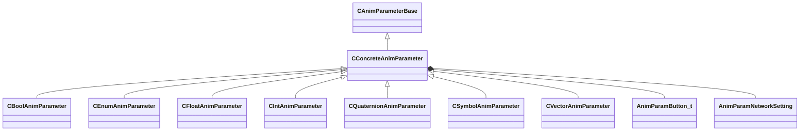

[Schemas](../../schemas.md) / [animgraphlib](../animgraphlib.md) / CConcreteAnimParameter

# CConcreteAnimParameter

> Source: **Build 25000182** · 2026-08-28 · `windows-x86_64` · schema `0.10.0`

**Kind:** class · **Size:** 128 bytes (`0x80`) · **Align:** n/a (unspecified) · **Module:** animgraphlib

**Inherits from:** [CAnimParameterBase](../animgraphlib/CAnimParameterBase.md)

**Derived by:** [CBoolAnimParameter](../animgraphlib/CBoolAnimParameter.md), [CEnumAnimParameter](../animgraphlib/CEnumAnimParameter.md), [CFloatAnimParameter](../animgraphlib/CFloatAnimParameter.md), [CIntAnimParameter](../animgraphlib/CIntAnimParameter.md), [CQuaternionAnimParameter](../animgraphlib/CQuaternionAnimParameter.md), [CSymbolAnimParameter](../animgraphlib/CSymbolAnimParameter.md), [CVectorAnimParameter](../animgraphlib/CVectorAnimParameter.md)

**Relationships:**

## Memory layout

13 fields (6 declared here, 7 inherited). Offsets are absolute from the object base.

| Offset | Field | Type | From | Annotations |
|--------|-------|------|------|-------------|
| `0x18` | `m_name` | CGlobalSymbol | [CAnimParameterBase](../animgraphlib/CAnimParameterBase.md) | `MPropertyFriendlyName Name` `MPropertySortPriority 100` |
| `0x20` | `m_sComment` | CUtlString | [CAnimParameterBase](../animgraphlib/CAnimParameterBase.md) | `MPropertyAttributeEditor TextBlock()` `MPropertyFriendlyName Comment` `MPropertySortPriority -100` |
| `0x28` | `m_group` | CUtlString | [CAnimParameterBase](../animgraphlib/CAnimParameterBase.md) | `MPropertyReadOnly` `MPropertySortPriority -90` |
| `0x30` | `m_id` | [AnimParamID](../modellib/AnimParamID.md) | [CAnimParameterBase](../animgraphlib/CAnimParameterBase.md) | `MPropertyReadOnly` `MPropertySortPriority -90` |
| `0x48` | `m_componentName` | CUtlString | [CAnimParameterBase](../animgraphlib/CAnimParameterBase.md) | `MPropertyAutoRebuildOnChange` `MPropertySuppressField` |
| `0x68` | `m_bNetworkingRequested` | bool | [CAnimParameterBase](../animgraphlib/CAnimParameterBase.md) | `MPropertySuppressField` |
| `0x69` | `m_bIsReferenced` | bool | [CAnimParameterBase](../animgraphlib/CAnimParameterBase.md) | `MPropertySuppressField` |
| `0x70` | `m_previewButton` | [AnimParamButton_t](../animgraphlib/AnimParamButton_t.md) |  | `MPropertyFriendlyName Preview Button` |
| `0x74` | `m_eNetworkSetting` | [AnimParamNetworkSetting](../animgraphlib/AnimParamNetworkSetting.md) |  | `MPropertyFriendlyName Network` |
| `0x78` | `m_bUseMostRecentValue` | bool |  | `MPropertyFriendlyName Force Latest Value` |
| `0x79` | `m_bAutoReset` | bool |  | `MPropertyFriendlyName Auto Reset` |
| `0x7a` | `m_bGameWritable` | bool |  | `MPropertyAttrStateCallback` `MPropertyFriendlyName Game Writable` `MPropertyGroupName +Permissions` |
| `0x7b` | `m_bGraphWritable` | bool |  | `MPropertyAttrStateCallback` `MPropertyFriendlyName Graph Writable` `MPropertyGroupName +Permissions` |
