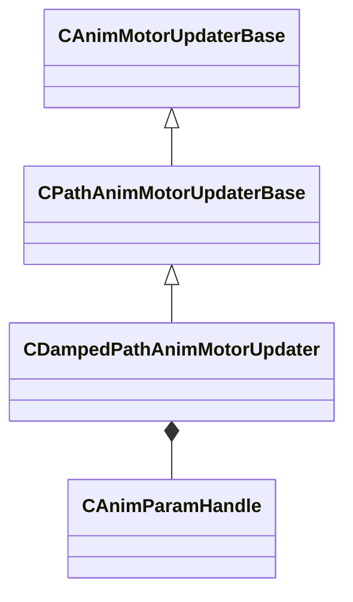

[Schemas](../../schemas.md) / [animgraphlib](../animgraphlib.md) / CDampedPathAnimMotorUpdater

# CDampedPathAnimMotorUpdater

**Kind:** class · **Size:** 72 bytes (`0x48`) · **Align:** 8 · **Module:** animgraphlib

**Inherits from:** [CPathAnimMotorUpdaterBase](../animgraphlib/CPathAnimMotorUpdaterBase.md)

**Relationships:**

## Memory layout

10 fields (7 declared here, 3 inherited). Offsets are absolute from the object base.

| Offset | Field | Type | From | Annotations |
|--------|-------|------|------|-------------|
| `0x10` | `m_name` | CUtlString | [CAnimMotorUpdaterBase](../animgraphlib/CAnimMotorUpdaterBase.md) |  |
| `0x18` | `m_bDefault` | bool | [CAnimMotorUpdaterBase](../animgraphlib/CAnimMotorUpdaterBase.md) |  |
| `0x20` | `m_bLockToPath` | bool | [CPathAnimMotorUpdaterBase](../animgraphlib/CPathAnimMotorUpdaterBase.md) |  |
| `0x2c` | `m_flAnticipationTime` | float32 |  |  |
| `0x30` | `m_flMinSpeedScale` | float32 |  |  |
| `0x34` | `m_hAnticipationPosParam` | [CAnimParamHandle](../animgraphlib/CAnimParamHandle.md) |  |  |
| `0x36` | `m_hAnticipationHeadingParam` | [CAnimParamHandle](../animgraphlib/CAnimParamHandle.md) |  |  |
| `0x38` | `m_flSpringConstant` | float32 |  |  |
| `0x3c` | `m_flMinSpringTension` | float32 |  |  |
| `0x40` | `m_flMaxSpringTension` | float32 |  |  |

KV3 class defaults

<pre>{
	&quot;_class&quot;: &quot;CDampedPathAnimMotorUpdater&quot;,
	&quot;m_name&quot;: &quot;&quot;,
	&quot;m_bDefault&quot;: false,
	&quot;m_bLockToPath&quot;: false,
	&quot;m_flAnticipationTime&quot;: 1.000000,
	&quot;m_flMinSpeedScale&quot;: 0.250000,
	&quot;m_hAnticipationPosParam&quot;:
	{
		&quot;m_type&quot;: &quot;ANIMPARAM_UNKNOWN&quot;,
		&quot;m_index&quot;: 255
	},
	&quot;m_hAnticipationHeadingParam&quot;:
	{
		&quot;m_type&quot;: &quot;ANIMPARAM_UNKNOWN&quot;,
		&quot;m_index&quot;: 255
	},
	&quot;m_flSpringConstant&quot;: 10.000000,
	&quot;m_flMinSpringTension&quot;: 1.000000,
	&quot;m_flMaxSpringTension&quot;: 100.000000
}</pre>

