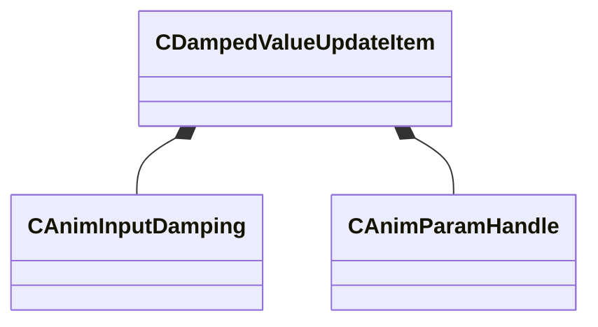

[Schemas](../../schemas.md) / [animgraphlib](../animgraphlib.md) / CDampedValueUpdateItem

# CDampedValueUpdateItem

> Source: **Build 25000182** · 2026-08-28 · `windows-x86_64` · schema `0.10.0`

**Kind:** class · **Size:** 40 bytes (`0x28`) · **Align:** 8 · **Module:** animgraphlib

**Relationships:**

## Memory layout

3 fields (3 declared here, 0 inherited). Offsets are absolute from the object base.

| Offset | Field | Type | From | Annotations |
|--------|-------|------|------|-------------|
| `0x0` | `m_damping` | [CAnimInputDamping](../animgraphlib/CAnimInputDamping.md) |  |  |
| `0x20` | `m_hParamIn` | [CAnimParamHandle](../animgraphlib/CAnimParamHandle.md) |  |  |
| `0x22` | `m_hParamOut` | [CAnimParamHandle](../animgraphlib/CAnimParamHandle.md) |  |  |

KV3 class defaults

<pre>{
	&quot;m_damping&quot;:
	{
		&quot;_class&quot;: &quot;CAnimInputDamping&quot;,
		&quot;m_speedFunction&quot;: &quot;NoDamping&quot;,
		&quot;m_fSpeedScale&quot;: 1.000000,
		&quot;m_fFallingSpeedScale&quot;: 1.000000
	},
	&quot;m_hParamIn&quot;:
	{
		&quot;m_type&quot;: &quot;ANIMPARAM_UNKNOWN&quot;,
		&quot;m_index&quot;: 255
	},
	&quot;m_hParamOut&quot;:
	{
		&quot;m_type&quot;: &quot;ANIMPARAM_UNKNOWN&quot;,
		&quot;m_index&quot;: 255
	}
}</pre>

