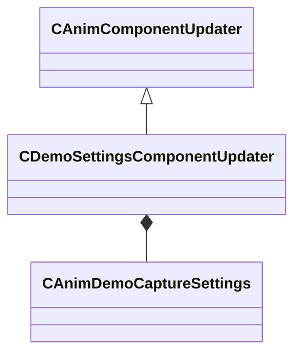

[Schemas](../../schemas.md) / [animgraphlib](../animgraphlib.md) / CDemoSettingsComponentUpdater

# CDemoSettingsComponentUpdater

**Kind:** class · **Size:** 176 bytes (`0xb0`) · **Align:** 8 · **Module:** animgraphlib

**Inherits from:** [CAnimComponentUpdater](../animgraphlib/CAnimComponentUpdater.md)

**Relationships:**

## Memory layout

5 fields (1 declared here, 4 inherited). Offsets are absolute from the object base.

| Offset | Field | Type | From | Annotations |
|--------|-------|------|------|-------------|
| `0x18` | `m_name` | CUtlString | [CAnimComponentUpdater](../animgraphlib/CAnimComponentUpdater.md) |  |
| `0x20` | `m_id` | [AnimComponentID](../modellib/AnimComponentID.md) | [CAnimComponentUpdater](../animgraphlib/CAnimComponentUpdater.md) |  |
| `0x24` | `m_networkMode` | [AnimNodeNetworkMode](../animgraphlib/AnimNodeNetworkMode.md) | [CAnimComponentUpdater](../animgraphlib/CAnimComponentUpdater.md) |  |
| `0x28` | `m_bStartEnabled` | bool | [CAnimComponentUpdater](../animgraphlib/CAnimComponentUpdater.md) |  |
| `0x30` | `m_settings` | [CAnimDemoCaptureSettings](../animgraphlib/CAnimDemoCaptureSettings.md) |  |  |

KV3 class defaults

<pre>{
	&quot;_class&quot;: &quot;CDemoSettingsComponentUpdater&quot;,
	&quot;m_name&quot;: &quot;&quot;,
	&quot;m_id&quot;:
	{
		&quot;m_id&quot;: &lt;HIDDEN FOR DIFF&gt;,
	},
	&quot;m_networkMode&quot;: &quot;ServerAuthoritative&quot;,
	&quot;m_bStartEnabled&quot;: false,
	&quot;m_settings&quot;:
	{
		&quot;m_vecErrorRangeSplineRotation&quot;:
		[
			0.100000,
			0.500000
		],
		&quot;m_vecErrorRangeSplineTranslation&quot;:
		[
			0.100000,
			0.500000
		],
		&quot;m_vecErrorRangeSplineScale&quot;:
		[
			0.100000,
			0.500000
		],
		&quot;m_flIkRotation_MaxSplineError&quot;: 0.030000,
		&quot;m_flIkTranslation_MaxSplineError&quot;: 0.300000,
		&quot;m_vecErrorRangeQuantizationRotation&quot;:
		[
			0.100000,
			0.500000
		],
		&quot;m_vecErrorRangeQuantizationTranslation&quot;:
		[
			0.100000,
			0.500000
		],
		&quot;m_vecErrorRangeQuantizationScale&quot;:
		[
			0.100000,
			0.500000
		],
		&quot;m_flIkRotation_MaxQuantizationError&quot;: 0.010000,
		&quot;m_flIkTranslation_MaxQuantizationError&quot;: 0.100000,
		&quot;m_baseSequence&quot;: &quot;&quot;,
		&quot;m_nBaseSequenceFrame&quot;: 0,
		&quot;m_boneSelectionMode&quot;: &quot;CaptureSelectedBones&quot;,
		&quot;m_bones&quot;:
		[
		],
		&quot;m_ikChains&quot;:
		[
		]
	}
}</pre>

