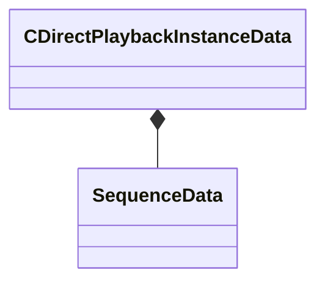

[Schemas](../../schemas.md) / [animgraphlib](../animgraphlib.md) / CDirectPlaybackInstanceData

# CDirectPlaybackInstanceData

**Kind:** class · **Size:** 328 bytes (`0x148`) · **Align:** 8 · **Module:** animgraphlib

**Relationships:**

## Memory layout

12 fields (12 declared here, 0 inherited). Offsets are absolute from the object base.

| Offset | Field | Type | From | Annotations |
|--------|-------|------|------|-------------|
| `0x0` | `m_vTargetPosition` | Vector |  |  |
| `0xc` | `m_flTargetFacing` | float32 |  |  |
| `0x10` | `m_flInterpEndTime` | float32 |  |  |
| `0x14` | `m_weights` | float32[4] |  |  |
| `0x24` | `m_sequences` | [SequenceData](../animgraphlib/SequenceData.md)[4] |  |  |
| `0x104` | `m_currentSequenceIndex` | uint32 |  |  |
| `0x108` | `m_currentSequenceData` | CAnimNetVar< uint64 > |  |  |
| `0x118` | `m_flFadeInTime` | float32 |  |  |
| `0x11c` | `m_flFadeOutTime` | float32 |  |  |
| `0x120` | `m_flForcedCycle` | CAnimNetVar< float32 > |  |  |
| `0x130` | `m_bResetPending` | bool |  |  |
| `0x138` | `m_SequenceCycleZeroTime` | CAnimNetVar< float32 > |  |  |

KV3 class defaults

<pre>{
	&quot;m_vTargetPosition&quot;:
	[
		0.000000,
		0.000000,
		0.000000
	],
	&quot;m_flTargetFacing&quot;: 0.000000,
	&quot;m_flInterpEndTime&quot;: -1.000000,
	&quot;m_weights&quot;:
	[
		0.000000,
		0.000000,
		0.000000,
		0.000000
	],
	&quot;m_sequences&quot;:
	[
		{
			&quot;m_hSequence&quot;: -1,
			&quot;m_cycle&quot;:
			{
				&quot;m_flCycleUnclamped&quot;: 0.000000,
				&quot;m_flPrevCycleUnclamped&quot;: 0.000000,
				&quot;m_flCyclesPerSecond&quot;: 1.000000,
				&quot;m_flCycleZeroTime&quot;: 0.000000,
				&quot;m_resetCount&quot;: 0
			}
		},
		{
			&quot;m_hSequence&quot;: -1,
			&quot;m_cycle&quot;:
			{
				&quot;m_flCycleUnclamped&quot;: 0.000000,
				&quot;m_flPrevCycleUnclamped&quot;: 0.000000,
				&quot;m_flCyclesPerSecond&quot;: 1.000000,
				&quot;m_flCycleZeroTime&quot;: 0.000000,
				&quot;m_resetCount&quot;: 0
			}
		},
		{
			&quot;m_hSequence&quot;: -1,
			&quot;m_cycle&quot;:
			{
				&quot;m_flCycleUnclamped&quot;: 0.000000,
				&quot;m_flPrevCycleUnclamped&quot;: 0.000000,
				&quot;m_flCyclesPerSecond&quot;: 1.000000,
				&quot;m_flCycleZeroTime&quot;: 0.000000,
				&quot;m_resetCount&quot;: 0
			}
		},
		{
			&quot;m_hSequence&quot;: -1,
			&quot;m_cycle&quot;:
			{
				&quot;m_flCycleUnclamped&quot;: 0.000000,
				&quot;m_flPrevCycleUnclamped&quot;: 0.000000,
				&quot;m_flCyclesPerSecond&quot;: 1.000000,
				&quot;m_flCycleZeroTime&quot;: 0.000000,
				&quot;m_resetCount&quot;: 0
			}
		}
	],
	&quot;m_currentSequenceIndex&quot;: 0,
	&quot;m_currentSequenceData&quot;: 0,
	&quot;m_flFadeInTime&quot;: 0.200000,
	&quot;m_flFadeOutTime&quot;: 0.200000,
	&quot;m_flForcedCycle&quot;: -1.000000,
	&quot;m_bResetPending&quot;: false,
	&quot;m_SequenceCycleZeroTime&quot;: 0.000000
}</pre>

