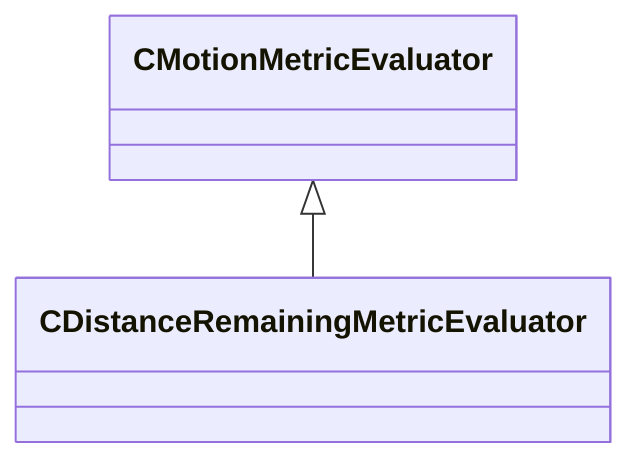

[Schemas](../../schemas.md) / [animgraphlib](../animgraphlib.md) / CDistanceRemainingMetricEvaluator

# CDistanceRemainingMetricEvaluator

> Source: **Build 25000182** · 2026-08-28 · `windows-x86_64` · schema `0.10.0`

**Kind:** class · **Size:** 104 bytes (`0x68`) · **Align:** 8 · **Module:** animgraphlib

**Inherits from:** [CMotionMetricEvaluator](../animgraphlib/CMotionMetricEvaluator.md)

**Relationships:**

## Memory layout

11 fields (7 declared here, 4 inherited). Offsets are absolute from the object base.

| Offset | Field | Type | From | Annotations |
|--------|-------|------|------|-------------|
| `0x18` | `m_means` | CUtlVector< float32 > | [CMotionMetricEvaluator](../animgraphlib/CMotionMetricEvaluator.md) |  |
| `0x30` | `m_standardDeviations` | CUtlVector< float32 > | [CMotionMetricEvaluator](../animgraphlib/CMotionMetricEvaluator.md) |  |
| `0x48` | `m_flWeight` | float32 | [CMotionMetricEvaluator](../animgraphlib/CMotionMetricEvaluator.md) |  |
| `0x4c` | `m_nDimensionStartIndex` | int32 | [CMotionMetricEvaluator](../animgraphlib/CMotionMetricEvaluator.md) |  |
| `0x50` | `m_flMaxDistance` | float32 |  |  |
| `0x54` | `m_flMinDistance` | float32 |  |  |
| `0x58` | `m_flStartGoalFilterDistance` | float32 |  |  |
| `0x5c` | `m_flMaxGoalOvershootScale` | float32 |  |  |
| `0x60` | `m_bFilterFixedMinDistance` | bool |  |  |
| `0x61` | `m_bFilterGoalDistance` | bool |  |  |
| `0x62` | `m_bFilterGoalOvershoot` | bool |  |  |

KV3 class defaults

<pre>{
	&quot;_class&quot;: &quot;CDistanceRemainingMetricEvaluator&quot;,
	&quot;m_means&quot;:
	[
	],
	&quot;m_standardDeviations&quot;:
	[
	],
	&quot;m_flWeight&quot;: 0.000000,
	&quot;m_nDimensionStartIndex&quot;: -1,
	&quot;m_flMaxDistance&quot;: 0.000000,
	&quot;m_flMinDistance&quot;: 0.000000,
	&quot;m_flStartGoalFilterDistance&quot;: 0.000000,
	&quot;m_flMaxGoalOvershootScale&quot;: 0.000000,
	&quot;m_bFilterFixedMinDistance&quot;: false,
	&quot;m_bFilterGoalDistance&quot;: false,
	&quot;m_bFilterGoalOvershoot&quot;: false
}</pre>

