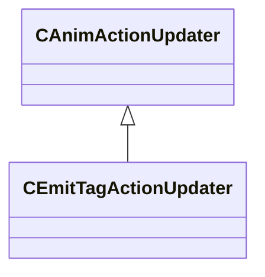

[Schemas](../../schemas.md) / [animgraphlib](../animgraphlib.md) / CEmitTagActionUpdater

# CEmitTagActionUpdater

> Source: **Build 25000182** · 2026-08-28 · `windows-x86_64` · schema `0.10.0`

**Kind:** class · **Size:** 32 bytes (`0x20`) · **Align:** 8 · **Module:** animgraphlib

**Inherits from:** [CAnimActionUpdater](../animgraphlib/CAnimActionUpdater.md)

**Relationships:**

## Memory layout

2 fields (2 declared here, 0 inherited). Offsets are absolute from the object base.

| Offset | Field | Type | From | Annotations |
|--------|-------|------|------|-------------|
| `0x18` | `m_nTagIndex` | int32 |  |  |
| `0x1c` | `m_bIsZeroDuration` | bool |  |  |

KV3 class defaults

<pre>{
	&quot;_class&quot;: &quot;CEmitTagActionUpdater&quot;,
	&quot;m_nTagIndex&quot;: -1,
	&quot;m_bIsZeroDuration&quot;: false
}</pre>

