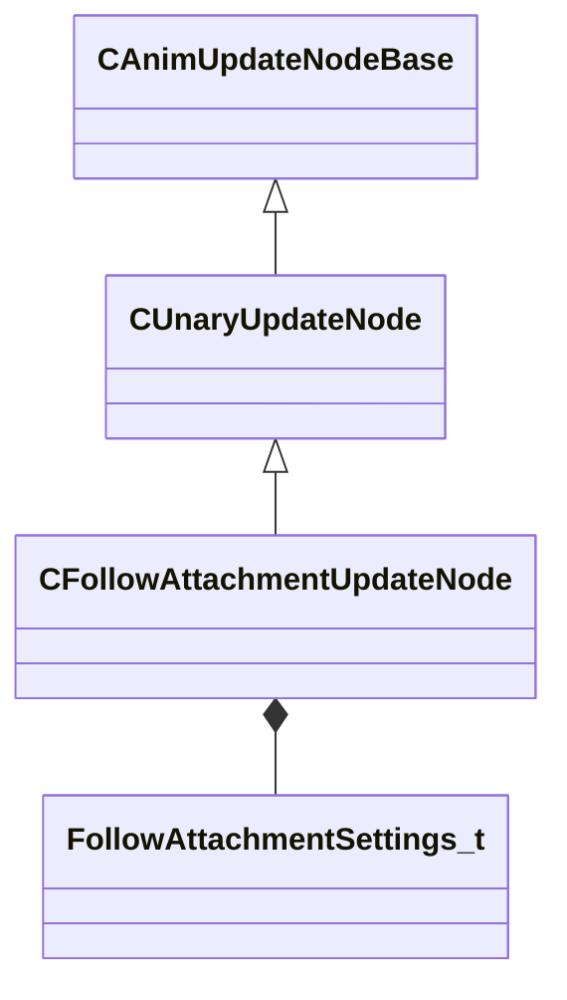

[Schemas](../../schemas.md) / [animgraphlib](../animgraphlib.md) / CFollowAttachmentUpdateNode

# CFollowAttachmentUpdateNode

**Kind:** class · **Size:** 272 bytes (`0x110`) · **Align:** 16 · **Module:** animgraphlib

**Inherits from:** [CUnaryUpdateNode](../animgraphlib/CUnaryUpdateNode.md)

**Relationships:**

## Memory layout

5 fields (1 declared here, 4 inherited). Offsets are absolute from the object base.

| Offset | Field | Type | From | Annotations |
|--------|-------|------|------|-------------|
| `0x18` | `m_nodePath` | [CAnimNodePath](../animgraphlib/CAnimNodePath.md) | [CAnimUpdateNodeBase](../animgraphlib/CAnimUpdateNodeBase.md) |  |
| `0x48` | `m_networkMode` | [AnimNodeNetworkMode](../!GlobalTypes/AnimNodeNetworkMode.md) | [CAnimUpdateNodeBase](../animgraphlib/CAnimUpdateNodeBase.md) |  |
| `0x50` | `m_name` | CUtlString | [CAnimUpdateNodeBase](../animgraphlib/CAnimUpdateNodeBase.md) |  |
| `0x60` | `m_pChildNode` | [CAnimUpdateNodeRef](../animgraphlib/CAnimUpdateNodeRef.md) | [CUnaryUpdateNode](../animgraphlib/CUnaryUpdateNode.md) |  |
| `0x70` | `m_opFixedData` | [FollowAttachmentSettings_t](../animgraphlib/FollowAttachmentSettings_t.md) |  |  |

KV3 class defaults

<pre>{
	&quot;_class&quot;: &quot;CFollowAttachmentUpdateNode&quot;,
	&quot;m_nodePath&quot;:
	{
		&quot;m_path&quot;:
		[
			{
				&quot;m_id&quot;: &lt;HIDDEN FOR DIFF&gt;,
			},
			{
				&quot;m_id&quot;: &lt;HIDDEN FOR DIFF&gt;,
			},
			{
				&quot;m_id&quot;: &lt;HIDDEN FOR DIFF&gt;,
			},
			{
				&quot;m_id&quot;: &lt;HIDDEN FOR DIFF&gt;,
			},
			{
				&quot;m_id&quot;: &lt;HIDDEN FOR DIFF&gt;,
			},
			{
				&quot;m_id&quot;: &lt;HIDDEN FOR DIFF&gt;,
			},
			{
				&quot;m_id&quot;: &lt;HIDDEN FOR DIFF&gt;,
			},
			{
				&quot;m_id&quot;: &lt;HIDDEN FOR DIFF&gt;,
			},
			{
				&quot;m_id&quot;: &lt;HIDDEN FOR DIFF&gt;,
			},
			{
				&quot;m_id&quot;: &lt;HIDDEN FOR DIFF&gt;,
			},
			{
				&quot;m_id&quot;: &lt;HIDDEN FOR DIFF&gt;,
			}
		],
		&quot;m_nCount&quot;: 0
	},
	&quot;m_networkMode&quot;: &quot;ServerAuthoritative&quot;,
	&quot;m_name&quot;: &quot;&quot;,
	&quot;m_pChildNode&quot;:
	{
		&quot;m_nodeIndex&quot;: -1
	},
	&quot;m_opFixedData&quot;:
	{
		&quot;m_attachment&quot;:
		{
			&quot;m_influenceRotations&quot;:
			[
				[
					0.000000,
					0.000000,
					0.000000,
					0.000000
				],
				[
					0.000000,
					0.000000,
					0.000000,
					0.000000
				],
				[
					0.000000,
					0.000000,
					0.000000,
					0.000000
				]
			],
			&quot;m_influenceOffsets&quot;:
			[
				[
					0.000000,
					0.000000,
					0.000000
				],
				[
					0.000000,
					0.000000,
					0.000000
				],
				[
					0.000000,
					0.000000,
					0.000000
				]
			],
			&quot;m_influenceIndices&quot;:
			[
				0,
				0,
				0
			],
			&quot;m_influenceWeights&quot;:
			[
				0.000000,
				0.000000,
				0.000000
			],
			&quot;m_numInfluences&quot;: 0
		},
		&quot;m_boneIndex&quot;: -1,
		&quot;m_attachmentHandle&quot;: 0,
		&quot;m_bMatchTranslation&quot;: false,
		&quot;m_bMatchRotation&quot;: false
	}
}</pre>

