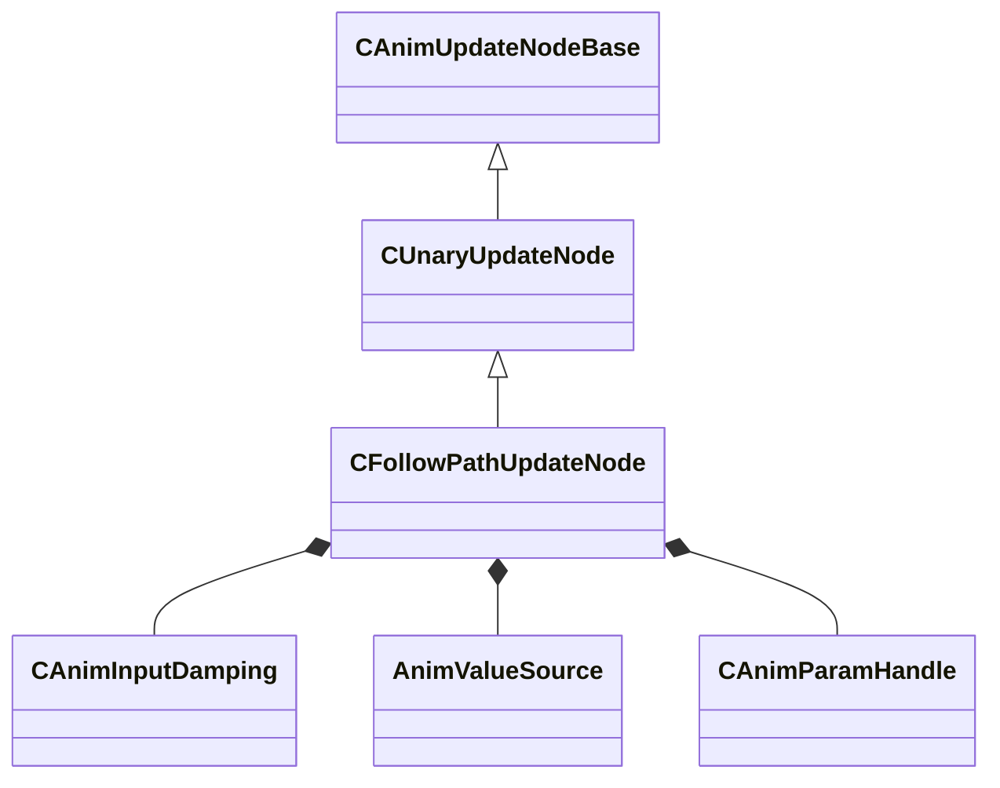

[Schemas](../../schemas.md) / [animgraphlib](../animgraphlib.md) / CFollowPathUpdateNode

# CFollowPathUpdateNode

> Source: **Build 25000182** · 2026-08-28 · `windows-x86_64` · schema `0.10.0`

**Kind:** class · **Size:** 184 bytes (`0xb8`) · **Align:** 8 · **Module:** animgraphlib

**Inherits from:** [CUnaryUpdateNode](../animgraphlib/CUnaryUpdateNode.md)

**Relationships:**

## Memory layout

17 fields (13 declared here, 4 inherited). Offsets are absolute from the object base.

| Offset | Field | Type | From | Annotations |
|--------|-------|------|------|-------------|
| `0x18` | `m_nodePath` | [CAnimNodePath](../animgraphlib/CAnimNodePath.md) | [CAnimUpdateNodeBase](../animgraphlib/CAnimUpdateNodeBase.md) |  |
| `0x48` | `m_networkMode` | [AnimNodeNetworkMode](../animgraphlib/AnimNodeNetworkMode.md) | [CAnimUpdateNodeBase](../animgraphlib/CAnimUpdateNodeBase.md) |  |
| `0x50` | `m_name` | CUtlString | [CAnimUpdateNodeBase](../animgraphlib/CAnimUpdateNodeBase.md) |  |
| `0x60` | `m_pChildNode` | [CAnimUpdateNodeRef](../animgraphlib/CAnimUpdateNodeRef.md) | [CUnaryUpdateNode](../animgraphlib/CUnaryUpdateNode.md) |  |
| `0x74` | `m_flBlendOutTime` | float32 |  |  |
| `0x78` | `m_bBlockNonPathMovement` | bool |  |  |
| `0x79` | `m_bStopFeetAtGoal` | bool |  |  |
| `0x7a` | `m_bScaleSpeed` | bool |  |  |
| `0x7c` | `m_flScale` | float32 |  |  |
| `0x80` | `m_flMinAngle` | float32 |  |  |
| `0x84` | `m_flMaxAngle` | float32 |  |  |
| `0x88` | `m_flSpeedScaleBlending` | float32 |  |  |
| `0x90` | `m_turnDamping` | [CAnimInputDamping](../animgraphlib/CAnimInputDamping.md) |  |  |
| `0xa8` | `m_facingTarget` | [AnimValueSource](../animgraphlib/AnimValueSource.md) |  |  |
| `0xac` | `m_hParam` | [CAnimParamHandle](../animgraphlib/CAnimParamHandle.md) |  |  |
| `0xb0` | `m_flTurnToFaceOffset` | float32 |  |  |
| `0xb4` | `m_bTurnToFace` | bool |  |  |

KV3 class defaults

<pre>{
	&quot;_class&quot;: &quot;CFollowPathUpdateNode&quot;,
	&quot;m_nodePath&quot;:
	{
		&quot;m_path&quot;:
		[
			{
				&quot;m_id&quot;: &lt;HIDDEN FOR DIFF&gt;,
			},
			{
				&quot;m_id&quot;: &lt;HIDDEN FOR DIFF&gt;,
			},
			{
				&quot;m_id&quot;: &lt;HIDDEN FOR DIFF&gt;,
			},
			{
				&quot;m_id&quot;: &lt;HIDDEN FOR DIFF&gt;,
			},
			{
				&quot;m_id&quot;: &lt;HIDDEN FOR DIFF&gt;,
			},
			{
				&quot;m_id&quot;: &lt;HIDDEN FOR DIFF&gt;,
			},
			{
				&quot;m_id&quot;: &lt;HIDDEN FOR DIFF&gt;,
			},
			{
				&quot;m_id&quot;: &lt;HIDDEN FOR DIFF&gt;,
			},
			{
				&quot;m_id&quot;: &lt;HIDDEN FOR DIFF&gt;,
			},
			{
				&quot;m_id&quot;: &lt;HIDDEN FOR DIFF&gt;,
			},
			{
				&quot;m_id&quot;: &lt;HIDDEN FOR DIFF&gt;,
			}
		],
		&quot;m_nCount&quot;: 0
	},
	&quot;m_networkMode&quot;: &quot;ServerAuthoritative&quot;,
	&quot;m_name&quot;: &quot;&quot;,
	&quot;m_pChildNode&quot;:
	{
		&quot;m_nodeIndex&quot;: -1
	},
	&quot;m_flBlendOutTime&quot;: 0.300000,
	&quot;m_bBlockNonPathMovement&quot;: false,
	&quot;m_bStopFeetAtGoal&quot;: false,
	&quot;m_bScaleSpeed&quot;: false,
	&quot;m_flScale&quot;: 0.000000,
	&quot;m_flMinAngle&quot;: 0.000000,
	&quot;m_flMaxAngle&quot;: 0.000000,
	&quot;m_flSpeedScaleBlending&quot;: 0.000000,
	&quot;m_turnDamping&quot;:
	{
		&quot;_class&quot;: &quot;CAnimInputDamping&quot;,
		&quot;m_speedFunction&quot;: &quot;NoDamping&quot;,
		&quot;m_fSpeedScale&quot;: 1.000000,
		&quot;m_fFallingSpeedScale&quot;: 1.000000
	},
	&quot;m_facingTarget&quot;: &quot;MoveHeading&quot;,
	&quot;m_hParam&quot;:
	{
		&quot;m_type&quot;: &quot;ANIMPARAM_UNKNOWN&quot;,
		&quot;m_index&quot;: 255
	},
	&quot;m_flTurnToFaceOffset&quot;: 0.000000,
	&quot;m_bTurnToFace&quot;: false
}</pre>

