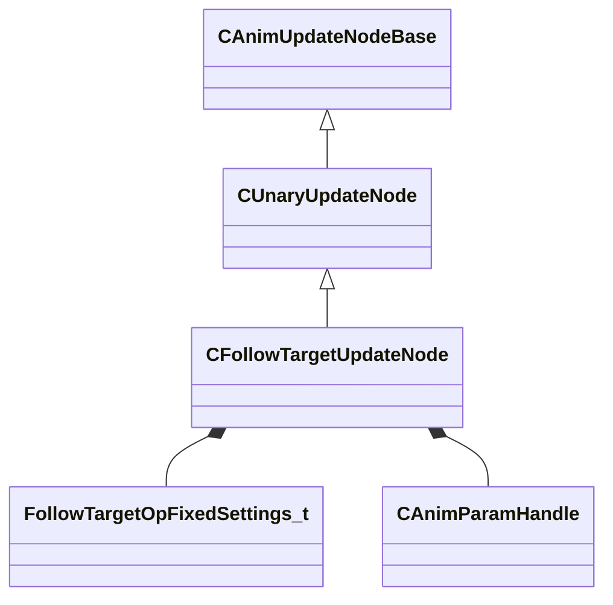

[Schemas](../../schemas.md) / [animgraphlib](../animgraphlib.md) / CFollowTargetUpdateNode

# CFollowTargetUpdateNode

> Source: **Build 25000182** · 2026-08-28 · `windows-x86_64` · schema `0.10.0`

**Kind:** class · **Size:** 144 bytes (`0x90`) · **Align:** 8 · **Module:** animgraphlib

**Inherits from:** [CUnaryUpdateNode](../animgraphlib/CUnaryUpdateNode.md)

**Relationships:**

## Memory layout

7 fields (3 declared here, 4 inherited). Offsets are absolute from the object base.

| Offset | Field | Type | From | Annotations |
|--------|-------|------|------|-------------|
| `0x18` | `m_nodePath` | [CAnimNodePath](../animgraphlib/CAnimNodePath.md) | [CAnimUpdateNodeBase](../animgraphlib/CAnimUpdateNodeBase.md) |  |
| `0x48` | `m_networkMode` | [AnimNodeNetworkMode](../animgraphlib/AnimNodeNetworkMode.md) | [CAnimUpdateNodeBase](../animgraphlib/CAnimUpdateNodeBase.md) |  |
| `0x50` | `m_name` | CUtlString | [CAnimUpdateNodeBase](../animgraphlib/CAnimUpdateNodeBase.md) |  |
| `0x60` | `m_pChildNode` | [CAnimUpdateNodeRef](../animgraphlib/CAnimUpdateNodeRef.md) | [CUnaryUpdateNode](../animgraphlib/CUnaryUpdateNode.md) |  |
| `0x70` | `m_opFixedData` | [FollowTargetOpFixedSettings_t](../animgraphlib/FollowTargetOpFixedSettings_t.md) |  |  |
| `0x88` | `m_hParameterPosition` | [CAnimParamHandle](../animgraphlib/CAnimParamHandle.md) |  |  |
| `0x8a` | `m_hParameterOrientation` | [CAnimParamHandle](../animgraphlib/CAnimParamHandle.md) |  |  |

KV3 class defaults

<pre>{
	&quot;_class&quot;: &quot;CFollowTargetUpdateNode&quot;,
	&quot;m_nodePath&quot;:
	{
		&quot;m_path&quot;:
		[
			{
				&quot;m_id&quot;: &lt;HIDDEN FOR DIFF&gt;,
			},
			{
				&quot;m_id&quot;: &lt;HIDDEN FOR DIFF&gt;,
			},
			{
				&quot;m_id&quot;: &lt;HIDDEN FOR DIFF&gt;,
			},
			{
				&quot;m_id&quot;: &lt;HIDDEN FOR DIFF&gt;,
			},
			{
				&quot;m_id&quot;: &lt;HIDDEN FOR DIFF&gt;,
			},
			{
				&quot;m_id&quot;: &lt;HIDDEN FOR DIFF&gt;,
			},
			{
				&quot;m_id&quot;: &lt;HIDDEN FOR DIFF&gt;,
			},
			{
				&quot;m_id&quot;: &lt;HIDDEN FOR DIFF&gt;,
			},
			{
				&quot;m_id&quot;: &lt;HIDDEN FOR DIFF&gt;,
			},
			{
				&quot;m_id&quot;: &lt;HIDDEN FOR DIFF&gt;,
			},
			{
				&quot;m_id&quot;: &lt;HIDDEN FOR DIFF&gt;,
			}
		],
		&quot;m_nCount&quot;: 0
	},
	&quot;m_networkMode&quot;: &quot;ServerAuthoritative&quot;,
	&quot;m_name&quot;: &quot;&quot;,
	&quot;m_pChildNode&quot;:
	{
		&quot;m_nodeIndex&quot;: -1
	},
	&quot;m_opFixedData&quot;:
	{
		&quot;m_boneIndex&quot;: -1,
		&quot;m_bBoneTarget&quot;: true,
		&quot;m_boneTargetIndex&quot;: -1,
		&quot;m_bWorldCoodinateTarget&quot;: true,
		&quot;m_bMatchTargetOrientation&quot;: false
	},
	&quot;m_hParameterPosition&quot;:
	{
		&quot;m_type&quot;: &quot;ANIMPARAM_UNKNOWN&quot;,
		&quot;m_index&quot;: 255
	},
	&quot;m_hParameterOrientation&quot;:
	{
		&quot;m_type&quot;: &quot;ANIMPARAM_UNKNOWN&quot;,
		&quot;m_index&quot;: 255
	}
}</pre>

