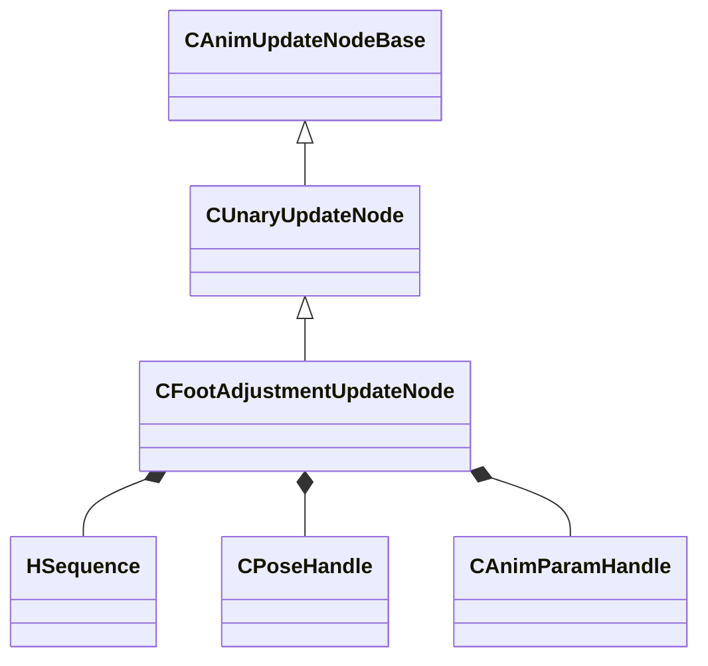

[Schemas](../../schemas.md) / [animgraphlib](../animgraphlib.md) / CFootAdjustmentUpdateNode

# CFootAdjustmentUpdateNode

**Kind:** class · **Size:** 176 bytes (`0xb0`) · **Align:** 8 · **Module:** animgraphlib

**Inherits from:** [CUnaryUpdateNode](../animgraphlib/CUnaryUpdateNode.md)

**Relationships:**

## Memory layout

13 fields (9 declared here, 4 inherited). Offsets are absolute from the object base.

| Offset | Field | Type | From | Annotations |
|--------|-------|------|------|-------------|
| `0x18` | `m_nodePath` | [CAnimNodePath](../animgraphlib/CAnimNodePath.md) | [CAnimUpdateNodeBase](../animgraphlib/CAnimUpdateNodeBase.md) |  |
| `0x48` | `m_networkMode` | [AnimNodeNetworkMode](../animgraphlib/AnimNodeNetworkMode.md) | [CAnimUpdateNodeBase](../animgraphlib/CAnimUpdateNodeBase.md) |  |
| `0x50` | `m_name` | CUtlString | [CAnimUpdateNodeBase](../animgraphlib/CAnimUpdateNodeBase.md) |  |
| `0x60` | `m_pChildNode` | [CAnimUpdateNodeRef](../animgraphlib/CAnimUpdateNodeRef.md) | [CUnaryUpdateNode](../animgraphlib/CUnaryUpdateNode.md) |  |
| `0x78` | `m_clips` | CUtlVector< [HSequence](../animationsystem/HSequence.md) > |  |  |
| `0x90` | `m_hBasePoseCacheHandle` | [CPoseHandle](../animgraphlib/CPoseHandle.md) |  |  |
| `0x94` | `m_facingTarget` | [CAnimParamHandle](../animgraphlib/CAnimParamHandle.md) |  |  |
| `0x98` | `m_flTurnTimeMin` | float32 |  |  |
| `0x9c` | `m_flTurnTimeMax` | float32 |  |  |
| `0xa0` | `m_flStepHeightMax` | float32 |  |  |
| `0xa4` | `m_flStepHeightMaxAngle` | float32 |  |  |
| `0xa8` | `m_bResetChild` | bool |  |  |
| `0xa9` | `m_bAnimationDriven` | bool |  |  |

KV3 class defaults

<pre>{
	&quot;_class&quot;: &quot;CFootAdjustmentUpdateNode&quot;,
	&quot;m_nodePath&quot;:
	{
		&quot;m_path&quot;:
		[
			{
				&quot;m_id&quot;: &lt;HIDDEN FOR DIFF&gt;,
			},
			{
				&quot;m_id&quot;: &lt;HIDDEN FOR DIFF&gt;,
			},
			{
				&quot;m_id&quot;: &lt;HIDDEN FOR DIFF&gt;,
			},
			{
				&quot;m_id&quot;: &lt;HIDDEN FOR DIFF&gt;,
			},
			{
				&quot;m_id&quot;: &lt;HIDDEN FOR DIFF&gt;,
			},
			{
				&quot;m_id&quot;: &lt;HIDDEN FOR DIFF&gt;,
			},
			{
				&quot;m_id&quot;: &lt;HIDDEN FOR DIFF&gt;,
			},
			{
				&quot;m_id&quot;: &lt;HIDDEN FOR DIFF&gt;,
			},
			{
				&quot;m_id&quot;: &lt;HIDDEN FOR DIFF&gt;,
			},
			{
				&quot;m_id&quot;: &lt;HIDDEN FOR DIFF&gt;,
			},
			{
				&quot;m_id&quot;: &lt;HIDDEN FOR DIFF&gt;,
			}
		],
		&quot;m_nCount&quot;: 0
	},
	&quot;m_networkMode&quot;: &quot;ServerAuthoritative&quot;,
	&quot;m_name&quot;: &quot;&quot;,
	&quot;m_pChildNode&quot;:
	{
		&quot;m_nodeIndex&quot;: -1
	},
	&quot;m_clips&quot;:
	[
	],
	&quot;m_hBasePoseCacheHandle&quot;:
	{
		&quot;m_nIndex&quot;: 65535,
		&quot;m_eType&quot;: &quot;POSETYPE_INVALID&quot;
	},
	&quot;m_facingTarget&quot;:
	{
		&quot;m_type&quot;: &quot;ANIMPARAM_UNKNOWN&quot;,
		&quot;m_index&quot;: 255
	},
	&quot;m_flTurnTimeMin&quot;: 0.000000,
	&quot;m_flTurnTimeMax&quot;: 0.000000,
	&quot;m_flStepHeightMax&quot;: 0.000000,
	&quot;m_flStepHeightMaxAngle&quot;: 0.000000,
	&quot;m_bResetChild&quot;: false,
	&quot;m_bAnimationDriven&quot;: false
}</pre>

