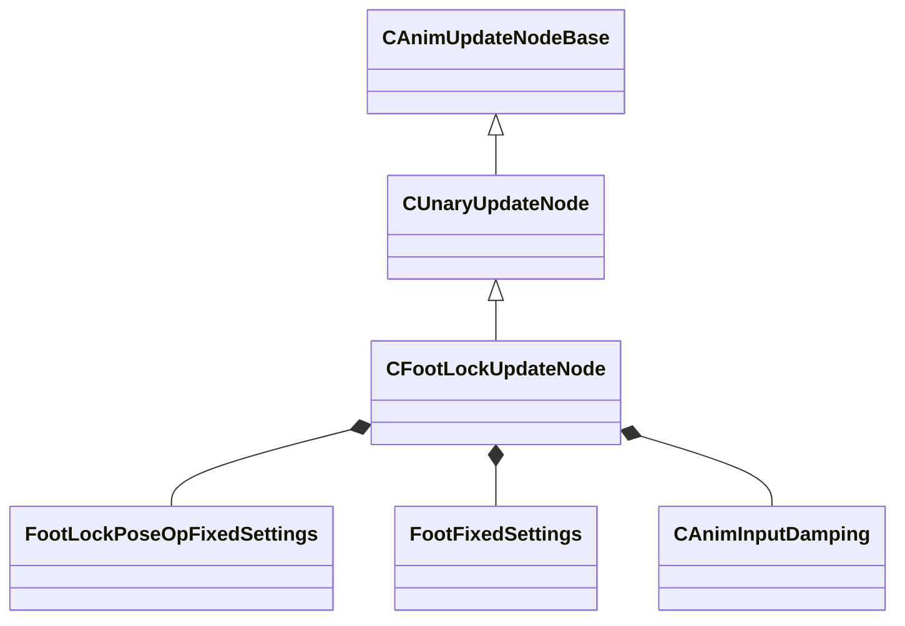

[Schemas](../../schemas.md) / [animgraphlib](../animgraphlib.md) / CFootLockUpdateNode

# CFootLockUpdateNode

**Kind:** class · **Size:** 344 bytes (`0x158`) · **Align:** 8 · **Module:** animgraphlib

**Inherits from:** [CUnaryUpdateNode](../animgraphlib/CUnaryUpdateNode.md)

**Relationships:**

## Memory layout

24 fields (20 declared here, 4 inherited). Offsets are absolute from the object base.

| Offset | Field | Type | From | Annotations |
|--------|-------|------|------|-------------|
| `0x18` | `m_nodePath` | [CAnimNodePath](../animgraphlib/CAnimNodePath.md) | [CAnimUpdateNodeBase](../animgraphlib/CAnimUpdateNodeBase.md) |  |
| `0x48` | `m_networkMode` | [AnimNodeNetworkMode](../!GlobalTypes/AnimNodeNetworkMode.md) | [CAnimUpdateNodeBase](../animgraphlib/CAnimUpdateNodeBase.md) |  |
| `0x50` | `m_name` | CUtlString | [CAnimUpdateNodeBase](../animgraphlib/CAnimUpdateNodeBase.md) |  |
| `0x60` | `m_pChildNode` | [CAnimUpdateNodeRef](../animgraphlib/CAnimUpdateNodeRef.md) | [CUnaryUpdateNode](../animgraphlib/CUnaryUpdateNode.md) |  |
| `0x70` | `m_opFixedSettings` | [FootLockPoseOpFixedSettings](../animgraphlib/FootLockPoseOpFixedSettings.md) |  |  |
| `0xe0` | `m_footSettings` | CUtlVector< [FootFixedSettings](../animgraphlib/FootFixedSettings.md) > |  |  |
| `0xf8` | `m_hipShiftDamping` | [CAnimInputDamping](../animgraphlib/CAnimInputDamping.md) |  |  |
| `0x110` | `m_rootHeightDamping` | [CAnimInputDamping](../animgraphlib/CAnimInputDamping.md) |  |  |
| `0x128` | `m_flStrideCurveScale` | float32 |  |  |
| `0x12c` | `m_flStrideCurveLimitScale` | float32 |  |  |
| `0x130` | `m_flStepHeightIncreaseScale` | float32 |  |  |
| `0x134` | `m_flStepHeightDecreaseScale` | float32 |  |  |
| `0x138` | `m_flHipShiftScale` | float32 |  |  |
| `0x13c` | `m_flBlendTime` | float32 |  |  |
| `0x140` | `m_flMaxRootHeightOffset` | float32 |  |  |
| `0x144` | `m_flMinRootHeightOffset` | float32 |  |  |
| `0x148` | `m_flTiltPlanePitchSpringStrength` | float32 |  |  |
| `0x14c` | `m_flTiltPlaneRollSpringStrength` | float32 |  |  |
| `0x150` | `m_bApplyFootRotationLimits` | bool |  |  |
| `0x151` | `m_bApplyHipShift` | bool |  |  |
| `0x152` | `m_bModulateStepHeight` | bool |  |  |
| `0x153` | `m_bResetChild` | bool |  |  |
| `0x154` | `m_bEnableVerticalCurvedPaths` | bool |  |  |
| `0x155` | `m_bEnableRootHeightDamping` | bool |  |  |

KV3 class defaults

<pre>{
	&quot;_class&quot;: &quot;CFootLockUpdateNode&quot;,
	&quot;m_nodePath&quot;:
	{
		&quot;m_path&quot;:
		[
			{
				&quot;m_id&quot;: &lt;HIDDEN FOR DIFF&gt;,
			},
			{
				&quot;m_id&quot;: &lt;HIDDEN FOR DIFF&gt;,
			},
			{
				&quot;m_id&quot;: &lt;HIDDEN FOR DIFF&gt;,
			},
			{
				&quot;m_id&quot;: &lt;HIDDEN FOR DIFF&gt;,
			},
			{
				&quot;m_id&quot;: &lt;HIDDEN FOR DIFF&gt;,
			},
			{
				&quot;m_id&quot;: &lt;HIDDEN FOR DIFF&gt;,
			},
			{
				&quot;m_id&quot;: &lt;HIDDEN FOR DIFF&gt;,
			},
			{
				&quot;m_id&quot;: &lt;HIDDEN FOR DIFF&gt;,
			},
			{
				&quot;m_id&quot;: &lt;HIDDEN FOR DIFF&gt;,
			},
			{
				&quot;m_id&quot;: &lt;HIDDEN FOR DIFF&gt;,
			},
			{
				&quot;m_id&quot;: &lt;HIDDEN FOR DIFF&gt;,
			}
		],
		&quot;m_nCount&quot;: 0
	},
	&quot;m_networkMode&quot;: &quot;ServerAuthoritative&quot;,
	&quot;m_name&quot;: &quot;&quot;,
	&quot;m_pChildNode&quot;:
	{
		&quot;m_nodeIndex&quot;: -1
	},
	&quot;m_opFixedSettings&quot;:
	{
		&quot;m_footInfo&quot;:
		[
		],
		&quot;m_hipDampingSettings&quot;:
		{
			&quot;_class&quot;: &quot;CAnimInputDamping&quot;,
			&quot;m_speedFunction&quot;: &quot;NoDamping&quot;,
			&quot;m_fSpeedScale&quot;: 1.000000,
			&quot;m_fFallingSpeedScale&quot;: 1.000000
		},
		&quot;m_nHipBoneIndex&quot;: -1,
		&quot;m_ikSolverType&quot;: &quot;IKSOLVER_TwoBone&quot;,
		&quot;m_bApplyTilt&quot;: false,
		&quot;m_bApplyHipDrop&quot;: false,
		&quot;m_bAlwaysUseFallbackHinge&quot;: false,
		&quot;m_bApplyFootRotationLimits&quot;: false,
		&quot;m_bApplyLegTwistLimits&quot;: false,
		&quot;m_flMaxFootHeight&quot;: -12.000000,
		&quot;m_flExtensionScale&quot;: 0.700000,
		&quot;m_flMaxLegTwist&quot;: 180.000000,
		&quot;m_bEnableLockBreaking&quot;: false,
		&quot;m_flLockBreakTolerance&quot;: 0.200000,
		&quot;m_flLockBlendTime&quot;: 0.200000,
		&quot;m_bEnableStretching&quot;: false,
		&quot;m_flMaxStretchAmount&quot;: 2.000000,
		&quot;m_flStretchExtensionScale&quot;: 0.998000
	},
	&quot;m_footSettings&quot;:
	[
	],
	&quot;m_hipShiftDamping&quot;:
	{
		&quot;_class&quot;: &quot;CAnimInputDamping&quot;,
		&quot;m_speedFunction&quot;: &quot;NoDamping&quot;,
		&quot;m_fSpeedScale&quot;: 1.000000,
		&quot;m_fFallingSpeedScale&quot;: 1.000000
	},
	&quot;m_rootHeightDamping&quot;:
	{
		&quot;_class&quot;: &quot;CAnimInputDamping&quot;,
		&quot;m_speedFunction&quot;: &quot;NoDamping&quot;,
		&quot;m_fSpeedScale&quot;: 1.000000,
		&quot;m_fFallingSpeedScale&quot;: 1.000000
	},
	&quot;m_flStrideCurveScale&quot;: 0.000000,
	&quot;m_flStrideCurveLimitScale&quot;: 0.000000,
	&quot;m_flStepHeightIncreaseScale&quot;: 0.000000,
	&quot;m_flStepHeightDecreaseScale&quot;: 0.000000,
	&quot;m_flHipShiftScale&quot;: 0.000000,
	&quot;m_flBlendTime&quot;: 0.000000,
	&quot;m_flMaxRootHeightOffset&quot;: 0.000000,
	&quot;m_flMinRootHeightOffset&quot;: 0.000000,
	&quot;m_flTiltPlanePitchSpringStrength&quot;: 0.000000,
	&quot;m_flTiltPlaneRollSpringStrength&quot;: 0.000000,
	&quot;m_bApplyFootRotationLimits&quot;: false,
	&quot;m_bApplyHipShift&quot;: false,
	&quot;m_bModulateStepHeight&quot;: false,
	&quot;m_bResetChild&quot;: false,
	&quot;m_bEnableVerticalCurvedPaths&quot;: false,
	&quot;m_bEnableRootHeightDamping&quot;: false
}</pre>

