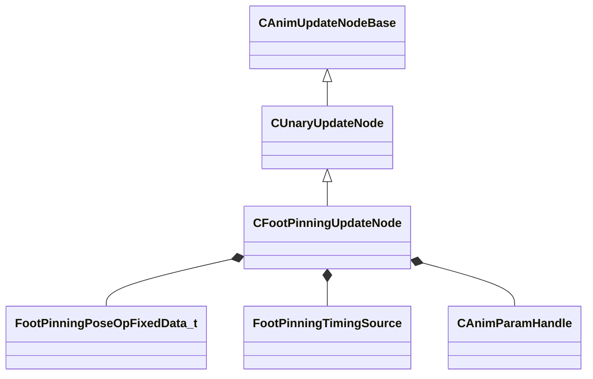

[Schemas](../../schemas.md) / [animgraphlib](../animgraphlib.md) / CFootPinningUpdateNode

# CFootPinningUpdateNode

**Kind:** class · **Size:** 208 bytes (`0xd0`) · **Align:** 8 · **Module:** animgraphlib

**Inherits from:** [CUnaryUpdateNode](../animgraphlib/CUnaryUpdateNode.md)

**Relationships:**

## Memory layout

8 fields (4 declared here, 4 inherited). Offsets are absolute from the object base.

| Offset | Field | Type | From | Annotations |
|--------|-------|------|------|-------------|
| `0x18` | `m_nodePath` | [CAnimNodePath](../animgraphlib/CAnimNodePath.md) | [CAnimUpdateNodeBase](../animgraphlib/CAnimUpdateNodeBase.md) |  |
| `0x48` | `m_networkMode` | [AnimNodeNetworkMode](../!GlobalTypes/AnimNodeNetworkMode.md) | [CAnimUpdateNodeBase](../animgraphlib/CAnimUpdateNodeBase.md) |  |
| `0x50` | `m_name` | CUtlString | [CAnimUpdateNodeBase](../animgraphlib/CAnimUpdateNodeBase.md) |  |
| `0x60` | `m_pChildNode` | [CAnimUpdateNodeRef](../animgraphlib/CAnimUpdateNodeRef.md) | [CUnaryUpdateNode](../animgraphlib/CUnaryUpdateNode.md) |  |
| `0x78` | `m_poseOpFixedData` | [FootPinningPoseOpFixedData_t](../animgraphlib/FootPinningPoseOpFixedData_t.md) |  |  |
| `0xa8` | `m_eTimingSource` | [FootPinningTimingSource](../!GlobalTypes/FootPinningTimingSource.md) |  |  |
| `0xb0` | `m_params` | CUtlVector< [CAnimParamHandle](../animgraphlib/CAnimParamHandle.md) > |  |  |
| `0xc8` | `m_bResetChild` | bool |  |  |

KV3 class defaults

<pre>{
	&quot;_class&quot;: &quot;CFootPinningUpdateNode&quot;,
	&quot;m_nodePath&quot;:
	{
		&quot;m_path&quot;:
		[
			{
				&quot;m_id&quot;: &lt;HIDDEN FOR DIFF&gt;,
			},
			{
				&quot;m_id&quot;: &lt;HIDDEN FOR DIFF&gt;,
			},
			{
				&quot;m_id&quot;: &lt;HIDDEN FOR DIFF&gt;,
			},
			{
				&quot;m_id&quot;: &lt;HIDDEN FOR DIFF&gt;,
			},
			{
				&quot;m_id&quot;: &lt;HIDDEN FOR DIFF&gt;,
			},
			{
				&quot;m_id&quot;: &lt;HIDDEN FOR DIFF&gt;,
			},
			{
				&quot;m_id&quot;: &lt;HIDDEN FOR DIFF&gt;,
			},
			{
				&quot;m_id&quot;: &lt;HIDDEN FOR DIFF&gt;,
			},
			{
				&quot;m_id&quot;: &lt;HIDDEN FOR DIFF&gt;,
			},
			{
				&quot;m_id&quot;: &lt;HIDDEN FOR DIFF&gt;,
			},
			{
				&quot;m_id&quot;: &lt;HIDDEN FOR DIFF&gt;,
			}
		],
		&quot;m_nCount&quot;: 0
	},
	&quot;m_networkMode&quot;: &quot;ServerAuthoritative&quot;,
	&quot;m_name&quot;: &quot;&quot;,
	&quot;m_pChildNode&quot;:
	{
		&quot;m_nodeIndex&quot;: -1
	},
	&quot;m_poseOpFixedData&quot;:
	{
		&quot;m_footInfo&quot;:
		[
		],
		&quot;m_flBlendTime&quot;: 0.000000,
		&quot;m_flLockBreakDistance&quot;: 0.000000,
		&quot;m_flMaxLegTwist&quot;: 25.000000,
		&quot;m_nHipBoneIndex&quot;: -1,
		&quot;m_bApplyLegTwistLimits&quot;: false,
		&quot;m_bApplyFootRotationLimits&quot;: false
	},
	&quot;m_eTimingSource&quot;: &quot;FootMotion&quot;,
	&quot;m_params&quot;:
	[
	],
	&quot;m_bResetChild&quot;: false
}</pre>

