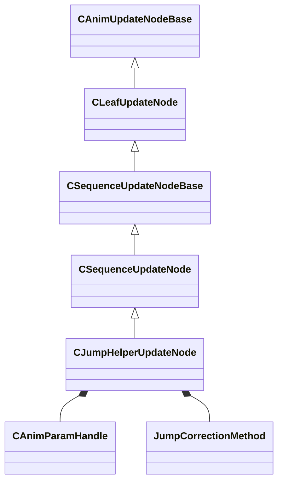

[Schemas](../../schemas.md) / [animgraphlib](../animgraphlib.md) / CJumpHelperUpdateNode

# CJumpHelperUpdateNode

**Kind:** class · **Size:** 216 bytes (`0xd8`) · **Align:** 8 · **Module:** animgraphlib

**Inherits from:** [CSequenceUpdateNode](../animgraphlib/CSequenceUpdateNode.md)

**Relationships:**

## Memory layout

17 fields (8 declared here, 9 inherited). Offsets are absolute from the object base.

| Offset | Field | Type | From | Annotations |
|--------|-------|------|------|-------------|
| `0x18` | `m_nodePath` | [CAnimNodePath](../animgraphlib/CAnimNodePath.md) | [CAnimUpdateNodeBase](../animgraphlib/CAnimUpdateNodeBase.md) |  |
| `0x48` | `m_networkMode` | [AnimNodeNetworkMode](../animgraphlib/AnimNodeNetworkMode.md) | [CAnimUpdateNodeBase](../animgraphlib/CAnimUpdateNodeBase.md) |  |
| `0x50` | `m_name` | CUtlString | [CAnimUpdateNodeBase](../animgraphlib/CAnimUpdateNodeBase.md) |  |
| `0x6c` | `m_playbackSpeed` | float32 | [CSequenceUpdateNodeBase](../animgraphlib/CSequenceUpdateNodeBase.md) |  |
| `0x70` | `m_bLoop` | bool | [CSequenceUpdateNodeBase](../animgraphlib/CSequenceUpdateNodeBase.md) |  |
| `0x78` | `m_hSequence` | [HSequence](../animationsystem/HSequence.md) | [CSequenceUpdateNode](../animgraphlib/CSequenceUpdateNode.md) |  |
| `0x7c` | `m_duration` | float32 | [CSequenceUpdateNode](../animgraphlib/CSequenceUpdateNode.md) |  |
| `0x80` | `m_paramSpans` | [CParamSpanUpdater](../animgraphlib/CParamSpanUpdater.md) | [CSequenceUpdateNode](../animgraphlib/CSequenceUpdateNode.md) |  |
| `0x98` | `m_tags` | CUtlVector< [TagSpan_t](../animgraphlib/TagSpan_t.md) > | [CSequenceUpdateNode](../animgraphlib/CSequenceUpdateNode.md) |  |
| `0xb0` | `m_hTargetParam` | [CAnimParamHandle](../animgraphlib/CAnimParamHandle.md) |  |  |
| `0xb4` | `m_flOriginalJumpMovement` | Vector |  |  |
| `0xc0` | `m_flOriginalJumpDuration` | float32 |  |  |
| `0xc4` | `m_flJumpStartCycle` | float32 |  |  |
| `0xc8` | `m_flJumpEndCycle` | float32 |  |  |
| `0xcc` | `m_eCorrectionMethod` | [JumpCorrectionMethod](../animgraphlib/JumpCorrectionMethod.md) |  |  |
| `0xd0` | `m_bTranslationAxis` | bool[3] |  |  |
| `0xd3` | `m_bScaleSpeed` | bool |  |  |

KV3 class defaults

<pre>{
	&quot;_class&quot;: &quot;CJumpHelperUpdateNode&quot;,
	&quot;m_nodePath&quot;:
	{
		&quot;m_path&quot;:
		[
			{
				&quot;m_id&quot;: &lt;HIDDEN FOR DIFF&gt;,
			},
			{
				&quot;m_id&quot;: &lt;HIDDEN FOR DIFF&gt;,
			},
			{
				&quot;m_id&quot;: &lt;HIDDEN FOR DIFF&gt;,
			},
			{
				&quot;m_id&quot;: &lt;HIDDEN FOR DIFF&gt;,
			},
			{
				&quot;m_id&quot;: &lt;HIDDEN FOR DIFF&gt;,
			},
			{
				&quot;m_id&quot;: &lt;HIDDEN FOR DIFF&gt;,
			},
			{
				&quot;m_id&quot;: &lt;HIDDEN FOR DIFF&gt;,
			},
			{
				&quot;m_id&quot;: &lt;HIDDEN FOR DIFF&gt;,
			},
			{
				&quot;m_id&quot;: &lt;HIDDEN FOR DIFF&gt;,
			},
			{
				&quot;m_id&quot;: &lt;HIDDEN FOR DIFF&gt;,
			},
			{
				&quot;m_id&quot;: &lt;HIDDEN FOR DIFF&gt;,
			}
		],
		&quot;m_nCount&quot;: 0
	},
	&quot;m_networkMode&quot;: &quot;ServerAuthoritative&quot;,
	&quot;m_name&quot;: &quot;&quot;,
	&quot;m_playbackSpeed&quot;: 1.000000,
	&quot;m_bLoop&quot;: false,
	&quot;m_hSequence&quot;: -1,
	&quot;m_duration&quot;: 0.000000,
	&quot;m_paramSpans&quot;:
	{
		&quot;m_spans&quot;:
		[
		]
	},
	&quot;m_tags&quot;:
	[
	],
	&quot;m_hTargetParam&quot;:
	{
		&quot;m_type&quot;: &quot;ANIMPARAM_UNKNOWN&quot;,
		&quot;m_index&quot;: 255
	},
	&quot;m_flOriginalJumpMovement&quot;:
	[
		0.000000,
		0.000000,
		0.000000
	],
	&quot;m_flOriginalJumpDuration&quot;: 0.000000,
	&quot;m_flJumpStartCycle&quot;: 0.000000,
	&quot;m_flJumpEndCycle&quot;: 0.000000,
	&quot;m_eCorrectionMethod&quot;: &quot;ScaleMotion&quot;,
	&quot;m_bTranslationAxis&quot;:
	[
		false,
		false,
		false
	],
	&quot;m_bScaleSpeed&quot;: false
}</pre>

