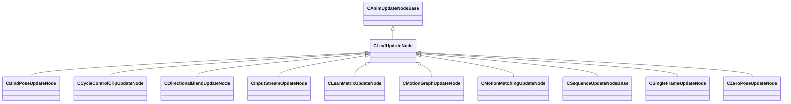

[Schemas](../../schemas.md) / [animgraphlib](../animgraphlib.md) / CLeafUpdateNode

# CLeafUpdateNode

**Kind:** class · **Size:** 88 bytes (`0x58`) · **Align:** 255 · **Module:** animgraphlib

**Inherits from:** [CAnimUpdateNodeBase](../animgraphlib/CAnimUpdateNodeBase.md)

**Derived by:** [CBindPoseUpdateNode](../animgraphlib/CBindPoseUpdateNode.md), [CCycleControlClipUpdateNode](../animgraphlib/CCycleControlClipUpdateNode.md), [CDirectionalBlendUpdateNode](../animgraphlib/CDirectionalBlendUpdateNode.md), [CInputStreamUpdateNode](../animgraphlib/CInputStreamUpdateNode.md), [CLeanMatrixUpdateNode](../animgraphlib/CLeanMatrixUpdateNode.md), [CMotionGraphUpdateNode](../animgraphlib/CMotionGraphUpdateNode.md), [CMotionMatchingUpdateNode](../animgraphlib/CMotionMatchingUpdateNode.md), [CSequenceUpdateNodeBase](../animgraphlib/CSequenceUpdateNodeBase.md), [CSingleFrameUpdateNode](../animgraphlib/CSingleFrameUpdateNode.md), [CZeroPoseUpdateNode](../animgraphlib/CZeroPoseUpdateNode.md)

**Relationships:**

## Memory layout

3 fields (0 declared here, 3 inherited). Offsets are absolute from the object base.

| Offset | Field | Type | From | Annotations |
|--------|-------|------|------|-------------|
| `0x18` | `m_nodePath` | [CAnimNodePath](../animgraphlib/CAnimNodePath.md) | [CAnimUpdateNodeBase](../animgraphlib/CAnimUpdateNodeBase.md) |  |
| `0x48` | `m_networkMode` | [AnimNodeNetworkMode](../animgraphlib/AnimNodeNetworkMode.md) | [CAnimUpdateNodeBase](../animgraphlib/CAnimUpdateNodeBase.md) |  |
| `0x50` | `m_name` | CUtlString | [CAnimUpdateNodeBase](../animgraphlib/CAnimUpdateNodeBase.md) |  |
