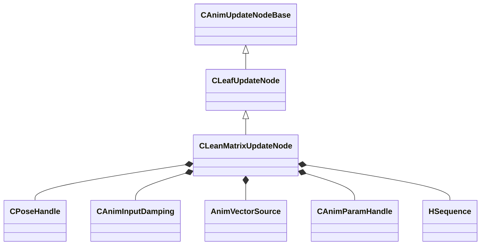

[Schemas](../../schemas.md) / [animgraphlib](../animgraphlib.md) / CLeanMatrixUpdateNode

# CLeanMatrixUpdateNode

> Source: **Build 25000182** · 2026-08-28 · `windows-x86_64` · schema `0.10.0`

**Kind:** class · **Size:** 240 bytes (`0xf0`) · **Align:** 8 · **Module:** animgraphlib

**Inherits from:** [CLeafUpdateNode](../animgraphlib/CLeafUpdateNode.md)

**Relationships:**

## Memory layout

13 fields (10 declared here, 3 inherited). Offsets are absolute from the object base.

| Offset | Field | Type | From | Annotations |
|--------|-------|------|------|-------------|
| `0x18` | `m_nodePath` | [CAnimNodePath](../animgraphlib/CAnimNodePath.md) | [CAnimUpdateNodeBase](../animgraphlib/CAnimUpdateNodeBase.md) |  |
| `0x48` | `m_networkMode` | [AnimNodeNetworkMode](../animgraphlib/AnimNodeNetworkMode.md) | [CAnimUpdateNodeBase](../animgraphlib/CAnimUpdateNodeBase.md) |  |
| `0x50` | `m_name` | CUtlString | [CAnimUpdateNodeBase](../animgraphlib/CAnimUpdateNodeBase.md) |  |
| `0x5c` | `m_frameCorners` | int32[3][3] |  |  |
| `0x80` | `m_poses` | [CPoseHandle](../animgraphlib/CPoseHandle.md)[9] |  |  |
| `0xa8` | `m_damping` | [CAnimInputDamping](../animgraphlib/CAnimInputDamping.md) |  |  |
| `0xc0` | `m_blendSource` | [AnimVectorSource](../animgraphlib/AnimVectorSource.md) |  |  |
| `0xc4` | `m_paramIndex` | [CAnimParamHandle](../animgraphlib/CAnimParamHandle.md) |  |  |
| `0xc8` | `m_verticalAxis` | Vector |  |  |
| `0xd4` | `m_horizontalAxis` | Vector |  |  |
| `0xe0` | `m_hSequence` | [HSequence](../animationsystem/HSequence.md) |  |  |
| `0xe4` | `m_flMaxValue` | float32 |  |  |
| `0xe8` | `m_nSequenceMaxFrame` | int32 |  |  |

KV3 class defaults

<pre>{
	&quot;_class&quot;: &quot;CLeanMatrixUpdateNode&quot;,
	&quot;m_nodePath&quot;:
	{
		&quot;m_path&quot;:
		[
			{
				&quot;m_id&quot;: &lt;HIDDEN FOR DIFF&gt;,
			},
			{
				&quot;m_id&quot;: &lt;HIDDEN FOR DIFF&gt;,
			},
			{
				&quot;m_id&quot;: &lt;HIDDEN FOR DIFF&gt;,
			},
			{
				&quot;m_id&quot;: &lt;HIDDEN FOR DIFF&gt;,
			},
			{
				&quot;m_id&quot;: &lt;HIDDEN FOR DIFF&gt;,
			},
			{
				&quot;m_id&quot;: &lt;HIDDEN FOR DIFF&gt;,
			},
			{
				&quot;m_id&quot;: &lt;HIDDEN FOR DIFF&gt;,
			},
			{
				&quot;m_id&quot;: &lt;HIDDEN FOR DIFF&gt;,
			},
			{
				&quot;m_id&quot;: &lt;HIDDEN FOR DIFF&gt;,
			},
			{
				&quot;m_id&quot;: &lt;HIDDEN FOR DIFF&gt;,
			},
			{
				&quot;m_id&quot;: &lt;HIDDEN FOR DIFF&gt;,
			}
		],
		&quot;m_nCount&quot;: 0
	},
	&quot;m_networkMode&quot;: &quot;ServerAuthoritative&quot;,
	&quot;m_name&quot;: &quot;&quot;,
	&quot;m_frameCorners&quot;:
	[
		[
			0,
			0,
			0
		],
		[
			0,
			0,
			0
		],
		[
			0,
			0,
			0
		]
	],
	&quot;m_poses&quot;:
	[
		{
			&quot;m_nIndex&quot;: 65535,
			&quot;m_eType&quot;: &quot;POSETYPE_INVALID&quot;
		},
		{
			&quot;m_nIndex&quot;: 65535,
			&quot;m_eType&quot;: &quot;POSETYPE_INVALID&quot;
		},
		{
			&quot;m_nIndex&quot;: 65535,
			&quot;m_eType&quot;: &quot;POSETYPE_INVALID&quot;
		},
		{
			&quot;m_nIndex&quot;: 65535,
			&quot;m_eType&quot;: &quot;POSETYPE_INVALID&quot;
		},
		{
			&quot;m_nIndex&quot;: 65535,
			&quot;m_eType&quot;: &quot;POSETYPE_INVALID&quot;
		},
		{
			&quot;m_nIndex&quot;: 65535,
			&quot;m_eType&quot;: &quot;POSETYPE_INVALID&quot;
		},
		{
			&quot;m_nIndex&quot;: 65535,
			&quot;m_eType&quot;: &quot;POSETYPE_INVALID&quot;
		},
		{
			&quot;m_nIndex&quot;: 65535,
			&quot;m_eType&quot;: &quot;POSETYPE_INVALID&quot;
		},
		{
			&quot;m_nIndex&quot;: 65535,
			&quot;m_eType&quot;: &quot;POSETYPE_INVALID&quot;
		}
	],
	&quot;m_damping&quot;:
	{
		&quot;_class&quot;: &quot;CAnimInputDamping&quot;,
		&quot;m_speedFunction&quot;: &quot;NoDamping&quot;,
		&quot;m_fSpeedScale&quot;: 1.000000,
		&quot;m_fFallingSpeedScale&quot;: 1.000000
	},
	&quot;m_blendSource&quot;: &quot;MoveDirection&quot;,
	&quot;m_paramIndex&quot;:
	{
		&quot;m_type&quot;: &quot;ANIMPARAM_UNKNOWN&quot;,
		&quot;m_index&quot;: 255
	},
	&quot;m_verticalAxis&quot;:
	[
		0.000000,
		0.000000,
		0.000000
	],
	&quot;m_horizontalAxis&quot;:
	[
		0.000000,
		0.000000,
		0.000000
	],
	&quot;m_hSequence&quot;: -1,
	&quot;m_flMaxValue&quot;: 0.000000,
	&quot;m_nSequenceMaxFrame&quot;: 0
}</pre>

