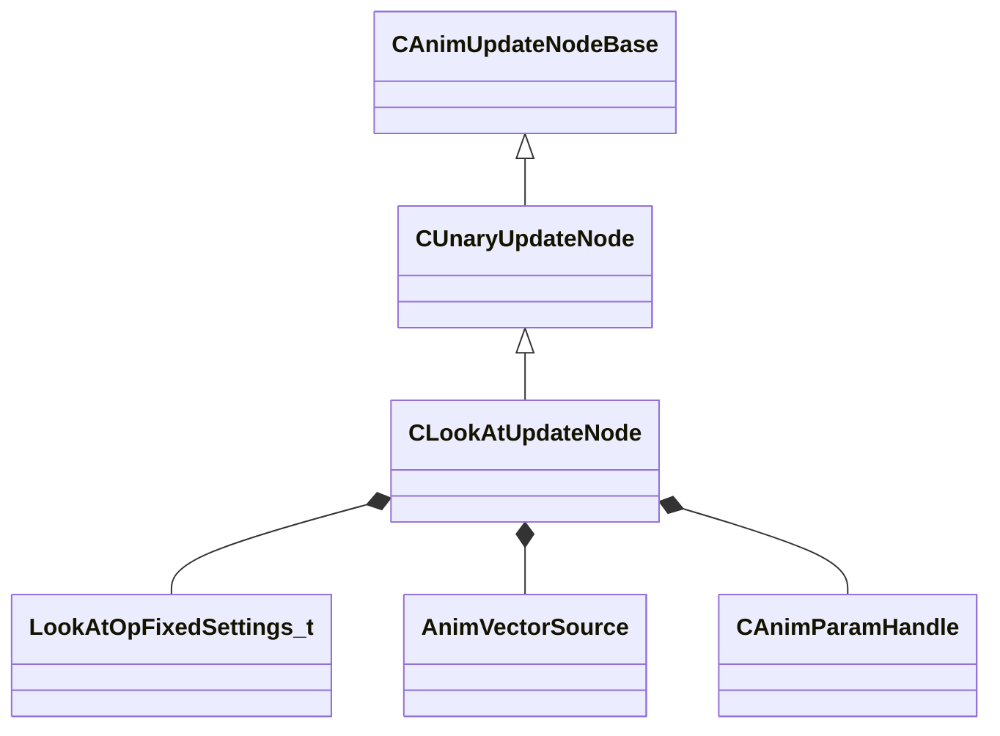

[Schemas](../../schemas.md) / [animgraphlib](../animgraphlib.md) / CLookAtUpdateNode

# CLookAtUpdateNode

> Source: **Build 25000182** · 2026-08-28 · `windows-x86_64` · schema `0.10.0`

**Kind:** class · **Size:** 352 bytes (`0x160`) · **Align:** 16 · **Module:** animgraphlib

**Inherits from:** [CUnaryUpdateNode](../animgraphlib/CUnaryUpdateNode.md)

**Relationships:**

## Memory layout

10 fields (6 declared here, 4 inherited). Offsets are absolute from the object base.

| Offset | Field | Type | From | Annotations |
|--------|-------|------|------|-------------|
| `0x18` | `m_nodePath` | [CAnimNodePath](../animgraphlib/CAnimNodePath.md) | [CAnimUpdateNodeBase](../animgraphlib/CAnimUpdateNodeBase.md) |  |
| `0x48` | `m_networkMode` | [AnimNodeNetworkMode](../animgraphlib/AnimNodeNetworkMode.md) | [CAnimUpdateNodeBase](../animgraphlib/CAnimUpdateNodeBase.md) |  |
| `0x50` | `m_name` | CUtlString | [CAnimUpdateNodeBase](../animgraphlib/CAnimUpdateNodeBase.md) |  |
| `0x60` | `m_pChildNode` | [CAnimUpdateNodeRef](../animgraphlib/CAnimUpdateNodeRef.md) | [CUnaryUpdateNode](../animgraphlib/CUnaryUpdateNode.md) |  |
| `0x70` | `m_opFixedSettings` | [LookAtOpFixedSettings_t](../animgraphlib/LookAtOpFixedSettings_t.md) |  |  |
| `0x148` | `m_target` | [AnimVectorSource](../animgraphlib/AnimVectorSource.md) |  |  |
| `0x14c` | `m_paramIndex` | [CAnimParamHandle](../animgraphlib/CAnimParamHandle.md) |  |  |
| `0x14e` | `m_weightParamIndex` | [CAnimParamHandle](../animgraphlib/CAnimParamHandle.md) |  |  |
| `0x150` | `m_bResetChild` | bool |  |  |
| `0x151` | `m_bLockWhenWaning` | bool |  |  |

KV3 class defaults

<pre>{
	&quot;_class&quot;: &quot;CLookAtUpdateNode&quot;,
	&quot;m_nodePath&quot;:
	{
		&quot;m_path&quot;:
		[
			{
				&quot;m_id&quot;: &lt;HIDDEN FOR DIFF&gt;,
			},
			{
				&quot;m_id&quot;: &lt;HIDDEN FOR DIFF&gt;,
			},
			{
				&quot;m_id&quot;: &lt;HIDDEN FOR DIFF&gt;,
			},
			{
				&quot;m_id&quot;: &lt;HIDDEN FOR DIFF&gt;,
			},
			{
				&quot;m_id&quot;: &lt;HIDDEN FOR DIFF&gt;,
			},
			{
				&quot;m_id&quot;: &lt;HIDDEN FOR DIFF&gt;,
			},
			{
				&quot;m_id&quot;: &lt;HIDDEN FOR DIFF&gt;,
			},
			{
				&quot;m_id&quot;: &lt;HIDDEN FOR DIFF&gt;,
			},
			{
				&quot;m_id&quot;: &lt;HIDDEN FOR DIFF&gt;,
			},
			{
				&quot;m_id&quot;: &lt;HIDDEN FOR DIFF&gt;,
			},
			{
				&quot;m_id&quot;: &lt;HIDDEN FOR DIFF&gt;,
			}
		],
		&quot;m_nCount&quot;: 0
	},
	&quot;m_networkMode&quot;: &quot;ServerAuthoritative&quot;,
	&quot;m_name&quot;: &quot;&quot;,
	&quot;m_pChildNode&quot;:
	{
		&quot;m_nodeIndex&quot;: -1
	},
	&quot;m_opFixedSettings&quot;:
	{
		&quot;m_attachment&quot;:
		{
			&quot;m_influenceRotations&quot;:
			[
				[
					0.000000,
					0.000000,
					0.000000,
					0.000000
				],
				[
					0.000000,
					0.000000,
					0.000000,
					0.000000
				],
				[
					0.000000,
					0.000000,
					0.000000,
					0.000000
				]
			],
			&quot;m_influenceOffsets&quot;:
			[
				[
					0.000000,
					0.000000,
					0.000000
				],
				[
					0.000000,
					0.000000,
					0.000000
				],
				[
					0.000000,
					0.000000,
					0.000000
				]
			],
			&quot;m_influenceIndices&quot;:
			[
				0,
				0,
				0
			],
			&quot;m_influenceWeights&quot;:
			[
				0.000000,
				0.000000,
				0.000000
			],
			&quot;m_numInfluences&quot;: 0
		},
		&quot;m_damping&quot;:
		{
			&quot;_class&quot;: &quot;CAnimInputDamping&quot;,
			&quot;m_speedFunction&quot;: &quot;NoDamping&quot;,
			&quot;m_fSpeedScale&quot;: 1.000000,
			&quot;m_fFallingSpeedScale&quot;: 1.000000
		},
		&quot;m_bones&quot;:
		[
		],
		&quot;m_flYawLimit&quot;: 45.000000,
		&quot;m_flPitchLimit&quot;: 45.000000,
		&quot;m_flHysteresisInnerAngle&quot;: 1.000000,
		&quot;m_flHysteresisOuterAngle&quot;: 20.000000,
		&quot;m_bRotateYawForward&quot;: true,
		&quot;m_bMaintainUpDirection&quot;: false,
		&quot;m_bTargetIsPosition&quot;: true,
		&quot;m_bUseHysteresis&quot;: false
	},
	&quot;m_target&quot;: &quot;MoveDirection&quot;,
	&quot;m_paramIndex&quot;:
	{
		&quot;m_type&quot;: &quot;ANIMPARAM_UNKNOWN&quot;,
		&quot;m_index&quot;: 255
	},
	&quot;m_weightParamIndex&quot;:
	{
		&quot;m_type&quot;: &quot;ANIMPARAM_UNKNOWN&quot;,
		&quot;m_index&quot;: 255
	},
	&quot;m_bResetChild&quot;: false,
	&quot;m_bLockWhenWaning&quot;: false
}</pre>

