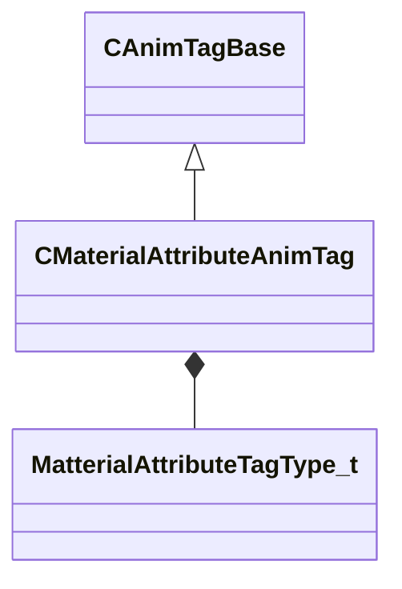

[Schemas](../../schemas.md) / [animgraphlib](../animgraphlib.md) / CMaterialAttributeAnimTag

# CMaterialAttributeAnimTag

**Kind:** class · **Size:** 112 bytes (`0x70`) · **Align:** 8 · **Module:** animgraphlib

**Inherits from:** [CAnimTagBase](../animgraphlib/CAnimTagBase.md)

**Metadata:** `MPropertyFriendlyName Material Attribute Tag`

**Relationships:**

## Memory layout

9 fields (4 declared here, 5 inherited). Offsets are absolute from the object base.

| Offset | Field | Type | From | Annotations |
|--------|-------|------|------|-------------|
| `0x18` | `m_name` | CGlobalSymbol | [CAnimTagBase](../animgraphlib/CAnimTagBase.md) | `MPropertyFriendlyName Name` `MPropertySortPriority 100` |
| `0x20` | `m_sComment` | CUtlString | [CAnimTagBase](../animgraphlib/CAnimTagBase.md) | `MPropertyAttributeEditor TextBlock()` `MPropertyFriendlyName Comment` `MPropertySortPriority -100` |
| `0x28` | `m_group` | CGlobalSymbol | [CAnimTagBase](../animgraphlib/CAnimTagBase.md) | `MPropertySuppressField` |
| `0x30` | `m_tagID` | [AnimTagID](../modellib/AnimTagID.md) | [CAnimTagBase](../animgraphlib/CAnimTagBase.md) | `MPropertySuppressField` |
| `0x48` | `m_bIsReferenced` | bool | [CAnimTagBase](../animgraphlib/CAnimTagBase.md) | `MPropertySuppressField` |
| `0x58` | `m_AttributeName` | CUtlString |  | `MPropertyFriendlyName Attribute Name` |
| `0x60` | `m_AttributeType` | [MatterialAttributeTagType_t](../!GlobalTypes/MatterialAttributeTagType_t.md) |  | `MPropertyAutoRebuildOnChange` `MPropertyFriendlyName Attribute Type` |
| `0x64` | `m_flValue` | float32 |  | `MPropertyAttrStateCallback` `MPropertyFriendlyName Value` |
| `0x68` | `m_Color` | Color |  | `MPropertyAttrStateCallback` `MPropertyFriendlyName Color` |

KV3 class defaults

<pre>{
	&quot;_class&quot;: &quot;CMaterialAttributeAnimTag&quot;,
	&quot;m_name&quot;: &quot;Unnamed Tag&quot;,
	&quot;m_sComment&quot;: &quot;&quot;,
	&quot;m_group&quot;: &quot;&quot;,
	&quot;m_tagID&quot;:
	{
		&quot;m_id&quot;: &lt;HIDDEN FOR DIFF&gt;,
	},
	&quot;m_bIsReferenced&quot;: false,
	&quot;m_AttributeName&quot;: &quot;&quot;,
	&quot;m_AttributeType&quot;: &quot;MATERIAL_ATTRIBUTE_TAG_VALUE&quot;,
	&quot;m_flValue&quot;: 0.000000,
	&quot;m_Color&quot;:
	[
		255,
		255,
		255
	]
}</pre>

