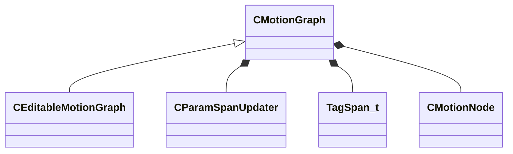

[Schemas](../../schemas.md) / [animgraphlib](../animgraphlib.md) / CMotionGraph

# CMotionGraph

**Kind:** class · **Size:** 88 bytes (`0x58`) · **Align:** 8 · **Module:** animgraphlib

**Derived by:** [CEditableMotionGraph](../animgraphlib/CEditableMotionGraph.md)

**Relationships:**

## Memory layout

7 fields (7 declared here, 0 inherited). Offsets are absolute from the object base.

| Offset | Field | Type | From | Annotations |
|--------|-------|------|------|-------------|
| `0x10` | `m_paramSpans` | [CParamSpanUpdater](../animgraphlib/CParamSpanUpdater.md) |  |  |
| `0x28` | `m_tags` | CUtlVector< [TagSpan_t](../animgraphlib/TagSpan_t.md) > |  |  |
| `0x40` | `m_pRootNode` | CSmartPtr< [CMotionNode](../animgraphlib/CMotionNode.md) > |  |  |
| `0x48` | `m_nParameterCount` | int32 |  |  |
| `0x4c` | `m_nConfigStartIndex` | int32 |  |  |
| `0x50` | `m_nConfigCount` | int32 |  |  |
| `0x54` | `m_bLoop` | bool |  |  |

KV3 class defaults

<pre>{
	&quot;_class&quot;: &quot;CMotionGraph&quot;,
	&quot;m_paramSpans&quot;:
	{
		&quot;m_spans&quot;:
		[
		]
	},
	&quot;m_tags&quot;:
	[
	],
	&quot;m_pRootNode&quot;: null,
	&quot;m_nParameterCount&quot;: 0,
	&quot;m_nConfigStartIndex&quot;: -1,
	&quot;m_nConfigCount&quot;: -1,
	&quot;m_bLoop&quot;: false
}</pre>

