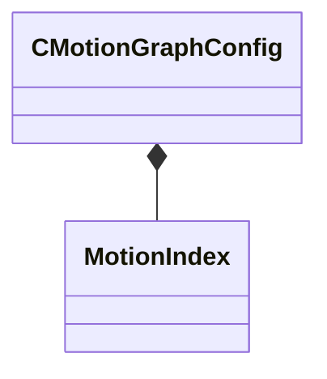

[Schemas](../../schemas.md) / [animgraphlib](../animgraphlib.md) / CMotionGraphConfig

# CMotionGraphConfig

> Source: **Build 25000182** · 2026-08-28 · `windows-x86_64` · schema `0.10.0`

**Kind:** class · **Size:** 32 bytes (`0x20`) · **Align:** 4 · **Module:** animgraphlib

**Relationships:**

## Memory layout

5 fields (5 declared here, 0 inherited). Offsets are absolute from the object base.

| Offset | Field | Type | From | Annotations |
|--------|-------|------|------|-------------|
| `0x0` | `m_paramValues` | float32[4] |  |  |
| `0x10` | `m_flDuration` | float32 |  |  |
| `0x14` | `m_nMotionIndex` | [MotionIndex](../animgraphlib/MotionIndex.md) |  |  |
| `0x18` | `m_nSampleStart` | int32 |  |  |
| `0x1c` | `m_nSampleCount` | int32 |  |  |

KV3 class defaults

<pre>{
	&quot;m_paramValues&quot;:
	[
		0.000000,
		0.000000,
		0.000000,
		0.000000
	],
	&quot;m_flDuration&quot;: 0.000000,
	&quot;m_nMotionIndex&quot;:
	{
		&quot;m_nGroup&quot;: 65535,
		&quot;m_nMotion&quot;: 65535
	},
	&quot;m_nSampleStart&quot;: -1,
	&quot;m_nSampleCount&quot;: 0
}</pre>

