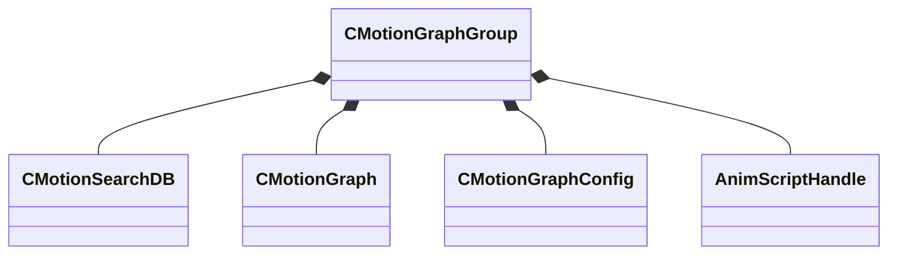

[Schemas](../../schemas.md) / [animgraphlib](../animgraphlib.md) / CMotionGraphGroup

# CMotionGraphGroup

> Source: **Build 25000182** · 2026-08-28 · `windows-x86_64` · schema `0.10.0`

**Kind:** class · **Size:** 264 bytes (`0x108`) · **Align:** 8 · **Module:** animgraphlib

**Relationships:**

## Memory layout

5 fields (5 declared here, 0 inherited). Offsets are absolute from the object base.

| Offset | Field | Type | From | Annotations |
|--------|-------|------|------|-------------|
| `0x0` | `m_searchDB` | [CMotionSearchDB](../animgraphlib/CMotionSearchDB.md) |  |  |
| `0xb8` | `m_motionGraphs` | CUtlVector< CSmartPtr< [CMotionGraph](../animgraphlib/CMotionGraph.md) > > |  |  |
| `0xd0` | `m_motionGraphConfigs` | CUtlVector< [CMotionGraphConfig](../animgraphlib/CMotionGraphConfig.md) > |  |  |
| `0xe8` | `m_sampleToConfig` | CUtlVector< int32 > |  |  |
| `0x100` | `m_hIsActiveScript` | [AnimScriptHandle](../modellib/AnimScriptHandle.md) |  |  |

KV3 class defaults

<pre>{
	&quot;m_searchDB&quot;:
	{
		&quot;m_rootNode&quot;:
		{
			&quot;m_children&quot;:
			[
			],
			&quot;m_quantizer&quot;:
			{
				&quot;m_centroidVectors&quot;:
				[
				],
				&quot;m_nCentroids&quot;: 0,
				&quot;m_nDimensions&quot;: 0
			},
			&quot;m_sampleCodes&quot;:
			[
			],
			&quot;m_sampleIndices&quot;:
			[
			],
			&quot;m_selectableSamples&quot;:
			[
			]
		},
		&quot;m_residualQuantizer&quot;:
		{
			&quot;m_subQuantizers&quot;:
			[
			],
			&quot;m_nDimensions&quot;: 0
		},
		&quot;m_codeIndices&quot;:
		[
		]
	},
	&quot;m_motionGraphs&quot;:
	[
	],
	&quot;m_motionGraphConfigs&quot;:
	[
	],
	&quot;m_sampleToConfig&quot;:
	[
	],
	&quot;m_hIsActiveScript&quot;:
	{
		&quot;m_id&quot;: &lt;HIDDEN FOR DIFF&gt;,
	}
}</pre>

