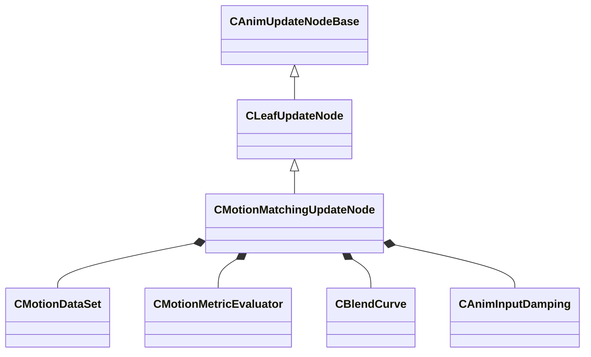

[Schemas](../../schemas.md) / [animgraphlib](../animgraphlib.md) / CMotionMatchingUpdateNode

# CMotionMatchingUpdateNode

> Source: **Build 25000182** · 2026-08-28 · `windows-x86_64` · schema `0.10.0`

**Kind:** class · **Size:** 328 bytes (`0x148`) · **Align:** 8 · **Module:** animgraphlib

**Inherits from:** [CLeafUpdateNode](../animgraphlib/CLeafUpdateNode.md)

**Relationships:**

## Memory layout

26 fields (23 declared here, 3 inherited). Offsets are absolute from the object base.

| Offset | Field | Type | From | Annotations |
|--------|-------|------|------|-------------|
| `0x18` | `m_nodePath` | [CAnimNodePath](../animgraphlib/CAnimNodePath.md) | [CAnimUpdateNodeBase](../animgraphlib/CAnimUpdateNodeBase.md) |  |
| `0x48` | `m_networkMode` | [AnimNodeNetworkMode](../animgraphlib/AnimNodeNetworkMode.md) | [CAnimUpdateNodeBase](../animgraphlib/CAnimUpdateNodeBase.md) |  |
| `0x50` | `m_name` | CUtlString | [CAnimUpdateNodeBase](../animgraphlib/CAnimUpdateNodeBase.md) |  |
| `0x58` | `m_dataSet` | [CMotionDataSet](../animgraphlib/CMotionDataSet.md) |  |  |
| `0x78` | `m_metrics` | CUtlVector< CSmartPtr< [CMotionMetricEvaluator](../animgraphlib/CMotionMetricEvaluator.md) > > |  |  |
| `0x90` | `m_weights` | CUtlVector< float32 > |  |  |
| `0xe0` | `m_bSearchEveryTick` | bool |  |  |
| `0xe4` | `m_flSearchInterval` | float32 |  |  |
| `0xe8` | `m_bSearchWhenClipEnds` | bool |  |  |
| `0xe9` | `m_bSearchWhenGoalChanges` | bool |  |  |
| `0xec` | `m_blendCurve` | [CBlendCurve](../animgraphlib/CBlendCurve.md) |  |  |
| `0xf4` | `m_flSampleRate` | float32 |  |  |
| `0xf8` | `m_flBlendTime` | float32 |  |  |
| `0xfc` | `m_bLockClipWhenWaning` | bool |  |  |
| `0x100` | `m_flSelectionThreshold` | float32 |  |  |
| `0x104` | `m_flReselectionTimeWindow` | float32 |  |  |
| `0x108` | `m_bEnableRotationCorrection` | bool |  |  |
| `0x109` | `m_bGoalAssist` | bool |  |  |
| `0x10c` | `m_flGoalAssistDistance` | float32 |  |  |
| `0x110` | `m_flGoalAssistTolerance` | float32 |  |  |
| `0x118` | `m_distanceScale_Damping` | [CAnimInputDamping](../animgraphlib/CAnimInputDamping.md) |  |  |
| `0x130` | `m_flDistanceScale_OuterRadius` | float32 |  |  |
| `0x134` | `m_flDistanceScale_InnerRadius` | float32 |  |  |
| `0x138` | `m_flDistanceScale_MaxScale` | float32 |  |  |
| `0x13c` | `m_flDistanceScale_MinScale` | float32 |  |  |
| `0x140` | `m_bEnableDistanceScaling` | bool |  |  |

KV3 class defaults

<pre>{
	&quot;_class&quot;: &quot;CMotionMatchingUpdateNode&quot;,
	&quot;m_nodePath&quot;:
	{
		&quot;m_path&quot;:
		[
			{
				&quot;m_id&quot;: &lt;HIDDEN FOR DIFF&gt;,
			},
			{
				&quot;m_id&quot;: &lt;HIDDEN FOR DIFF&gt;,
			},
			{
				&quot;m_id&quot;: &lt;HIDDEN FOR DIFF&gt;,
			},
			{
				&quot;m_id&quot;: &lt;HIDDEN FOR DIFF&gt;,
			},
			{
				&quot;m_id&quot;: &lt;HIDDEN FOR DIFF&gt;,
			},
			{
				&quot;m_id&quot;: &lt;HIDDEN FOR DIFF&gt;,
			},
			{
				&quot;m_id&quot;: &lt;HIDDEN FOR DIFF&gt;,
			},
			{
				&quot;m_id&quot;: &lt;HIDDEN FOR DIFF&gt;,
			},
			{
				&quot;m_id&quot;: &lt;HIDDEN FOR DIFF&gt;,
			},
			{
				&quot;m_id&quot;: &lt;HIDDEN FOR DIFF&gt;,
			},
			{
				&quot;m_id&quot;: &lt;HIDDEN FOR DIFF&gt;,
			}
		],
		&quot;m_nCount&quot;: 0
	},
	&quot;m_networkMode&quot;: &quot;ServerAuthoritative&quot;,
	&quot;m_name&quot;: &quot;&quot;,
	&quot;m_dataSet&quot;:
	{
		&quot;m_groups&quot;:
		[
		],
		&quot;m_nDimensionCount&quot;: 0
	},
	&quot;m_metrics&quot;:
	[
	],
	&quot;m_weights&quot;:
	[
	],
	&quot;m_bSearchEveryTick&quot;: false,
	&quot;m_flSearchInterval&quot;: 0.100000,
	&quot;m_bSearchWhenClipEnds&quot;: true,
	&quot;m_bSearchWhenGoalChanges&quot;: true,
	&quot;m_blendCurve&quot;:
	{
		&quot;m_flControlPoint1&quot;: 0.000000,
		&quot;m_flControlPoint2&quot;: 1.000000
	},
	&quot;m_flSampleRate&quot;: 0.100000,
	&quot;m_flBlendTime&quot;: 0.300000,
	&quot;m_bLockClipWhenWaning&quot;: false,
	&quot;m_flSelectionThreshold&quot;: 0.000000,
	&quot;m_flReselectionTimeWindow&quot;: 0.300000,
	&quot;m_bEnableRotationCorrection&quot;: true,
	&quot;m_bGoalAssist&quot;: false,
	&quot;m_flGoalAssistDistance&quot;: 0.000000,
	&quot;m_flGoalAssistTolerance&quot;: 0.000000,
	&quot;m_distanceScale_Damping&quot;:
	{
		&quot;_class&quot;: &quot;CAnimInputDamping&quot;,
		&quot;m_speedFunction&quot;: &quot;NoDamping&quot;,
		&quot;m_fSpeedScale&quot;: 1.000000,
		&quot;m_fFallingSpeedScale&quot;: 1.000000
	},
	&quot;m_flDistanceScale_OuterRadius&quot;: 0.000000,
	&quot;m_flDistanceScale_InnerRadius&quot;: 0.000000,
	&quot;m_flDistanceScale_MaxScale&quot;: 0.000000,
	&quot;m_flDistanceScale_MinScale&quot;: 0.000000,
	&quot;m_bEnableDistanceScaling&quot;: false
}</pre>

