[Schemas](../../schemas.md) / [animgraphlib](../animgraphlib.md) / CMotionMetricEvaluator

# CMotionMetricEvaluator

**Kind:** class · **Size:** 80 bytes (`0x50`) · **Align:** 255 · **Module:** animgraphlib

**Derived by:** [CBlockSelectionMetricEvaluator](../animgraphlib/CBlockSelectionMetricEvaluator.md), [CBonePositionMetricEvaluator](../animgraphlib/CBonePositionMetricEvaluator.md), [CBoneVelocityMetricEvaluator](../animgraphlib/CBoneVelocityMetricEvaluator.md), [CCurrentRotationVelocityMetricEvaluator](../animgraphlib/CCurrentRotationVelocityMetricEvaluator.md), [CCurrentVelocityMetricEvaluator](../animgraphlib/CCurrentVelocityMetricEvaluator.md), [CDistanceRemainingMetricEvaluator](../animgraphlib/CDistanceRemainingMetricEvaluator.md), [CFootCycleMetricEvaluator](../animgraphlib/CFootCycleMetricEvaluator.md), [CFootPositionMetricEvaluator](../animgraphlib/CFootPositionMetricEvaluator.md), [CFutureFacingMetricEvaluator](../animgraphlib/CFutureFacingMetricEvaluator.md), [CFutureVelocityMetricEvaluator](../animgraphlib/CFutureVelocityMetricEvaluator.md), [CPathMetricEvaluator](../animgraphlib/CPathMetricEvaluator.md), [CStepsRemainingMetricEvaluator](../animgraphlib/CStepsRemainingMetricEvaluator.md), [CTimeRemainingMetricEvaluator](../animgraphlib/CTimeRemainingMetricEvaluator.md)

**Relationships:**

```mermaid
classDiagram
    CMotionMetricEvaluator <|-- CBlockSelectionMetricEvaluator
    CMotionMetricEvaluator <|-- CBonePositionMetricEvaluator
    CMotionMetricEvaluator <|-- CBoneVelocityMetricEvaluator
    CMotionMetricEvaluator <|-- CCurrentRotationVelocityMetricEvaluator
    CMotionMetricEvaluator <|-- CCurrentVelocityMetricEvaluator
    CMotionMetricEvaluator <|-- CDistanceRemainingMetricEvaluator
    CMotionMetricEvaluator <|-- CFootCycleMetricEvaluator
    CMotionMetricEvaluator <|-- CFootPositionMetricEvaluator
    CMotionMetricEvaluator <|-- CFutureFacingMetricEvaluator
    CMotionMetricEvaluator <|-- CFutureVelocityMetricEvaluator
    CMotionMetricEvaluator <|-- CPathMetricEvaluator
    CMotionMetricEvaluator <|-- CStepsRemainingMetricEvaluator
    CMotionMetricEvaluator <|-- CTimeRemainingMetricEvaluator
```

## Memory layout

4 fields (4 declared here, 0 inherited). Offsets are absolute from the object base.

| Offset | Field | Type | From | Annotations |
|--------|-------|------|------|-------------|
| `0x18` | `m_means` | CUtlVector< float32 > |  |  |
| `0x30` | `m_standardDeviations` | CUtlVector< float32 > |  |  |
| `0x48` | `m_flWeight` | float32 |  |  |
| `0x4c` | `m_nDimensionStartIndex` | int32 |  |  |
