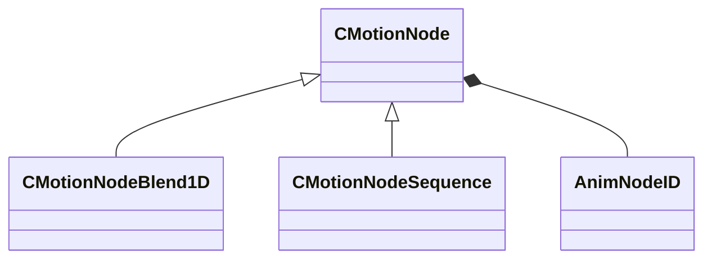

[Schemas](../../schemas.md) / [animgraphlib](../animgraphlib.md) / CMotionNode

# CMotionNode

> Source: **Build 25000182** · 2026-08-28 · `windows-x86_64` · schema `0.10.0`

**Kind:** class · **Size:** 40 bytes (`0x28`) · **Align:** n/a (unspecified) · **Module:** animgraphlib

**Derived by:** [CMotionNodeBlend1D](../animgraphlib/CMotionNodeBlend1D.md), [CMotionNodeSequence](../animgraphlib/CMotionNodeSequence.md)

**Relationships:**

## Memory layout

2 fields (2 declared here, 0 inherited). Offsets are absolute from the object base.

| Offset | Field | Type | From | Annotations |
|--------|-------|------|------|-------------|
| `0x18` | `m_name` | CUtlString |  |  |
| `0x20` | `m_id` | [AnimNodeID](../modellib/AnimNodeID.md) |  |  |
