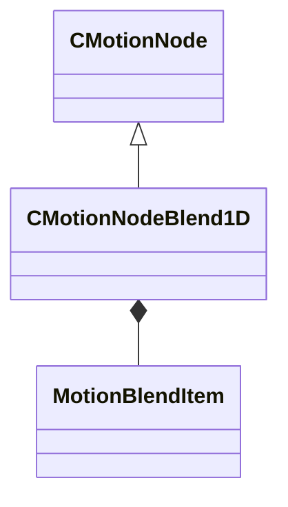

[Schemas](../../schemas.md) / [animgraphlib](../animgraphlib.md) / CMotionNodeBlend1D

# CMotionNodeBlend1D

> Source: **Build 25000182** · 2026-08-28 · `windows-x86_64` · schema `0.10.0`

**Kind:** class · **Size:** 72 bytes (`0x48`) · **Align:** 8 · **Module:** animgraphlib

**Inherits from:** [CMotionNode](../animgraphlib/CMotionNode.md)

**Relationships:**

## Memory layout

4 fields (2 declared here, 2 inherited). Offsets are absolute from the object base.

| Offset | Field | Type | From | Annotations |
|--------|-------|------|------|-------------|
| `0x18` | `m_name` | CUtlString | [CMotionNode](../animgraphlib/CMotionNode.md) |  |
| `0x20` | `m_id` | [AnimNodeID](../modellib/AnimNodeID.md) | [CMotionNode](../animgraphlib/CMotionNode.md) |  |
| `0x28` | `m_blendItems` | CUtlVector< [MotionBlendItem](../animgraphlib/MotionBlendItem.md) > |  |  |
| `0x40` | `m_nParamIndex` | int32 |  |  |

KV3 class defaults

<pre>{
	&quot;_class&quot;: &quot;CMotionNodeBlend1D&quot;,
	&quot;m_name&quot;: &quot;&quot;,
	&quot;m_id&quot;:
	{
		&quot;m_id&quot;: &lt;HIDDEN FOR DIFF&gt;,
	},
	&quot;m_blendItems&quot;:
	[
	],
	&quot;m_nParamIndex&quot;: 0
}</pre>

