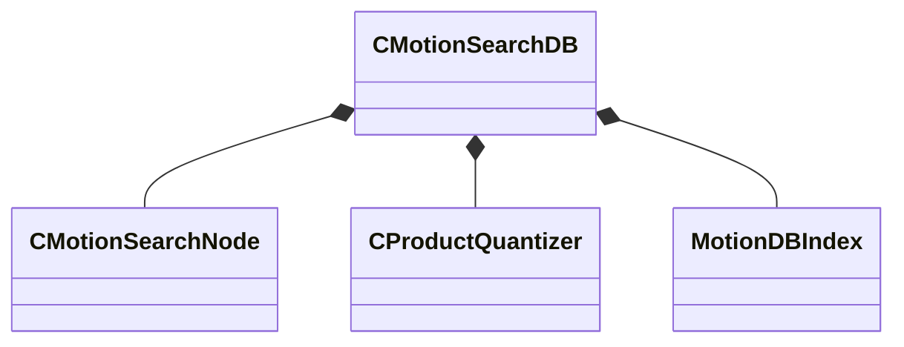

[Schemas](../../schemas.md) / [animgraphlib](../animgraphlib.md) / CMotionSearchDB

# CMotionSearchDB

**Kind:** class · **Size:** 184 bytes (`0xb8`) · **Align:** 8 · **Module:** animgraphlib

**Relationships:**

## Memory layout

3 fields (3 declared here, 0 inherited). Offsets are absolute from the object base.

| Offset | Field | Type | From | Annotations |
|--------|-------|------|------|-------------|
| `0x0` | `m_rootNode` | [CMotionSearchNode](../animgraphlib/CMotionSearchNode.md) |  |  |
| `0x80` | `m_residualQuantizer` | [CProductQuantizer](../animgraphlib/CProductQuantizer.md) |  |  |
| `0xa0` | `m_codeIndices` | CUtlVector< [MotionDBIndex](../animgraphlib/MotionDBIndex.md) > |  |  |

KV3 class defaults

<pre>{
	&quot;m_rootNode&quot;:
	{
		&quot;m_children&quot;:
		[
		],
		&quot;m_quantizer&quot;:
		{
			&quot;m_centroidVectors&quot;:
			[
			],
			&quot;m_nCentroids&quot;: 0,
			&quot;m_nDimensions&quot;: 0
		},
		&quot;m_sampleCodes&quot;:
		[
		],
		&quot;m_sampleIndices&quot;:
		[
		],
		&quot;m_selectableSamples&quot;:
		[
		]
	},
	&quot;m_residualQuantizer&quot;:
	{
		&quot;m_subQuantizers&quot;:
		[
		],
		&quot;m_nDimensions&quot;: 0
	},
	&quot;m_codeIndices&quot;:
	[
	]
}</pre>

