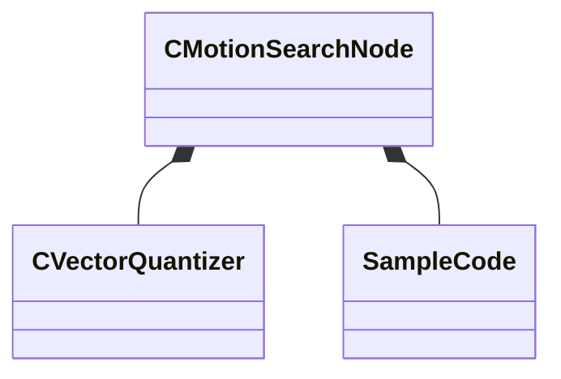

[Schemas](../../schemas.md) / [animgraphlib](../animgraphlib.md) / CMotionSearchNode

# CMotionSearchNode

**Kind:** class · **Size:** 128 bytes (`0x80`) · **Align:** 8 · **Module:** animgraphlib

**Relationships:**

## Memory layout

5 fields (5 declared here, 0 inherited). Offsets are absolute from the object base.

| Offset | Field | Type | From | Annotations |
|--------|-------|------|------|-------------|
| `0x0` | `m_children` | CUtlVector< [CMotionSearchNode](../animgraphlib/CMotionSearchNode.md)* > |  |  |
| `0x18` | `m_quantizer` | [CVectorQuantizer](../animgraphlib/CVectorQuantizer.md) |  |  |
| `0x38` | `m_sampleCodes` | CUtlVector< CUtlVector< [SampleCode](../animgraphlib/SampleCode.md) > > |  |  |
| `0x50` | `m_sampleIndices` | CUtlVector< CUtlVector< int32 > > |  |  |
| `0x68` | `m_selectableSamples` | CUtlVector< int32 > |  |  |

KV3 class defaults

<pre>{
	&quot;m_children&quot;:
	[
	],
	&quot;m_quantizer&quot;:
	{
		&quot;m_centroidVectors&quot;:
		[
		],
		&quot;m_nCentroids&quot;: 0,
		&quot;m_nDimensions&quot;: 0
	},
	&quot;m_sampleCodes&quot;:
	[
	],
	&quot;m_sampleIndices&quot;:
	[
	],
	&quot;m_selectableSamples&quot;:
	[
	]
}</pre>

