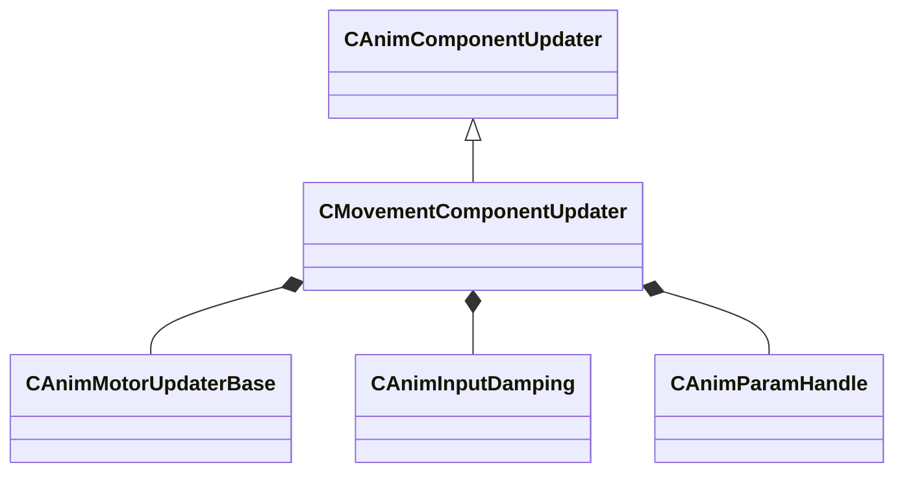

[Schemas](../../schemas.md) / [animgraphlib](../animgraphlib.md) / CMovementComponentUpdater

# CMovementComponentUpdater

> Source: **Build 25000182** · 2026-08-28 · `windows-x86_64` · schema `0.10.0`

**Kind:** class · **Size:** 184 bytes (`0xb8`) · **Align:** 8 · **Module:** animgraphlib

**Inherits from:** [CAnimComponentUpdater](../animgraphlib/CAnimComponentUpdater.md)

**Relationships:**

## Memory layout

12 fields (8 declared here, 4 inherited). Offsets are absolute from the object base.

| Offset | Field | Type | From | Annotations |
|--------|-------|------|------|-------------|
| `0x18` | `m_name` | CUtlString | [CAnimComponentUpdater](../animgraphlib/CAnimComponentUpdater.md) |  |
| `0x20` | `m_id` | [AnimComponentID](../modellib/AnimComponentID.md) | [CAnimComponentUpdater](../animgraphlib/CAnimComponentUpdater.md) |  |
| `0x24` | `m_networkMode` | [AnimNodeNetworkMode](../animgraphlib/AnimNodeNetworkMode.md) | [CAnimComponentUpdater](../animgraphlib/CAnimComponentUpdater.md) |  |
| `0x28` | `m_bStartEnabled` | bool | [CAnimComponentUpdater](../animgraphlib/CAnimComponentUpdater.md) |  |
| `0x30` | `m_motors` | CUtlVector< CSmartPtr< [CAnimMotorUpdaterBase](../animgraphlib/CAnimMotorUpdaterBase.md) > > |  |  |
| `0x48` | `m_facingDamping` | [CAnimInputDamping](../animgraphlib/CAnimInputDamping.md) |  |  |
| `0x68` | `m_nDefaultMotorIndex` | int32 |  |  |
| `0x6c` | `m_flDefaultRunSpeed` | float32 |  |  |
| `0x70` | `m_bMoveVarsDisabled` | bool |  |  |
| `0x71` | `m_bNetworkPath` | bool |  |  |
| `0x72` | `m_bNetworkFacing` | bool |  |  |
| `0x73` | `m_paramHandles` | [CAnimParamHandle](../animgraphlib/CAnimParamHandle.md)[34] |  |  |

KV3 class defaults

<pre>{
	&quot;_class&quot;: &quot;CMovementComponentUpdater&quot;,
	&quot;m_name&quot;: &quot;&quot;,
	&quot;m_id&quot;:
	{
		&quot;m_id&quot;: &lt;HIDDEN FOR DIFF&gt;,
	},
	&quot;m_networkMode&quot;: &quot;ServerAuthoritative&quot;,
	&quot;m_bStartEnabled&quot;: false,
	&quot;m_motors&quot;:
	[
	],
	&quot;m_facingDamping&quot;:
	{
		&quot;_class&quot;: &quot;CAnimInputDamping&quot;,
		&quot;m_speedFunction&quot;: &quot;NoDamping&quot;,
		&quot;m_fSpeedScale&quot;: 1.000000,
		&quot;m_fFallingSpeedScale&quot;: 1.000000
	},
	&quot;m_nDefaultMotorIndex&quot;: 0,
	&quot;m_flDefaultRunSpeed&quot;: 0.000000,
	&quot;m_bMoveVarsDisabled&quot;: false,
	&quot;m_bNetworkPath&quot;: true,
	&quot;m_bNetworkFacing&quot;: true,
	&quot;m_paramHandles&quot;:
	[
		{
			&quot;m_type&quot;: &quot;ANIMPARAM_UNKNOWN&quot;,
			&quot;m_index&quot;: 255
		},
		{
			&quot;m_type&quot;: &quot;ANIMPARAM_UNKNOWN&quot;,
			&quot;m_index&quot;: 255
		},
		{
			&quot;m_type&quot;: &quot;ANIMPARAM_UNKNOWN&quot;,
			&quot;m_index&quot;: 255
		},
		{
			&quot;m_type&quot;: &quot;ANIMPARAM_UNKNOWN&quot;,
			&quot;m_index&quot;: 255
		},
		{
			&quot;m_type&quot;: &quot;ANIMPARAM_UNKNOWN&quot;,
			&quot;m_index&quot;: 255
		},
		{
			&quot;m_type&quot;: &quot;ANIMPARAM_UNKNOWN&quot;,
			&quot;m_index&quot;: 255
		},
		{
			&quot;m_type&quot;: &quot;ANIMPARAM_UNKNOWN&quot;,
			&quot;m_index&quot;: 255
		},
		{
			&quot;m_type&quot;: &quot;ANIMPARAM_UNKNOWN&quot;,
			&quot;m_index&quot;: 255
		},
		{
			&quot;m_type&quot;: &quot;ANIMPARAM_UNKNOWN&quot;,
			&quot;m_index&quot;: 255
		},
		{
			&quot;m_type&quot;: &quot;ANIMPARAM_UNKNOWN&quot;,
			&quot;m_index&quot;: 255
		},
		{
			&quot;m_type&quot;: &quot;ANIMPARAM_UNKNOWN&quot;,
			&quot;m_index&quot;: 255
		},
		{
			&quot;m_type&quot;: &quot;ANIMPARAM_UNKNOWN&quot;,
			&quot;m_index&quot;: 255
		},
		{
			&quot;m_type&quot;: &quot;ANIMPARAM_UNKNOWN&quot;,
			&quot;m_index&quot;: 255
		},
		{
			&quot;m_type&quot;: &quot;ANIMPARAM_UNKNOWN&quot;,
			&quot;m_index&quot;: 255
		},
		{
			&quot;m_type&quot;: &quot;ANIMPARAM_UNKNOWN&quot;,
			&quot;m_index&quot;: 255
		},
		{
			&quot;m_type&quot;: &quot;ANIMPARAM_UNKNOWN&quot;,
			&quot;m_index&quot;: 255
		},
		{
			&quot;m_type&quot;: &quot;ANIMPARAM_UNKNOWN&quot;,
			&quot;m_index&quot;: 255
		},
		{
			&quot;m_type&quot;: &quot;ANIMPARAM_UNKNOWN&quot;,
			&quot;m_index&quot;: 255
		},
		{
			&quot;m_type&quot;: &quot;ANIMPARAM_UNKNOWN&quot;,
			&quot;m_index&quot;: 255
		},
		{
			&quot;m_type&quot;: &quot;ANIMPARAM_UNKNOWN&quot;,
			&quot;m_index&quot;: 255
		},
		{
			&quot;m_type&quot;: &quot;ANIMPARAM_UNKNOWN&quot;,
			&quot;m_index&quot;: 255
		},
		{
			&quot;m_type&quot;: &quot;ANIMPARAM_UNKNOWN&quot;,
			&quot;m_index&quot;: 255
		},
		{
			&quot;m_type&quot;: &quot;ANIMPARAM_UNKNOWN&quot;,
			&quot;m_index&quot;: 255
		},
		{
			&quot;m_type&quot;: &quot;ANIMPARAM_UNKNOWN&quot;,
			&quot;m_index&quot;: 255
		},
		{
			&quot;m_type&quot;: &quot;ANIMPARAM_UNKNOWN&quot;,
			&quot;m_index&quot;: 255
		},
		{
			&quot;m_type&quot;: &quot;ANIMPARAM_UNKNOWN&quot;,
			&quot;m_index&quot;: 255
		},
		{
			&quot;m_type&quot;: &quot;ANIMPARAM_UNKNOWN&quot;,
			&quot;m_index&quot;: 255
		},
		{
			&quot;m_type&quot;: &quot;ANIMPARAM_UNKNOWN&quot;,
			&quot;m_index&quot;: 255
		},
		{
			&quot;m_type&quot;: &quot;ANIMPARAM_UNKNOWN&quot;,
			&quot;m_index&quot;: 255
		},
		{
			&quot;m_type&quot;: &quot;ANIMPARAM_UNKNOWN&quot;,
			&quot;m_index&quot;: 255
		},
		{
			&quot;m_type&quot;: &quot;ANIMPARAM_UNKNOWN&quot;,
			&quot;m_index&quot;: 255
		},
		{
			&quot;m_type&quot;: &quot;ANIMPARAM_UNKNOWN&quot;,
			&quot;m_index&quot;: 255
		},
		{
			&quot;m_type&quot;: &quot;ANIMPARAM_UNKNOWN&quot;,
			&quot;m_index&quot;: 255
		},
		{
			&quot;m_type&quot;: &quot;ANIMPARAM_UNKNOWN&quot;,
			&quot;m_index&quot;: 255
		}
	]
}</pre>

