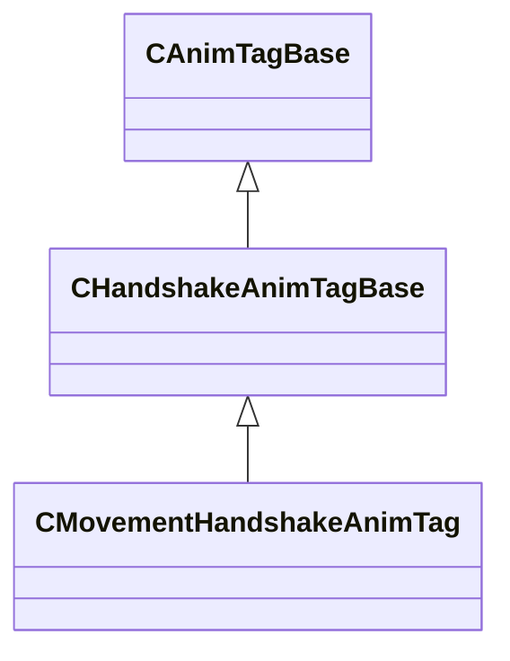

[Schemas](../../schemas.md) / [animgraphlib](../animgraphlib.md) / CMovementHandshakeAnimTag

# CMovementHandshakeAnimTag

> Source: **Build 25000182** · 2026-08-28 · `windows-x86_64` · schema `0.10.0`

**Kind:** class · **Size:** 88 bytes (`0x58`) · **Align:** 8 · **Module:** animgraphlib

**Inherits from:** [CHandshakeAnimTagBase](../animgraphlib/CHandshakeAnimTagBase.md)

**Metadata:** `MPropertyFriendlyName Movement Handshake Tag`

**Relationships:**

## Memory layout

6 fields (0 declared here, 6 inherited). Offsets are absolute from the object base.

| Offset | Field | Type | From | Annotations |
|--------|-------|------|------|-------------|
| `0x18` | `m_name` | CGlobalSymbol | [CAnimTagBase](../animgraphlib/CAnimTagBase.md) | `MPropertyFriendlyName Name` `MPropertySortPriority 100` |
| `0x20` | `m_sComment` | CUtlString | [CAnimTagBase](../animgraphlib/CAnimTagBase.md) | `MPropertyAttributeEditor TextBlock()` `MPropertyFriendlyName Comment` `MPropertySortPriority -100` |
| `0x28` | `m_group` | CGlobalSymbol | [CAnimTagBase](../animgraphlib/CAnimTagBase.md) | `MPropertySuppressField` |
| `0x30` | `m_tagID` | [AnimTagID](../modellib/AnimTagID.md) | [CAnimTagBase](../animgraphlib/CAnimTagBase.md) | `MPropertySuppressField` |
| `0x48` | `m_bIsReferenced` | bool | [CAnimTagBase](../animgraphlib/CAnimTagBase.md) | `MPropertySuppressField` |
| `0x50` | `m_bIsDisableTag` | bool | [CHandshakeAnimTagBase](../animgraphlib/CHandshakeAnimTagBase.md) | `MPropertyFriendlyName Disables Handshake` |

KV3 class defaults

<pre>{
	&quot;_class&quot;: &quot;CMovementHandshakeAnimTag&quot;,
	&quot;m_name&quot;: &quot;Unnamed Tag&quot;,
	&quot;m_sComment&quot;: &quot;&quot;,
	&quot;m_group&quot;: &quot;&quot;,
	&quot;m_tagID&quot;:
	{
		&quot;m_id&quot;: &lt;HIDDEN FOR DIFF&gt;,
	},
	&quot;m_bIsReferenced&quot;: false,
	&quot;m_bIsDisableTag&quot;: false
}</pre>

