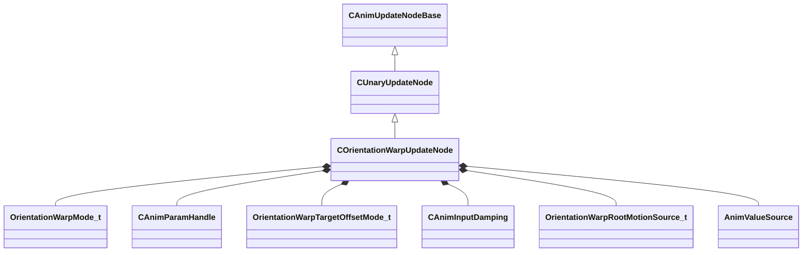

[Schemas](../../schemas.md) / [animgraphlib](../animgraphlib.md) / COrientationWarpUpdateNode

# COrientationWarpUpdateNode

**Kind:** class · **Size:** 192 bytes (`0xc0`) · **Align:** 8 · **Module:** animgraphlib

**Inherits from:** [CUnaryUpdateNode](../animgraphlib/CUnaryUpdateNode.md)

**Relationships:**

## Memory layout

17 fields (13 declared here, 4 inherited). Offsets are absolute from the object base.

| Offset | Field | Type | From | Annotations |
|--------|-------|------|------|-------------|
| `0x18` | `m_nodePath` | [CAnimNodePath](../animgraphlib/CAnimNodePath.md) | [CAnimUpdateNodeBase](../animgraphlib/CAnimUpdateNodeBase.md) |  |
| `0x48` | `m_networkMode` | [AnimNodeNetworkMode](../animgraphlib/AnimNodeNetworkMode.md) | [CAnimUpdateNodeBase](../animgraphlib/CAnimUpdateNodeBase.md) |  |
| `0x50` | `m_name` | CUtlString | [CAnimUpdateNodeBase](../animgraphlib/CAnimUpdateNodeBase.md) |  |
| `0x60` | `m_pChildNode` | [CAnimUpdateNodeRef](../animgraphlib/CAnimUpdateNodeRef.md) | [CUnaryUpdateNode](../animgraphlib/CUnaryUpdateNode.md) |  |
| `0x74` | `m_eMode` | [OrientationWarpMode_t](../animgraphlib/OrientationWarpMode_t.md) |  |  |
| `0x78` | `m_hTargetParam` | [CAnimParamHandle](../animgraphlib/CAnimParamHandle.md) |  |  |
| `0x7a` | `m_hTargetPositionParam` | [CAnimParamHandle](../animgraphlib/CAnimParamHandle.md) |  |  |
| `0x7c` | `m_hFallbackTargetPositionParam` | [CAnimParamHandle](../animgraphlib/CAnimParamHandle.md) |  |  |
| `0x80` | `m_eTargetOffsetMode` | [OrientationWarpTargetOffsetMode_t](../animgraphlib/OrientationWarpTargetOffsetMode_t.md) |  |  |
| `0x84` | `m_flTargetOffset` | float32 |  |  |
| `0x88` | `m_hTargetOffsetParam` | [CAnimParamHandle](../animgraphlib/CAnimParamHandle.md) |  |  |
| `0x90` | `m_damping` | [CAnimInputDamping](../animgraphlib/CAnimInputDamping.md) |  |  |
| `0xa8` | `m_eRootMotionSource` | [OrientationWarpRootMotionSource_t](../animgraphlib/OrientationWarpRootMotionSource_t.md) |  |  |
| `0xac` | `m_flMaxRootMotionScale` | float32 |  |  |
| `0xb0` | `m_bEnablePreferredRotationDirection` | bool |  |  |
| `0xb4` | `m_ePreferredRotationDirection` | [AnimValueSource](../animgraphlib/AnimValueSource.md) |  |  |
| `0xb8` | `m_flPreferredRotationThreshold` | float32 |  |  |

KV3 class defaults

<pre>{
	&quot;_class&quot;: &quot;COrientationWarpUpdateNode&quot;,
	&quot;m_nodePath&quot;:
	{
		&quot;m_path&quot;:
		[
			{
				&quot;m_id&quot;: &lt;HIDDEN FOR DIFF&gt;,
			},
			{
				&quot;m_id&quot;: &lt;HIDDEN FOR DIFF&gt;,
			},
			{
				&quot;m_id&quot;: &lt;HIDDEN FOR DIFF&gt;,
			},
			{
				&quot;m_id&quot;: &lt;HIDDEN FOR DIFF&gt;,
			},
			{
				&quot;m_id&quot;: &lt;HIDDEN FOR DIFF&gt;,
			},
			{
				&quot;m_id&quot;: &lt;HIDDEN FOR DIFF&gt;,
			},
			{
				&quot;m_id&quot;: &lt;HIDDEN FOR DIFF&gt;,
			},
			{
				&quot;m_id&quot;: &lt;HIDDEN FOR DIFF&gt;,
			},
			{
				&quot;m_id&quot;: &lt;HIDDEN FOR DIFF&gt;,
			},
			{
				&quot;m_id&quot;: &lt;HIDDEN FOR DIFF&gt;,
			},
			{
				&quot;m_id&quot;: &lt;HIDDEN FOR DIFF&gt;,
			}
		],
		&quot;m_nCount&quot;: 0
	},
	&quot;m_networkMode&quot;: &quot;ServerAuthoritative&quot;,
	&quot;m_name&quot;: &quot;&quot;,
	&quot;m_pChildNode&quot;:
	{
		&quot;m_nodeIndex&quot;: -1
	},
	&quot;m_eMode&quot;: &quot;eInvalid&quot;,
	&quot;m_hTargetParam&quot;:
	{
		&quot;m_type&quot;: &quot;ANIMPARAM_UNKNOWN&quot;,
		&quot;m_index&quot;: 255
	},
	&quot;m_hTargetPositionParam&quot;:
	{
		&quot;m_type&quot;: &quot;ANIMPARAM_UNKNOWN&quot;,
		&quot;m_index&quot;: 255
	},
	&quot;m_hFallbackTargetPositionParam&quot;:
	{
		&quot;m_type&quot;: &quot;ANIMPARAM_UNKNOWN&quot;,
		&quot;m_index&quot;: 255
	},
	&quot;m_eTargetOffsetMode&quot;: &quot;eLiteralValue&quot;,
	&quot;m_flTargetOffset&quot;: 0.000000,
	&quot;m_hTargetOffsetParam&quot;:
	{
		&quot;m_type&quot;: &quot;ANIMPARAM_UNKNOWN&quot;,
		&quot;m_index&quot;: 255
	},
	&quot;m_damping&quot;:
	{
		&quot;_class&quot;: &quot;CAnimInputDamping&quot;,
		&quot;m_speedFunction&quot;: &quot;NoDamping&quot;,
		&quot;m_fSpeedScale&quot;: 1.000000,
		&quot;m_fFallingSpeedScale&quot;: 1.000000
	},
	&quot;m_eRootMotionSource&quot;: &quot;eAnimationOrProcedural&quot;,
	&quot;m_flMaxRootMotionScale&quot;: 10.000000,
	&quot;m_bEnablePreferredRotationDirection&quot;: false,
	&quot;m_ePreferredRotationDirection&quot;: &quot;FacingHeading&quot;,
	&quot;m_flPreferredRotationThreshold&quot;: 190.000000
}</pre>

