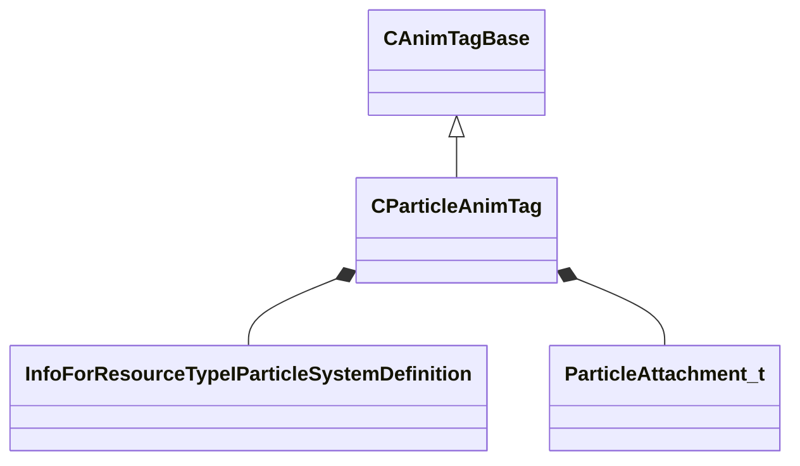

[Schemas](../../schemas.md) / [animgraphlib](../animgraphlib.md) / CParticleAnimTag

# CParticleAnimTag

> Source: **Build 25000182** · 2026-08-28 · `windows-x86_64` · schema `0.10.0`

**Kind:** class · **Size:** 152 bytes (`0x98`) · **Align:** 8 · **Module:** animgraphlib

**Inherits from:** [CAnimTagBase](../animgraphlib/CAnimTagBase.md)

**Metadata:** `MPropertyFriendlyName Particle Tag`

**Relationships:**

## Memory layout

16 fields (11 declared here, 5 inherited). Offsets are absolute from the object base.

| Offset | Field | Type | From | Annotations |
|--------|-------|------|------|-------------|
| `0x18` | `m_name` | CGlobalSymbol | [CAnimTagBase](../animgraphlib/CAnimTagBase.md) | `MPropertyFriendlyName Name` `MPropertySortPriority 100` |
| `0x20` | `m_sComment` | CUtlString | [CAnimTagBase](../animgraphlib/CAnimTagBase.md) | `MPropertyAttributeEditor TextBlock()` `MPropertyFriendlyName Comment` `MPropertySortPriority -100` |
| `0x28` | `m_group` | CGlobalSymbol | [CAnimTagBase](../animgraphlib/CAnimTagBase.md) | `MPropertySuppressField` |
| `0x30` | `m_tagID` | [AnimTagID](../modellib/AnimTagID.md) | [CAnimTagBase](../animgraphlib/CAnimTagBase.md) | `MPropertySuppressField` |
| `0x48` | `m_bIsReferenced` | bool | [CAnimTagBase](../animgraphlib/CAnimTagBase.md) | `MPropertySuppressField` |
| `0x58` | `m_hParticleSystem` | CStrongHandle< [InfoForResourceTypeIParticleSystemDefinition](../resourcesystem/InfoForResourceTypeIParticleSystemDefinition.md) > |  | `MPropertySuppressField` |
| `0x60` | `m_particleSystemName` | CUtlString |  | `MPropertyAttributeEditor AssetBrowse( vpcf )` `MPropertyFriendlyName Particle System` |
| `0x68` | `m_configName` | CUtlString |  | `MPropertyFriendlyName Configuration` |
| `0x70` | `m_bDetachFromOwner` | bool |  | `MPropertyFriendlyName Detach From Owner` |
| `0x71` | `m_bAggregate` | bool |  | `MPropertyFriendlyName Attempt to Aggregate` |
| `0x72` | `m_bStopWhenTagEnds` | bool |  | `MPropertyFriendlyName Stop on Tag End` `MPropertyGroupName Ending` |
| `0x73` | `m_bTagEndStopIsInstant` | bool |  | `MPropertyFriendlyName Tag End Stop is Instant` `MPropertyGroupName Ending` |
| `0x78` | `m_attachmentName` | CUtlString |  | `MPropertyAttributeChoiceName Attachment` `MPropertyFriendlyName Attachment` `MPropertyGroupName Attachments` |
| `0x80` | `m_attachmentType` | [ParticleAttachment_t](../animationsystem/ParticleAttachment_t.md) |  | `MPropertyFriendlyName Attachment Type` `MPropertyGroupName Attachments` |
| `0x88` | `m_attachmentCP1Name` | CUtlString |  | `MPropertyAttributeChoiceName Attachment` `MPropertyFriendlyName Attachment (Control Point 1)` `MPropertyGroupName Attachments` |
| `0x90` | `m_attachmentCP1Type` | [ParticleAttachment_t](../animationsystem/ParticleAttachment_t.md) |  | `MPropertyFriendlyName Attachment Type (Control Point 1)` `MPropertyGroupName Attachments` |

KV3 class defaults

<pre>{
	&quot;_class&quot;: &quot;CParticleAnimTag&quot;,
	&quot;m_name&quot;: &quot;Unnamed Tag&quot;,
	&quot;m_sComment&quot;: &quot;&quot;,
	&quot;m_group&quot;: &quot;&quot;,
	&quot;m_tagID&quot;:
	{
		&quot;m_id&quot;: &lt;HIDDEN FOR DIFF&gt;,
	},
	&quot;m_bIsReferenced&quot;: false,
	&quot;m_hParticleSystem&quot;: &quot;&quot;,
	&quot;m_particleSystemName&quot;: &quot;&quot;,
	&quot;m_configName&quot;: &quot;&quot;,
	&quot;m_bDetachFromOwner&quot;: false,
	&quot;m_bAggregate&quot;: false,
	&quot;m_bStopWhenTagEnds&quot;: false,
	&quot;m_bTagEndStopIsInstant&quot;: false,
	&quot;m_attachmentName&quot;: &quot;&quot;,
	&quot;m_attachmentType&quot;: &quot;PATTACH_POINT_FOLLOW&quot;,
	&quot;m_attachmentCP1Name&quot;: &quot;&quot;,
	&quot;m_attachmentCP1Type&quot;: &quot;PATTACH_INVALID&quot;
}</pre>

