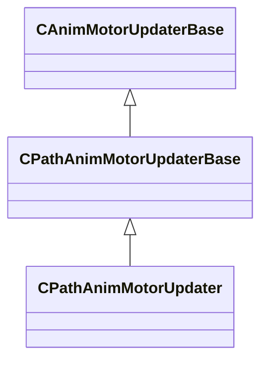

[Schemas](../../schemas.md) / [animgraphlib](../animgraphlib.md) / CPathAnimMotorUpdater

# CPathAnimMotorUpdater

> Source: **Build 25000182** · 2026-08-28 · `windows-x86_64` · schema `0.10.0`

**Kind:** class · **Size:** 40 bytes (`0x28`) · **Align:** 8 · **Module:** animgraphlib

**Inherits from:** [CPathAnimMotorUpdaterBase](../animgraphlib/CPathAnimMotorUpdaterBase.md)

**Relationships:**

## Memory layout

3 fields (0 declared here, 3 inherited). Offsets are absolute from the object base.

| Offset | Field | Type | From | Annotations |
|--------|-------|------|------|-------------|
| `0x10` | `m_name` | CUtlString | [CAnimMotorUpdaterBase](../animgraphlib/CAnimMotorUpdaterBase.md) |  |
| `0x18` | `m_bDefault` | bool | [CAnimMotorUpdaterBase](../animgraphlib/CAnimMotorUpdaterBase.md) |  |
| `0x20` | `m_bLockToPath` | bool | [CPathAnimMotorUpdaterBase](../animgraphlib/CPathAnimMotorUpdaterBase.md) |  |

KV3 class defaults

<pre>{
	&quot;_class&quot;: &quot;CPathAnimMotorUpdater&quot;,
	&quot;m_name&quot;: &quot;&quot;,
	&quot;m_bDefault&quot;: false,
	&quot;m_bLockToPath&quot;: false
}</pre>

