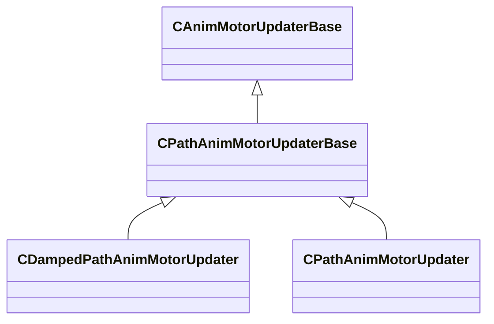

[Schemas](../../schemas.md) / [animgraphlib](../animgraphlib.md) / CPathAnimMotorUpdaterBase

# CPathAnimMotorUpdaterBase

> Source: **Build 25000182** · 2026-08-28 · `windows-x86_64` · schema `0.10.0`

**Kind:** class · **Size:** 40 bytes (`0x28`) · **Align:** n/a (unspecified) · **Module:** animgraphlib

**Inherits from:** [CAnimMotorUpdaterBase](../animgraphlib/CAnimMotorUpdaterBase.md)

**Derived by:** [CDampedPathAnimMotorUpdater](../animgraphlib/CDampedPathAnimMotorUpdater.md), [CPathAnimMotorUpdater](../animgraphlib/CPathAnimMotorUpdater.md)

**Relationships:**

## Memory layout

3 fields (1 declared here, 2 inherited). Offsets are absolute from the object base.

| Offset | Field | Type | From | Annotations |
|--------|-------|------|------|-------------|
| `0x10` | `m_name` | CUtlString | [CAnimMotorUpdaterBase](../animgraphlib/CAnimMotorUpdaterBase.md) |  |
| `0x18` | `m_bDefault` | bool | [CAnimMotorUpdaterBase](../animgraphlib/CAnimMotorUpdaterBase.md) |  |
| `0x20` | `m_bLockToPath` | bool |  |  |
