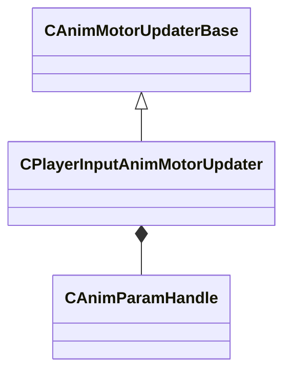

[Schemas](../../schemas.md) / [animgraphlib](../animgraphlib.md) / CPlayerInputAnimMotorUpdater

# CPlayerInputAnimMotorUpdater

> Source: **Build 25000182** · 2026-08-28 · `windows-x86_64` · schema `0.10.0`

**Kind:** class · **Size:** 80 bytes (`0x50`) · **Align:** 8 · **Module:** animgraphlib

**Inherits from:** [CAnimMotorUpdaterBase](../animgraphlib/CAnimMotorUpdaterBase.md)

**Relationships:**

## Memory layout

8 fields (6 declared here, 2 inherited). Offsets are absolute from the object base.

| Offset | Field | Type | From | Annotations |
|--------|-------|------|------|-------------|
| `0x10` | `m_name` | CUtlString | [CAnimMotorUpdaterBase](../animgraphlib/CAnimMotorUpdaterBase.md) |  |
| `0x18` | `m_bDefault` | bool | [CAnimMotorUpdaterBase](../animgraphlib/CAnimMotorUpdaterBase.md) |  |
| `0x20` | `m_sampleTimes` | CUtlVector< float32 > |  |  |
| `0x3c` | `m_flSpringConstant` | float32 |  |  |
| `0x40` | `m_flAnticipationDistance` | float32 |  |  |
| `0x44` | `m_hAnticipationPosParam` | [CAnimParamHandle](../animgraphlib/CAnimParamHandle.md) |  |  |
| `0x46` | `m_hAnticipationHeadingParam` | [CAnimParamHandle](../animgraphlib/CAnimParamHandle.md) |  |  |
| `0x48` | `m_bUseAcceleration` | bool |  |  |

KV3 class defaults

<pre>{
	&quot;_class&quot;: &quot;CPlayerInputAnimMotorUpdater&quot;,
	&quot;m_name&quot;: &quot;&quot;,
	&quot;m_bDefault&quot;: false,
	&quot;m_sampleTimes&quot;:
	[
	],
	&quot;m_flSpringConstant&quot;: 0.000000,
	&quot;m_flAnticipationDistance&quot;: 0.000000,
	&quot;m_hAnticipationPosParam&quot;:
	{
		&quot;m_type&quot;: &quot;ANIMPARAM_UNKNOWN&quot;,
		&quot;m_index&quot;: 255
	},
	&quot;m_hAnticipationHeadingParam&quot;:
	{
		&quot;m_type&quot;: &quot;ANIMPARAM_UNKNOWN&quot;,
		&quot;m_index&quot;: 255
	},
	&quot;m_bUseAcceleration&quot;: false
}</pre>

