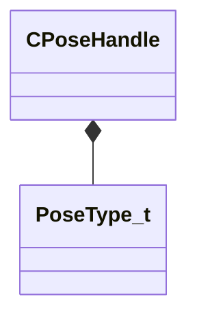

[Schemas](../../schemas.md) / [animgraphlib](../animgraphlib.md) / CPoseHandle

# CPoseHandle

> Source: **Build 25000182** · 2026-08-28 · `windows-x86_64` · schema `0.10.0`

**Kind:** class · **Size:** 4 bytes (`0x4`) · **Align:** 2 · **Module:** animgraphlib

**Relationships:**

## Memory layout

2 fields (2 declared here, 0 inherited). Offsets are absolute from the object base.

| Offset | Field | Type | From | Annotations |
|--------|-------|------|------|-------------|
| `0x0` | `m_nIndex` | uint16 |  |  |
| `0x2` | `m_eType` | [PoseType_t](../animgraphlib/PoseType_t.md) |  |  |

KV3 class defaults

<pre>{
	&quot;m_nIndex&quot;: 65535,
	&quot;m_eType&quot;: &quot;POSETYPE_INVALID&quot;
}</pre>

