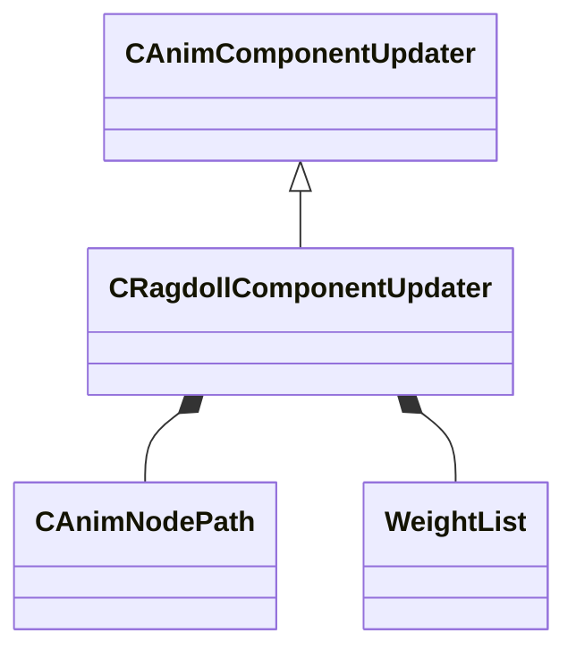

[Schemas](../../schemas.md) / [animgraphlib](../animgraphlib.md) / CRagdollComponentUpdater

# CRagdollComponentUpdater

**Kind:** class · **Size:** 216 bytes (`0xd8`) · **Align:** 8 · **Module:** animgraphlib

**Inherits from:** [CAnimComponentUpdater](../animgraphlib/CAnimComponentUpdater.md)

**Relationships:**

## Memory layout

14 fields (10 declared here, 4 inherited). Offsets are absolute from the object base.

| Offset | Field | Type | From | Annotations |
|--------|-------|------|------|-------------|
| `0x18` | `m_name` | CUtlString | [CAnimComponentUpdater](../animgraphlib/CAnimComponentUpdater.md) |  |
| `0x20` | `m_id` | [AnimComponentID](../modellib/AnimComponentID.md) | [CAnimComponentUpdater](../animgraphlib/CAnimComponentUpdater.md) |  |
| `0x24` | `m_networkMode` | [AnimNodeNetworkMode](../animgraphlib/AnimNodeNetworkMode.md) | [CAnimComponentUpdater](../animgraphlib/CAnimComponentUpdater.md) |  |
| `0x28` | `m_bStartEnabled` | bool | [CAnimComponentUpdater](../animgraphlib/CAnimComponentUpdater.md) |  |
| `0x30` | `m_ragdollNodePaths` | CUtlVector< [CAnimNodePath](../animgraphlib/CAnimNodePath.md) > |  |  |
| `0x48` | `m_followAttachmentNodePaths` | CUtlVector< [CAnimNodePath](../animgraphlib/CAnimNodePath.md) > |  |  |
| `0x60` | `m_boneIndices` | CUtlVector< int32 > |  |  |
| `0x78` | `m_boneNames` | CUtlVector< CUtlString > |  |  |
| `0x90` | `m_weightLists` | CUtlVector< [WeightList](../animgraphlib/WeightList.md) > |  |  |
| `0xa8` | `m_boneToWeightIndices` | CUtlVector< int32 > |  |  |
| `0xc0` | `m_flSpringFrequencyMin` | float32 |  |  |
| `0xc4` | `m_flSpringFrequencyMax` | float32 |  |  |
| `0xc8` | `m_flMaxStretch` | float32 |  |  |
| `0xcc` | `m_bSolidCollisionAtZeroWeight` | bool |  |  |

KV3 class defaults

<pre>{
	&quot;_class&quot;: &quot;CRagdollComponentUpdater&quot;,
	&quot;m_name&quot;: &quot;&quot;,
	&quot;m_id&quot;:
	{
		&quot;m_id&quot;: &lt;HIDDEN FOR DIFF&gt;,
	},
	&quot;m_networkMode&quot;: &quot;ServerAuthoritative&quot;,
	&quot;m_bStartEnabled&quot;: false,
	&quot;m_ragdollNodePaths&quot;:
	[
	],
	&quot;m_followAttachmentNodePaths&quot;:
	[
	],
	&quot;m_boneIndices&quot;:
	[
	],
	&quot;m_boneNames&quot;:
	[
	],
	&quot;m_weightLists&quot;:
	[
	],
	&quot;m_boneToWeightIndices&quot;:
	[
	],
	&quot;m_flSpringFrequencyMin&quot;: 0.000000,
	&quot;m_flSpringFrequencyMax&quot;: 15.000000,
	&quot;m_flMaxStretch&quot;: 56.000000,
	&quot;m_bSolidCollisionAtZeroWeight&quot;: false
}</pre>

