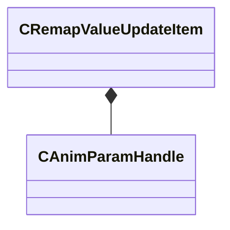

[Schemas](../../schemas.md) / [animgraphlib](../animgraphlib.md) / CRemapValueUpdateItem

# CRemapValueUpdateItem

**Kind:** class · **Size:** 20 bytes (`0x14`) · **Align:** 4 · **Module:** animgraphlib

**Relationships:**

## Memory layout

6 fields (6 declared here, 0 inherited). Offsets are absolute from the object base.

| Offset | Field | Type | From | Annotations |
|--------|-------|------|------|-------------|
| `0x0` | `m_hParamIn` | [CAnimParamHandle](../animgraphlib/CAnimParamHandle.md) |  |  |
| `0x2` | `m_hParamOut` | [CAnimParamHandle](../animgraphlib/CAnimParamHandle.md) |  |  |
| `0x4` | `m_flMinInputValue` | float32 |  |  |
| `0x8` | `m_flMaxInputValue` | float32 |  |  |
| `0xc` | `m_flMinOutputValue` | float32 |  |  |
| `0x10` | `m_flMaxOutputValue` | float32 |  |  |

KV3 class defaults

<pre>{
	&quot;m_hParamIn&quot;:
	{
		&quot;m_type&quot;: &quot;ANIMPARAM_UNKNOWN&quot;,
		&quot;m_index&quot;: 255
	},
	&quot;m_hParamOut&quot;:
	{
		&quot;m_type&quot;: &quot;ANIMPARAM_UNKNOWN&quot;,
		&quot;m_index&quot;: 255
	},
	&quot;m_flMinInputValue&quot;: 0.000000,
	&quot;m_flMaxInputValue&quot;: 0.000000,
	&quot;m_flMinOutputValue&quot;: 0.000000,
	&quot;m_flMaxOutputValue&quot;: 0.000000
}</pre>

