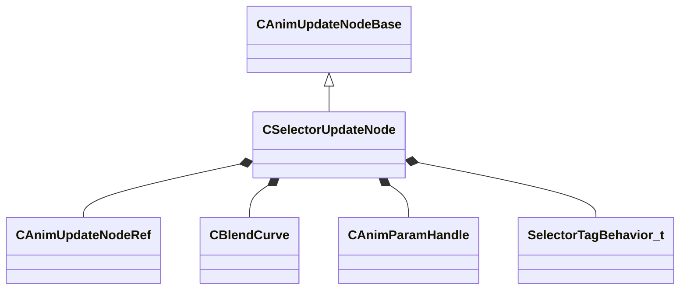

[Schemas](../../schemas.md) / [animgraphlib](../animgraphlib.md) / CSelectorUpdateNode

# CSelectorUpdateNode

**Kind:** class · **Size:** 184 bytes (`0xb8`) · **Align:** 8 · **Module:** animgraphlib

**Inherits from:** [CAnimUpdateNodeBase](../animgraphlib/CAnimUpdateNodeBase.md)

**Relationships:**

## Memory layout

13 fields (10 declared here, 3 inherited). Offsets are absolute from the object base.

| Offset | Field | Type | From | Annotations |
|--------|-------|------|------|-------------|
| `0x18` | `m_nodePath` | [CAnimNodePath](../animgraphlib/CAnimNodePath.md) | [CAnimUpdateNodeBase](../animgraphlib/CAnimUpdateNodeBase.md) |  |
| `0x48` | `m_networkMode` | [AnimNodeNetworkMode](../animgraphlib/AnimNodeNetworkMode.md) | [CAnimUpdateNodeBase](../animgraphlib/CAnimUpdateNodeBase.md) |  |
| `0x50` | `m_name` | CUtlString | [CAnimUpdateNodeBase](../animgraphlib/CAnimUpdateNodeBase.md) |  |
| `0x60` | `m_children` | CUtlVector< [CAnimUpdateNodeRef](../animgraphlib/CAnimUpdateNodeRef.md) > |  |  |
| `0x78` | `m_tags` | CUtlVector< int8 > |  |  |
| `0x94` | `m_blendCurve` | [CBlendCurve](../animgraphlib/CBlendCurve.md) |  |  |
| `0x9c` | `m_flBlendTime` | CAnimValue< float32 > |  |  |
| `0xa4` | `m_hParameter` | [CAnimParamHandle](../animgraphlib/CAnimParamHandle.md) |  |  |
| `0xa8` | `m_nTagIndex` | int32 |  |  |
| `0xac` | `m_eTagBehavior` | [SelectorTagBehavior_t](../animgraphlib/SelectorTagBehavior_t.md) |  |  |
| `0xb0` | `m_bResetOnChange` | bool |  |  |
| `0xb1` | `m_bLockWhenWaning` | bool |  |  |
| `0xb2` | `m_bSyncCyclesOnChange` | bool |  |  |

KV3 class defaults

<pre>{
	&quot;_class&quot;: &quot;CSelectorUpdateNode&quot;,
	&quot;m_nodePath&quot;:
	{
		&quot;m_path&quot;:
		[
			{
				&quot;m_id&quot;: &lt;HIDDEN FOR DIFF&gt;,
			},
			{
				&quot;m_id&quot;: &lt;HIDDEN FOR DIFF&gt;,
			},
			{
				&quot;m_id&quot;: &lt;HIDDEN FOR DIFF&gt;,
			},
			{
				&quot;m_id&quot;: &lt;HIDDEN FOR DIFF&gt;,
			},
			{
				&quot;m_id&quot;: &lt;HIDDEN FOR DIFF&gt;,
			},
			{
				&quot;m_id&quot;: &lt;HIDDEN FOR DIFF&gt;,
			},
			{
				&quot;m_id&quot;: &lt;HIDDEN FOR DIFF&gt;,
			},
			{
				&quot;m_id&quot;: &lt;HIDDEN FOR DIFF&gt;,
			},
			{
				&quot;m_id&quot;: &lt;HIDDEN FOR DIFF&gt;,
			},
			{
				&quot;m_id&quot;: &lt;HIDDEN FOR DIFF&gt;,
			},
			{
				&quot;m_id&quot;: &lt;HIDDEN FOR DIFF&gt;,
			}
		],
		&quot;m_nCount&quot;: 0
	},
	&quot;m_networkMode&quot;: &quot;ServerAuthoritative&quot;,
	&quot;m_name&quot;: &quot;&quot;,
	&quot;m_children&quot;:
	[
	],
	&quot;m_tags&quot;:
	[
	],
	&quot;m_blendCurve&quot;:
	{
		&quot;m_flControlPoint1&quot;: 0.000000,
		&quot;m_flControlPoint2&quot;: 1.000000
	},
	&quot;m_flBlendTime&quot;:
	{
		&quot;m_constValue&quot;: 0.000000,
		&quot;m_hParam&quot;:
		{
			&quot;m_type&quot;: &quot;ANIMPARAM_UNKNOWN&quot;,
			&quot;m_index&quot;: 255
		}
	},
	&quot;m_hParameter&quot;:
	{
		&quot;m_type&quot;: &quot;ANIMPARAM_UNKNOWN&quot;,
		&quot;m_index&quot;: 255
	},
	&quot;m_nTagIndex&quot;: -1,
	&quot;m_eTagBehavior&quot;: &quot;SelectorTagBehavior_OnWhileCurrent&quot;,
	&quot;m_bResetOnChange&quot;: false,
	&quot;m_bLockWhenWaning&quot;: false,
	&quot;m_bSyncCyclesOnChange&quot;: false
}</pre>

