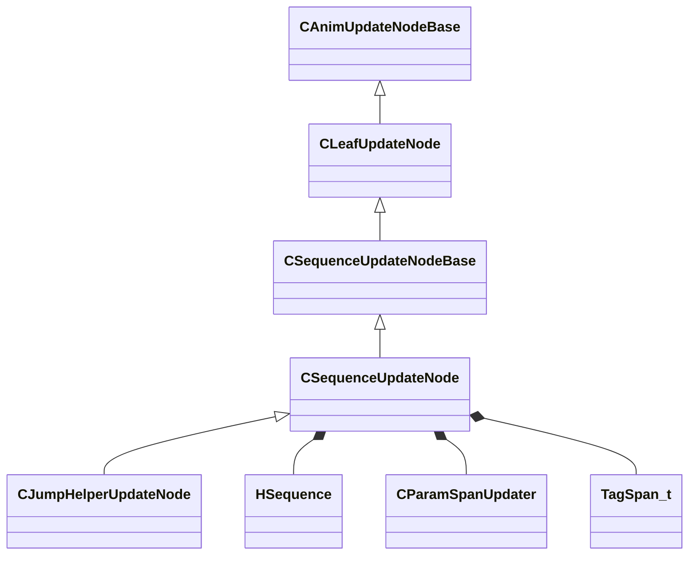

[Schemas](../../schemas.md) / [animgraphlib](../animgraphlib.md) / CSequenceUpdateNode

# CSequenceUpdateNode

**Kind:** class · **Size:** 176 bytes (`0xb0`) · **Align:** 8 · **Module:** animgraphlib

**Inherits from:** [CSequenceUpdateNodeBase](../animgraphlib/CSequenceUpdateNodeBase.md)

**Derived by:** [CJumpHelperUpdateNode](../animgraphlib/CJumpHelperUpdateNode.md)

**Relationships:**

## Memory layout

9 fields (4 declared here, 5 inherited). Offsets are absolute from the object base.

| Offset | Field | Type | From | Annotations |
|--------|-------|------|------|-------------|
| `0x18` | `m_nodePath` | [CAnimNodePath](../animgraphlib/CAnimNodePath.md) | [CAnimUpdateNodeBase](../animgraphlib/CAnimUpdateNodeBase.md) |  |
| `0x48` | `m_networkMode` | [AnimNodeNetworkMode](../!GlobalTypes/AnimNodeNetworkMode.md) | [CAnimUpdateNodeBase](../animgraphlib/CAnimUpdateNodeBase.md) |  |
| `0x50` | `m_name` | CUtlString | [CAnimUpdateNodeBase](../animgraphlib/CAnimUpdateNodeBase.md) |  |
| `0x6c` | `m_playbackSpeed` | float32 | [CSequenceUpdateNodeBase](../animgraphlib/CSequenceUpdateNodeBase.md) |  |
| `0x70` | `m_bLoop` | bool | [CSequenceUpdateNodeBase](../animgraphlib/CSequenceUpdateNodeBase.md) |  |
| `0x78` | `m_hSequence` | [HSequence](../animationsystem/HSequence.md) |  |  |
| `0x7c` | `m_duration` | float32 |  |  |
| `0x80` | `m_paramSpans` | [CParamSpanUpdater](../animgraphlib/CParamSpanUpdater.md) |  |  |
| `0x98` | `m_tags` | CUtlVector< [TagSpan_t](../animgraphlib/TagSpan_t.md) > |  |  |

KV3 class defaults

<pre>{
	&quot;_class&quot;: &quot;CSequenceUpdateNode&quot;,
	&quot;m_nodePath&quot;:
	{
		&quot;m_path&quot;:
		[
			{
				&quot;m_id&quot;: &lt;HIDDEN FOR DIFF&gt;,
			},
			{
				&quot;m_id&quot;: &lt;HIDDEN FOR DIFF&gt;,
			},
			{
				&quot;m_id&quot;: &lt;HIDDEN FOR DIFF&gt;,
			},
			{
				&quot;m_id&quot;: &lt;HIDDEN FOR DIFF&gt;,
			},
			{
				&quot;m_id&quot;: &lt;HIDDEN FOR DIFF&gt;,
			},
			{
				&quot;m_id&quot;: &lt;HIDDEN FOR DIFF&gt;,
			},
			{
				&quot;m_id&quot;: &lt;HIDDEN FOR DIFF&gt;,
			},
			{
				&quot;m_id&quot;: &lt;HIDDEN FOR DIFF&gt;,
			},
			{
				&quot;m_id&quot;: &lt;HIDDEN FOR DIFF&gt;,
			},
			{
				&quot;m_id&quot;: &lt;HIDDEN FOR DIFF&gt;,
			},
			{
				&quot;m_id&quot;: &lt;HIDDEN FOR DIFF&gt;,
			}
		],
		&quot;m_nCount&quot;: 0
	},
	&quot;m_networkMode&quot;: &quot;ServerAuthoritative&quot;,
	&quot;m_name&quot;: &quot;&quot;,
	&quot;m_playbackSpeed&quot;: 1.000000,
	&quot;m_bLoop&quot;: false,
	&quot;m_hSequence&quot;: -1,
	&quot;m_duration&quot;: 0.000000,
	&quot;m_paramSpans&quot;:
	{
		&quot;m_spans&quot;:
		[
		]
	},
	&quot;m_tags&quot;:
	[
	]
}</pre>

