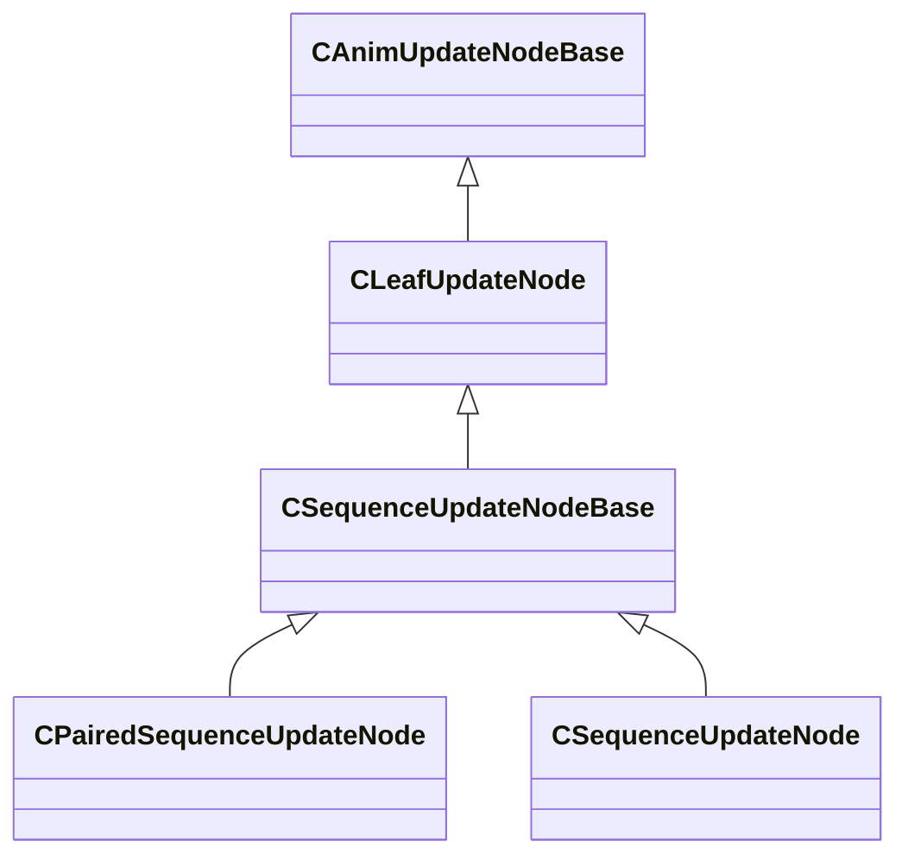

[Schemas](../../schemas.md) / [animgraphlib](../animgraphlib.md) / CSequenceUpdateNodeBase

# CSequenceUpdateNodeBase

> Source: **Build 25000182** · 2026-08-28 · `windows-x86_64` · schema `0.10.0`

**Kind:** class · **Size:** 120 bytes (`0x78`) · **Align:** n/a (unspecified) · **Module:** animgraphlib

**Inherits from:** [CLeafUpdateNode](../animgraphlib/CLeafUpdateNode.md)

**Derived by:** [CPairedSequenceUpdateNode](../animgraphlib/CPairedSequenceUpdateNode.md), [CSequenceUpdateNode](../animgraphlib/CSequenceUpdateNode.md)

**Relationships:**

## Memory layout

5 fields (2 declared here, 3 inherited). Offsets are absolute from the object base.

| Offset | Field | Type | From | Annotations |
|--------|-------|------|------|-------------|
| `0x18` | `m_nodePath` | [CAnimNodePath](../animgraphlib/CAnimNodePath.md) | [CAnimUpdateNodeBase](../animgraphlib/CAnimUpdateNodeBase.md) |  |
| `0x48` | `m_networkMode` | [AnimNodeNetworkMode](../animgraphlib/AnimNodeNetworkMode.md) | [CAnimUpdateNodeBase](../animgraphlib/CAnimUpdateNodeBase.md) |  |
| `0x50` | `m_name` | CUtlString | [CAnimUpdateNodeBase](../animgraphlib/CAnimUpdateNodeBase.md) |  |
| `0x6c` | `m_playbackSpeed` | float32 |  |  |
| `0x70` | `m_bLoop` | bool |  |  |
