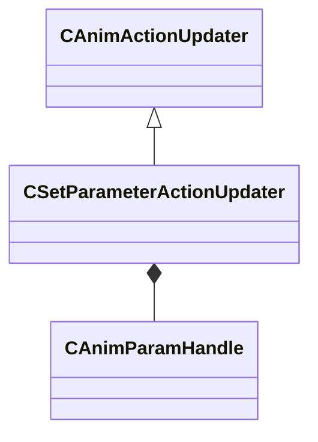

[Schemas](../../schemas.md) / [animgraphlib](../animgraphlib.md) / CSetParameterActionUpdater

# CSetParameterActionUpdater

> Source: **Build 25000182** · 2026-08-28 · `windows-x86_64` · schema `0.10.0`

**Kind:** class · **Size:** 48 bytes (`0x30`) · **Align:** 8 · **Module:** animgraphlib

**Inherits from:** [CAnimActionUpdater](../animgraphlib/CAnimActionUpdater.md)

**Relationships:**

## Memory layout

2 fields (2 declared here, 0 inherited). Offsets are absolute from the object base.

| Offset | Field | Type | From | Annotations |
|--------|-------|------|------|-------------|
| `0x18` | `m_hParam` | [CAnimParamHandle](../animgraphlib/CAnimParamHandle.md) |  |  |
| `0x1a` | `m_value` | CAnimVariant |  |  |

KV3 class defaults

<pre>{
	&quot;_class&quot;: &quot;CSetParameterActionUpdater&quot;,
	&quot;m_hParam&quot;:
	{
		&quot;m_type&quot;: &quot;ANIMPARAM_UNKNOWN&quot;,
		&quot;m_index&quot;: 255
	},
	&quot;m_value&quot;:
	{
		&quot;m_nType&quot;: 0
	}
}</pre>

