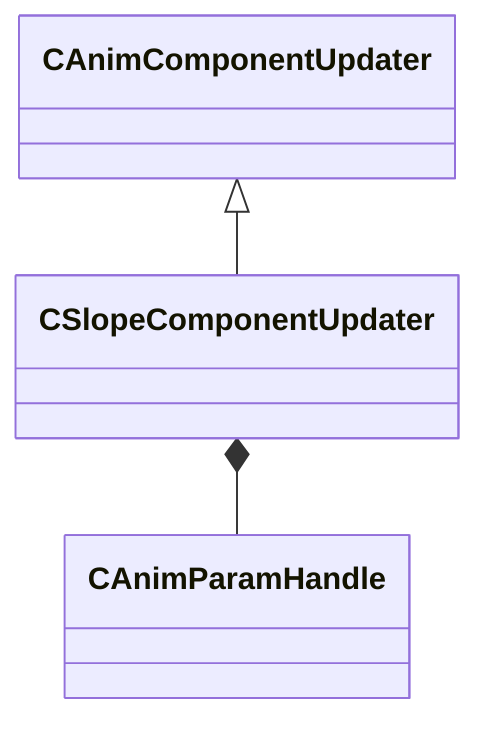

[Schemas](../../schemas.md) / [animgraphlib](../animgraphlib.md) / CSlopeComponentUpdater

# CSlopeComponentUpdater

> Source: **Build 25000182** · 2026-08-28 · `windows-x86_64` · schema `0.10.0`

**Kind:** class · **Size:** 72 bytes (`0x48`) · **Align:** 8 · **Module:** animgraphlib

**Inherits from:** [CAnimComponentUpdater](../animgraphlib/CAnimComponentUpdater.md)

**Relationships:**

## Memory layout

11 fields (7 declared here, 4 inherited). Offsets are absolute from the object base.

| Offset | Field | Type | From | Annotations |
|--------|-------|------|------|-------------|
| `0x18` | `m_name` | CUtlString | [CAnimComponentUpdater](../animgraphlib/CAnimComponentUpdater.md) |  |
| `0x20` | `m_id` | [AnimComponentID](../modellib/AnimComponentID.md) | [CAnimComponentUpdater](../animgraphlib/CAnimComponentUpdater.md) |  |
| `0x24` | `m_networkMode` | [AnimNodeNetworkMode](../animgraphlib/AnimNodeNetworkMode.md) | [CAnimComponentUpdater](../animgraphlib/CAnimComponentUpdater.md) |  |
| `0x28` | `m_bStartEnabled` | bool | [CAnimComponentUpdater](../animgraphlib/CAnimComponentUpdater.md) |  |
| `0x34` | `m_flTraceDistance` | float32 |  |  |
| `0x38` | `m_hSlopeAngle` | [CAnimParamHandle](../animgraphlib/CAnimParamHandle.md) |  |  |
| `0x3a` | `m_hSlopeAngleFront` | [CAnimParamHandle](../animgraphlib/CAnimParamHandle.md) |  |  |
| `0x3c` | `m_hSlopeAngleSide` | [CAnimParamHandle](../animgraphlib/CAnimParamHandle.md) |  |  |
| `0x3e` | `m_hSlopeHeading` | [CAnimParamHandle](../animgraphlib/CAnimParamHandle.md) |  |  |
| `0x40` | `m_hSlopeNormal` | [CAnimParamHandle](../animgraphlib/CAnimParamHandle.md) |  |  |
| `0x42` | `m_hSlopeNormal_WorldSpace` | [CAnimParamHandle](../animgraphlib/CAnimParamHandle.md) |  |  |

KV3 class defaults

<pre>{
	&quot;_class&quot;: &quot;CSlopeComponentUpdater&quot;,
	&quot;m_name&quot;: &quot;&quot;,
	&quot;m_id&quot;:
	{
		&quot;m_id&quot;: &lt;HIDDEN FOR DIFF&gt;,
	},
	&quot;m_networkMode&quot;: &quot;ServerAuthoritative&quot;,
	&quot;m_bStartEnabled&quot;: false,
	&quot;m_flTraceDistance&quot;: 36.000000,
	&quot;m_hSlopeAngle&quot;:
	{
		&quot;m_type&quot;: &quot;ANIMPARAM_UNKNOWN&quot;,
		&quot;m_index&quot;: 255
	},
	&quot;m_hSlopeAngleFront&quot;:
	{
		&quot;m_type&quot;: &quot;ANIMPARAM_UNKNOWN&quot;,
		&quot;m_index&quot;: 255
	},
	&quot;m_hSlopeAngleSide&quot;:
	{
		&quot;m_type&quot;: &quot;ANIMPARAM_UNKNOWN&quot;,
		&quot;m_index&quot;: 255
	},
	&quot;m_hSlopeHeading&quot;:
	{
		&quot;m_type&quot;: &quot;ANIMPARAM_UNKNOWN&quot;,
		&quot;m_index&quot;: 255
	},
	&quot;m_hSlopeNormal&quot;:
	{
		&quot;m_type&quot;: &quot;ANIMPARAM_UNKNOWN&quot;,
		&quot;m_index&quot;: 255
	},
	&quot;m_hSlopeNormal_WorldSpace&quot;:
	{
		&quot;m_type&quot;: &quot;ANIMPARAM_UNKNOWN&quot;,
		&quot;m_index&quot;: 255
	}
}</pre>

