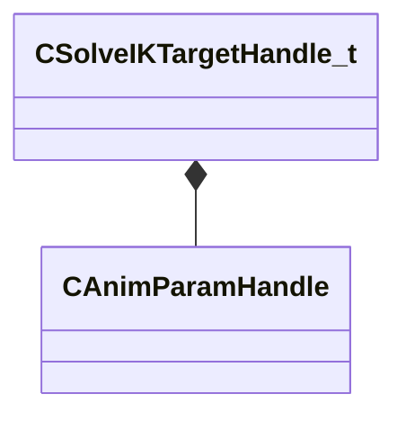

[Schemas](../../schemas.md) / [animgraphlib](../animgraphlib.md) / CSolveIKTargetHandle_t

# CSolveIKTargetHandle_t

**Kind:** class · **Size:** 4 bytes (`0x4`) · **Align:** 1 · **Module:** animgraphlib

**Relationships:**

## Memory layout

2 fields (2 declared here, 0 inherited). Offsets are absolute from the object base.

| Offset | Field | Type | From | Annotations |
|--------|-------|------|------|-------------|
| `0x0` | `m_positionHandle` | [CAnimParamHandle](../animgraphlib/CAnimParamHandle.md) |  |  |
| `0x2` | `m_orientationHandle` | [CAnimParamHandle](../animgraphlib/CAnimParamHandle.md) |  |  |

KV3 class defaults

<pre>{
	&quot;m_positionHandle&quot;:
	{
		&quot;m_type&quot;: &quot;ANIMPARAM_UNKNOWN&quot;,
		&quot;m_index&quot;: 255
	},
	&quot;m_orientationHandle&quot;:
	{
		&quot;m_type&quot;: &quot;ANIMPARAM_UNKNOWN&quot;,
		&quot;m_index&quot;: 255
	}
}</pre>

